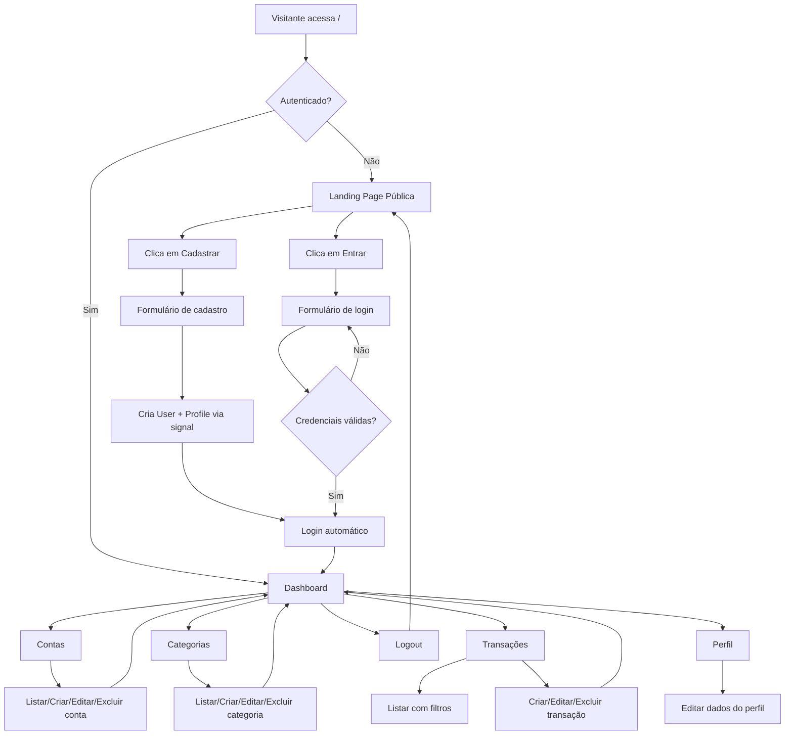
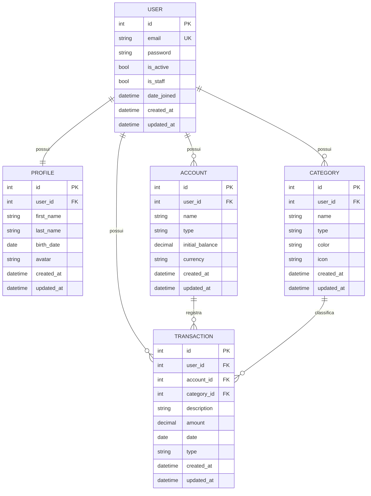

# PRD — Finanpy

**Documento de Requisitos de Produto**
**Versão:** 1.0
**Data:** 18 de abril de 2026
**Status:** Draft

---

## 1. Visão geral

O **Finanpy** é um sistema web de gestão de finanças pessoais desenvolvido em Django (full stack), com interface em Django Template Language (DTL) estilizada com TailwindCSS. O produto permite que usuários organizem suas contas bancárias, categorizem despesas e receitas, acompanhem transações e visualizem o fluxo financeiro em um dashboard moderno, responsivo e com identidade visual de nível premium SaaS.

O projeto é intencionalmente simples e enxuto, priorizando entrega de valor imediata sobre complexidade arquitetural. Nada de microserviços, filas, caches distribuídos ou containers na fase inicial — apenas Django, SQLite e boas práticas.

---

## 2. Sobre o produto

Finanpy é uma aplicação monolítica Django organizada em apps por domínio (`users`, `profiles`, `accounts`, `categories`, `transactions`) e um app de configurações globais (`core`). O usuário se cadastra com e-mail e senha, acessa um dashboard e passa a registrar contas, categorias e transações, obtendo uma visão consolidada de sua vida financeira.

O sistema possui dois contextos visuais:

- **Área pública** — landing page de apresentação com chamadas para cadastro e login.
- **Área autenticada** — dashboard e telas de gestão (CRUDs) de contas, categorias e transações.

Ambas compartilham a mesma identidade visual, baseada em um design system único.

---

## 3. Propósito

Oferecer uma ferramenta simples, rápida e visualmente agradável para que pessoas físicas tenham controle sobre seu dinheiro sem precisar de planilhas manuais ou aplicativos sobrecarregados de funcionalidades. O propósito é reduzir o atrito entre "querer organizar as finanças" e "efetivamente organizar as finanças".

---

## 4. Público alvo

- Pessoas físicas entre 20 e 50 anos com renda ativa e múltiplas fontes/contas.
- Usuários que já tentaram planilhas e desistiram pela fricção de manutenção.
- Pessoas que não querem sincronizar dados bancários via Open Finance e preferem lançamento manual com total privacidade.
- Perfil alfabetizado digitalmente, confortável com interfaces web modernas.

---

## 5. Objetivos

1. Entregar um MVP funcional de gestão financeira pessoal em Django com autenticação, contas, categorias e transações.
2. Garantir experiência visual consistente e premium em todas as telas via design system próprio.
3. Manter a base de código simples, aderente à PEP-8 e aos padrões idiomáticos do Django (CBVs, signals, ORM).
4. Permitir que um novo usuário consiga cadastrar-se, criar uma conta, uma categoria e registrar sua primeira transação em menos de 3 minutos.
5. Isolar domínios em apps Django distintos para facilitar evolução e manutenção.

---

## 6. Requisitos funcionais

### 6.1 Autenticação e perfil

- RF01 — Cadastro de usuário via e-mail e senha (sem username).
- RF02 — Login via e-mail e senha.
- RF03 — Logout autenticado.
- RF04 — Criação automática de `Profile` ao criar `User` (via signal).
- RF05 — Edição do perfil do usuário (nome, data de nascimento, avatar opcional).

### 6.2 Contas bancárias

- RF06 — Criar, listar, editar e excluir contas bancárias do usuário autenticado.
- RF07 — Cada conta possui nome, tipo (corrente, poupança, carteira, investimento), saldo inicial e moeda (BRL como padrão).
- RF08 — Exibir saldo atual calculado a partir de saldo inicial + transações.

### 6.3 Categorias

- RF09 — Criar, listar, editar e excluir categorias do usuário autenticado.
- RF10 — Categorias possuem nome, tipo (receita ou despesa), cor e ícone.

### 6.4 Transações

- RF11 — Criar, listar, editar e excluir transações do usuário autenticado.
- RF12 — Cada transação possui descrição, valor, data, tipo (entrada/saída), conta associada e categoria associada.
- RF13 — Listagem de transações com filtros por período, conta, categoria e tipo.
- RF14 — Paginação da listagem.

### 6.5 Dashboard

- RF15 — Exibir saldo total consolidado de todas as contas.
- RF16 — Exibir total de receitas e despesas do mês corrente.
- RF17 — Exibir lista das últimas transações.
- RF18 — Exibir distribuição de despesas por categoria (texto/lista, sem gráficos complexos no MVP).

### 6.6 Site público

- RF19 — Landing page com hero, seção de features, CTA de cadastro e link para login.
- RF20 — Rotas públicas acessíveis sem autenticação.

### 6.7 Fluxograma de UX (Mermaid)



---

## 7. Requisitos não-funcionais

- RNF01 — **Performance:** páginas devem renderizar em menos de 500ms em condições locais.
- RNF02 — **Responsividade:** layouts adaptáveis de 320px (mobile) a 1920px (desktop).
- RNF03 — **Acessibilidade:** contraste mínimo AA e navegação por teclado nos formulários.
- RNF04 — **Segurança:** proteção CSRF nativa do Django, senhas com hashing PBKDF2, sessões seguras.
- RNF05 — **Manutenibilidade:** aderência à PEP-8, uso de aspas simples, código em inglês, interface em pt-BR.
- RNF06 — **Persistência:** SQLite padrão do Django.
- RNF07 — **Auditoria mínima:** todos os models possuem `created_at` e `updated_at`.
- RNF08 — **Isolamento de domínios:** cada domínio em seu próprio app Django.
- RNF09 — **Simplicidade:** preferência por Class-Based Views e recursos nativos; sem dependências desnecessárias.

---

## 8. Arquitetura técnica

### 8.1 Stack

| Camada | Tecnologia |
|---|---|
| Linguagem | Python 3.12+ |
| Framework | Django 5.x |
| Template engine | Django Template Language (DTL) |
| Estilização | TailwindCSS (via CDN no MVP) |
| Banco de dados | SQLite |
| Autenticação | `django.contrib.auth` customizado (login por e-mail) |
| Forms | Django Forms / ModelForms |
| Views | Class-Based Views (CBVs) |
| Versionamento | Git |

### 8.2 Estrutura de apps

- `core` — settings, urls raiz, wsgi/asgi.
- `users` — `User` customizado herdando de `AbstractUser` com e-mail como USERNAME_FIELD.
- `profiles` — `Profile` 1:1 com `User`, criado via signal.
- `accounts` — contas bancárias.
- `categories` — categorias de transações.
- `transactions` — transações financeiras.

### 8.3 Estrutura de dados (Mermaid)



---

## 9. Design system

### 9.1 Filosofia

Design moderno, clean e premium, fugindo do clichê black/purple. Paleta principal baseada em **teal/emerald** para ações positivas combinada com **slate** frio nos fundos e acentos em **amber** para destaques financeiros. Gradientes suaves em hero e cards de métricas.

### 9.2 Paleta de cores (Tailwind)

| Token | Uso | Classe Tailwind |
|---|---|---|
| Primária | CTAs, links, destaques | `emerald-500`, `emerald-600` |
| Primária hover | Interação | `emerald-700` |
| Secundária | Acento, destaques financeiros | `amber-400`, `amber-500` |
| Sucesso (receitas) | Valores positivos | `emerald-500` |
| Erro (despesas) | Valores negativos | `rose-500` |
| Fundo app | Background global | `slate-950` |
| Fundo card | Cards e painéis | `slate-900` |
| Fundo input | Inputs e selects | `slate-800` |
| Borda | Divisores e bordas | `slate-700` |
| Texto principal | Conteúdo | `slate-100` |
| Texto secundário | Legendas, placeholders | `slate-400` |
| Gradiente hero | Landing/banners | `from-emerald-500 via-teal-500 to-cyan-500` |
| Gradiente card destaque | Cards métricos | `from-slate-800 to-slate-900` |

### 9.3 Tipografia

- Fonte: **Inter** (Google Fonts).
- Títulos: `font-semibold tracking-tight`.
- Corpo: `font-normal leading-relaxed`.
- Escala: `text-sm` (12–14px), `text-base` (16px), `text-lg`, `text-xl`, `text-2xl`, `text-4xl` para hero.

### 9.4 Componentes padrão (classes Tailwind)

**Botão primário**
```html
<button class='inline-flex items-center justify-center gap-2 rounded-xl bg-gradient-to-r from-emerald-500 to-teal-500 px-5 py-2.5 text-sm font-semibold text-white shadow-lg shadow-emerald-500/20 transition hover:from-emerald-600 hover:to-teal-600 focus:outline-none focus:ring-2 focus:ring-emerald-400'>
  Salvar
</button>
```

**Botão secundário**
```html
<button class='inline-flex items-center justify-center gap-2 rounded-xl border border-slate-700 bg-slate-800 px-5 py-2.5 text-sm font-semibold text-slate-100 transition hover:bg-slate-700'>
  Cancelar
</button>
```

**Input padrão**
```html
<input class='w-full rounded-xl border border-slate-700 bg-slate-800 px-4 py-2.5 text-slate-100 placeholder-slate-500 transition focus:border-emerald-500 focus:outline-none focus:ring-2 focus:ring-emerald-500/40' />
```

**Label padrão**
```html
<label class='mb-1.5 block text-sm font-medium text-slate-300'>E-mail</label>
```

**Card**
```html
<div class='rounded-2xl border border-slate-800 bg-slate-900/80 p-6 shadow-xl shadow-black/20 backdrop-blur'>
  ...
</div>
```

**Card de métrica (dashboard)**
```html
<div class='rounded-2xl bg-gradient-to-br from-slate-800 to-slate-900 p-6 ring-1 ring-slate-700/50'>
  <p class='text-sm text-slate-400'>Saldo total</p>
  <p class='mt-2 text-3xl font-semibold text-emerald-400'>R$ 12.430,00</p>
</div>
```

**Tabela/grid de listagem**
```html
<div class='overflow-hidden rounded-2xl border border-slate-800'>
  <table class='w-full text-sm'>
    <thead class='bg-slate-800/60 text-slate-300'>
      <tr><th class='px-4 py-3 text-left font-medium'>...</th></tr>
    </thead>
    <tbody class='divide-y divide-slate-800 bg-slate-900'>
      <tr class='hover:bg-slate-800/50'><td class='px-4 py-3'>...</td></tr>
    </tbody>
  </table>
</div>
```

**Menu lateral (sidebar autenticada)**
```html
<aside class='w-64 border-r border-slate-800 bg-slate-950 p-4'>
  <nav class='flex flex-col gap-1'>
    <a class='flex items-center gap-3 rounded-xl px-3 py-2 text-slate-300 hover:bg-slate-800 hover:text-white' href='...'>...</a>
    <a class='flex items-center gap-3 rounded-xl bg-emerald-500/10 px-3 py-2 text-emerald-400' href='...'>Ativo</a>
  </nav>
</aside>
```

**Topbar**
```html
<header class='flex items-center justify-between border-b border-slate-800 bg-slate-950/80 px-6 py-4 backdrop-blur'>
  ...
</header>
```

**Alerta/mensagem Django messages**
```html
<div class='rounded-xl border border-emerald-500/30 bg-emerald-500/10 px-4 py-3 text-sm text-emerald-300'>
  Operação realizada com sucesso.
</div>
```

### 9.5 Layout base

- **Layout público:** `base_public.html` com topbar simples, conteúdo centralizado e footer discreto.
- **Layout autenticado:** `base_app.html` com sidebar à esquerda, topbar superior e área de conteúdo com `max-w-7xl mx-auto p-6`.
- **Espaçamento:** múltiplos de 4 (Tailwind default).
- **Raios:** `rounded-xl` (12px) padrão, `rounded-2xl` (16px) em cards.
- **Sombras:** sutis com tons de preto translúcido (`shadow-black/20`).

---

## 10. User stories

### 10.1 Épico: Autenticação

**US01 — Cadastro com e-mail**
Como visitante, quero me cadastrar informando e-mail e senha para acessar o sistema.
- Aceite: formulário valida e-mail único, senha mínima de 8 caracteres, cria `User` + `Profile`, loga automaticamente.

**US02 — Login com e-mail**
Como usuário, quero fazer login com e-mail e senha.
- Aceite: autenticação por e-mail, mensagem de erro clara em falha, redirecionamento ao dashboard.

**US03 — Logout**
Como usuário autenticado, quero sair do sistema.
- Aceite: encerra sessão e redireciona para landing.

### 10.2 Épico: Perfil

**US04 — Editar perfil**
Como usuário, quero editar meus dados pessoais.
- Aceite: formulário com nome, sobrenome, data de nascimento, avatar opcional; salva com mensagem de sucesso.

### 10.3 Épico: Contas

**US05 — Gerenciar contas bancárias**
Como usuário, quero criar, listar, editar e excluir minhas contas.
- Aceite: CRUD completo, apenas contas do usuário são exibidas, saldo inicial aceita valores positivos e negativos.

### 10.4 Épico: Categorias

**US06 — Gerenciar categorias**
Como usuário, quero criar, listar, editar e excluir categorias de receita e despesa.
- Aceite: CRUD completo, tipo obrigatório (receita/despesa), cor e ícone opcionais.

### 10.5 Épico: Transações

**US07 — Registrar transação**
Como usuário, quero registrar uma entrada ou saída vinculada a uma conta e categoria.
- Aceite: formulário com descrição, valor, data, tipo, conta e categoria; validação de campos obrigatórios.

**US08 — Listar transações com filtros**
Como usuário, quero filtrar transações por período, conta, categoria e tipo.
- Aceite: filtros via querystring, paginação, ordenação por data decrescente.

**US09 — Editar e excluir transação**
Como usuário, quero editar ou excluir uma transação existente.
- Aceite: somente o dono da transação pode alterá-la; confirmação antes da exclusão.

### 10.6 Épico: Dashboard

**US10 — Visão consolidada**
Como usuário, quero ver meu saldo total, receitas e despesas do mês e últimas transações.
- Aceite: dashboard renderiza cards com valores corretos, lista últimas 10 transações.

### 10.7 Épico: Site público

**US11 — Landing page**
Como visitante, quero entender o que é o Finanpy e me cadastrar.
- Aceite: página pública com hero, features, CTAs de cadastro e login.

---

## 11. Métricas de sucesso

### 11.1 KPIs de produto

- **Ativação:** % de usuários cadastrados que criam ao menos 1 conta e 1 transação nos primeiros 7 dias (meta: > 60%).
- **Retenção D7:** % de usuários que retornam após 7 dias (meta: > 35%).
- **Time to value:** tempo médio entre cadastro e primeira transação registrada (meta: < 5 minutos).

### 11.2 KPIs de usuário

- Número médio de transações registradas por usuário por mês.
- Número médio de contas por usuário.
- Número médio de categorias por usuário.

### 11.3 KPIs técnicos

- Tempo médio de resposta das views (meta: < 300ms).
- Taxa de erro 500 (meta: < 0,1%).
- Cobertura de testes (medida nas sprints finais, meta: > 70%).

---

## 12. Riscos e mitigações

| Risco | Impacto | Probabilidade | Mitigação |
|---|---|---|---|
| Escopo crescer e virar over-engineering | Alto | Média | Congelar escopo MVP; novas features só após entrega do MVP. |
| Customização de `User` feita tarde e gerar migration dolorosa | Alto | Alta | Criar `User` customizado na **primeira** migration, antes de qualquer outro model. |
| Design inconsistente entre telas | Médio | Média | Design system centralizado em templates base e parciais reutilizáveis. |
| SQLite limitar concorrência em produção | Baixo (MVP) | Baixa | Aceito no MVP; migração para Postgres prevista em sprint futura. |
| Ausência de testes iniciais gerar regressões | Médio | Média | Testes planejados para sprints finais; uso intenso de recursos nativos reduz superfície de bugs. |
| Signals mal posicionados causando acoplamento | Médio | Baixa | Manter signals em `signals.py` por app e registrá-los em `apps.py`. |
| CDN do Tailwind indisponível | Baixo | Baixa | Migrar para build local do Tailwind em sprint futura. |

---

## 13. Agente de IA — Análise Financeira Personalizada

### 13.1 Visão geral

O módulo `ai` introduz um agente de análise financeira que processa os dados transacionais do usuário e retorna insights personalizados em linguagem natural. O agente é executado via management command Django, persiste os resultados no model `AIAnalysis` e o dashboard exibe a análise mais recente.

### 13.2 Problema

Usuários acumulam transações mas não extraem padrões automaticamente. Visualizar números isolados (saldo, total de despesas) não responde perguntas como "onde estou gastando mais?", "meu padrão mudou este mês?" ou "o que posso ajustar?".

### 13.3 Objetivo

Gerar, periodicamente, um relatório de insights financeiros por usuário, usando LLM para interpretar os dados já registrados no sistema e comunicar conclusões acionáveis em pt-BR.

### 13.4 Arquitetura do módulo

```
ai/
├── agents/
│   ├── finance_insight_agent.py   # Lógica do agente LangChain
│   └── ai_integration_expert.md  # Agente documental (padrões LangChain 1.0)
├── models.py                      # AIAnalysis
├── admin.py
├── apps.py
├── services/
│   └── analysis_service.py        # Orquestrador: coleta dados + chama agente + persiste
├── management/
│   └── commands/
│       └── run_finance_analysis.py
└── migrations/
```

### 13.5 Model AIAnalysis

| Campo | Tipo | Descrição |
|---|---|---|
| `user` | FK → User | Dono da análise |
| `analysis_text` | TextField | Texto completo gerado pelo LLM |
| `insights` | JSONField | Lista de strings: insights extraídos |
| `period_start` | DateField | Início do período analisado |
| `period_end` | DateField | Fim do período analisado |
| `model_used` | CharField | Nome do modelo OpenAI utilizado |
| `tokens_used` | IntegerField (null) | Total de tokens consumidos |
| `created_at` | DateTimeField | Auto |

### 13.6 Pipeline de execução

1. `run_finance_analysis` itera todos os usuários ativos do sistema.
2. Para cada usuário, `AnalysisService.run_for_user(user)` coleta via ORM: contas, saldos, transações dos últimos 30 dias, breakdown por categoria.
3. O contexto estruturado é passado ao `FinanceInsightAgent.analyze(context)`.
4. O agente constrói um `ChatPromptTemplate`, invoca `ChatOpenAI(model='gpt-5-mini')` via LCEL (`prompt | llm | parser`) e retorna `AnalysisResult(summary, insights)`.
5. `AnalysisService` persiste o resultado em `AIAnalysis`.
6. O dashboard consulta `AIAnalysis.objects.filter(user=user).order_by('-created_at').first()` e exibe o card de insights.

### 13.7 Integrações

| Dependência | Papel |
|---|---|
| `langchain` | Framework do agente (LCEL, prompts, output parsers) |
| `langchain-openai` | Wrapper `ChatOpenAI` para API OpenAI |
| `langchain-core` | `ChatPromptTemplate`, `StrOutputParser` |
| `openai` | SDK base (requerido por `langchain-openai`) |

Variável de ambiente necessária: `OPENAI_API_KEY`.

### 13.8 Decisões técnicas

- **LCEL (LangChain Expression Language)** em vez de `LLMChain` legado: mais legível, compatível com LangChain 1.0.
- **JSONField para `insights`**: permite iterar bullets no template sem parsing adicional.
- **`run_finance_analysis` como management command**: execução isolada, schedulável via cron/Celery futuro, sem acoplamento com request/response cycle.
- **Uma análise por execução por usuário**: sem deduplicação por período — o histórico completo fica disponível via admin.
- **Temperatura 0.3**: balanço entre determinismo e fluência natural nas respostas do LLM.

---
**Fim do documento.**
