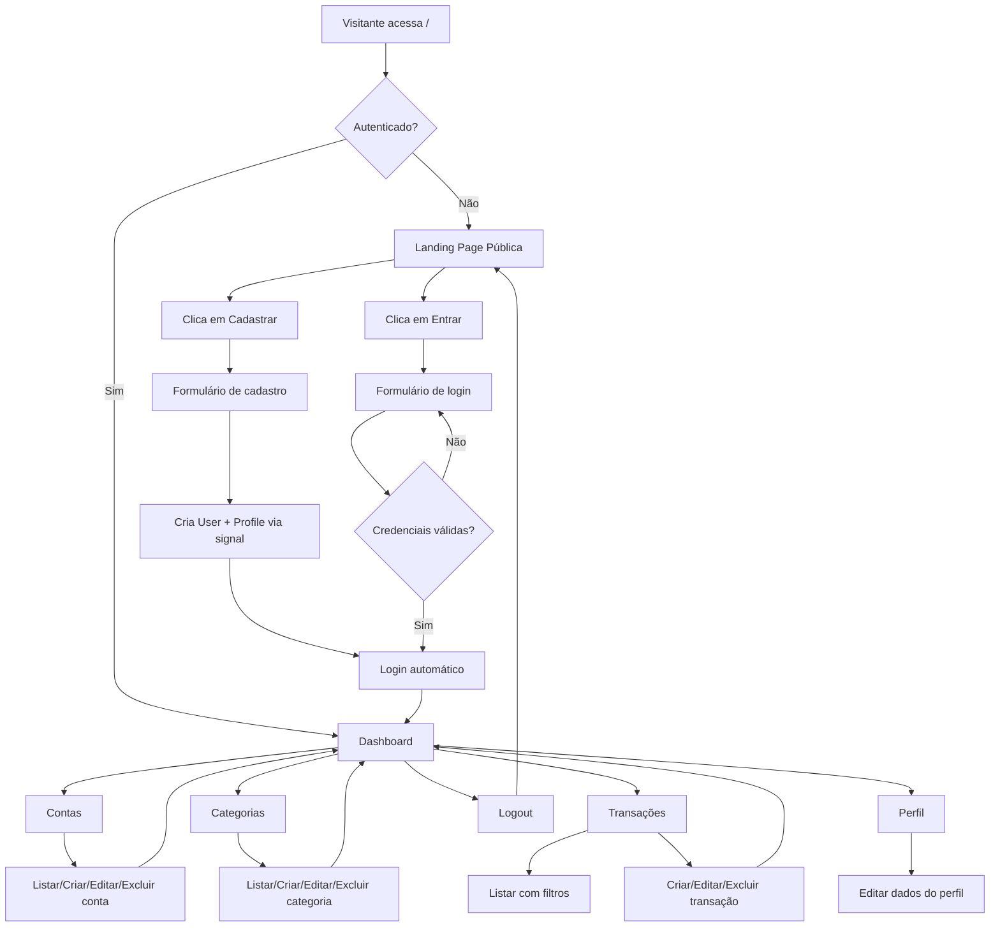
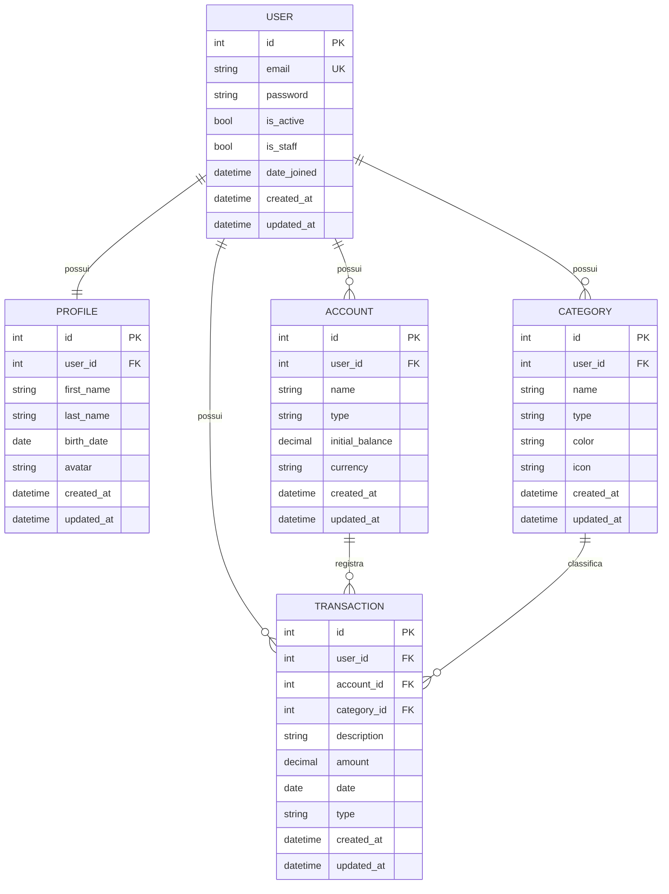

# PRD — Finanpy

**Documento de Requisitos de Produto**
**Versão:** 1.0
**Data:** 18 de abril de 2026
**Status:** Draft

---

## 1. Visão geral

O **Finanpy** é um sistema web de gestão de finanças pessoais desenvolvido em Django (full stack), com interface em Django Template Language (DTL) estilizada com TailwindCSS. O produto permite que usuários organizem suas contas bancárias, categorizem despesas e receitas, acompanhem transações e visualizem o fluxo financeiro em um dashboard moderno, responsivo e com identidade visual de nível premium SaaS.

O projeto é intencionalmente simples e enxuto, priorizando entrega de valor imediata sobre complexidade arquitetural. Nada de microserviços, filas, caches distribuídos ou containers na fase inicial — apenas Django, SQLite e boas práticas.

---

## 2. Sobre o produto

Finanpy é uma aplicação monolítica Django organizada em apps por domínio (`users`, `profiles`, `accounts`, `categories`, `transactions`) e um app de configurações globais (`core`). O usuário se cadastra com e-mail e senha, acessa um dashboard e passa a registrar contas, categorias e transações, obtendo uma visão consolidada de sua vida financeira.

O sistema possui dois contextos visuais:

- **Área pública** — landing page de apresentação com chamadas para cadastro e login.
- **Área autenticada** — dashboard e telas de gestão (CRUDs) de contas, categorias e transações.

Ambas compartilham a mesma identidade visual, baseada em um design system único.

---

## 3. Propósito

Oferecer uma ferramenta simples, rápida e visualmente agradável para que pessoas físicas tenham controle sobre seu dinheiro sem precisar de planilhas manuais ou aplicativos sobrecarregados de funcionalidades. O propósito é reduzir o atrito entre "querer organizar as finanças" e "efetivamente organizar as finanças".

---

## 4. Público alvo

- Pessoas físicas entre 20 e 50 anos com renda ativa e múltiplas fontes/contas.
- Usuários que já tentaram planilhas e desistiram pela fricção de manutenção.
- Pessoas que não querem sincronizar dados bancários via Open Finance e preferem lançamento manual com total privacidade.
- Perfil alfabetizado digitalmente, confortável com interfaces web modernas.

---

## 5. Objetivos

1. Entregar um MVP funcional de gestão financeira pessoal em Django com autenticação, contas, categorias e transações.
2. Garantir experiência visual consistente e premium em todas as telas via design system próprio.
3. Manter a base de código simples, aderente à PEP-8 e aos padrões idiomáticos do Django (CBVs, signals, ORM).
4. Permitir que um novo usuário consiga cadastrar-se, criar uma conta, uma categoria e registrar sua primeira transação em menos de 3 minutos.
5. Isolar domínios em apps Django distintos para facilitar evolução e manutenção.

---

## 6. Requisitos funcionais

### 6.1 Autenticação e perfil

- RF01 — Cadastro de usuário via e-mail e senha (sem username).
- RF02 — Login via e-mail e senha.
- RF03 — Logout autenticado.
- RF04 — Criação automática de `Profile` ao criar `User` (via signal).
- RF05 — Edição do perfil do usuário (nome, data de nascimento, avatar opcional).

### 6.2 Contas bancárias

- RF06 — Criar, listar, editar e excluir contas bancárias do usuário autenticado.
- RF07 — Cada conta possui nome, tipo (corrente, poupança, carteira, investimento), saldo inicial e moeda (BRL como padrão).
- RF08 — Exibir saldo atual calculado a partir de saldo inicial + transações.

### 6.3 Categorias

- RF09 — Criar, listar, editar e excluir categorias do usuário autenticado.
- RF10 — Categorias possuem nome, tipo (receita ou despesa), cor e ícone.

### 6.4 Transações

- RF11 — Criar, listar, editar e excluir transações do usuário autenticado.
- RF12 — Cada transação possui descrição, valor, data, tipo (entrada/saída), conta associada e categoria associada.
- RF13 — Listagem de transações com filtros por período, conta, categoria e tipo.
- RF14 — Paginação da listagem.

### 6.5 Dashboard

- RF15 — Exibir saldo total consolidado de todas as contas.
- RF16 — Exibir total de receitas e despesas do mês corrente.
- RF17 — Exibir lista das últimas transações.
- RF18 — Exibir distribuição de despesas por categoria (texto/lista, sem gráficos complexos no MVP).

### 6.6 Site público

- RF19 — Landing page com hero, seção de features, CTA de cadastro e link para login.
- RF20 — Rotas públicas acessíveis sem autenticação.

### 6.7 Fluxograma de UX (Mermaid)



---

## 7. Requisitos não-funcionais

- RNF01 — **Performance:** páginas devem renderizar em menos de 500ms em condições locais.
- RNF02 — **Responsividade:** layouts adaptáveis de 320px (mobile) a 1920px (desktop).
- RNF03 — **Acessibilidade:** contraste mínimo AA e navegação por teclado nos formulários.
- RNF04 — **Segurança:** proteção CSRF nativa do Django, senhas com hashing PBKDF2, sessões seguras.
- RNF05 — **Manutenibilidade:** aderência à PEP-8, uso de aspas simples, código em inglês, interface em pt-BR.
- RNF06 — **Persistência:** SQLite padrão do Django.
- RNF07 — **Auditoria mínima:** todos os models possuem `created_at` e `updated_at`.
- RNF08 — **Isolamento de domínios:** cada domínio em seu próprio app Django.
- RNF09 — **Simplicidade:** preferência por Class-Based Views e recursos nativos; sem dependências desnecessárias.

---

## 8. Arquitetura técnica

### 8.1 Stack

| Camada | Tecnologia |
|---|---|
| Linguagem | Python 3.12+ |
| Framework | Django 5.x |
| Template engine | Django Template Language (DTL) |
| Estilização | TailwindCSS (via CDN no MVP) |
| Banco de dados | SQLite |
| Autenticação | `django.contrib.auth` customizado (login por e-mail) |
| Forms | Django Forms / ModelForms |
| Views | Class-Based Views (CBVs) |
| Versionamento | Git |

### 8.2 Estrutura de apps

- `core` — settings, urls raiz, wsgi/asgi.
- `users` — `User` customizado herdando de `AbstractUser` com e-mail como USERNAME_FIELD.
- `profiles` — `Profile` 1:1 com `User`, criado via signal.
- `accounts` — contas bancárias.
- `categories` — categorias de transações.
- `transactions` — transações financeiras.

### 8.3 Estrutura de dados (Mermaid)



---

## 9. Design system

### 9.1 Filosofia

Design moderno, clean e premium, fugindo do clichê black/purple. Paleta principal baseada em **teal/emerald** para ações positivas combinada com **slate** frio nos fundos e acentos em **amber** para destaques financeiros. Gradientes suaves em hero e cards de métricas.

### 9.2 Paleta de cores (Tailwind)

| Token | Uso | Classe Tailwind |
|---|---|---|
| Primária | CTAs, links, destaques | `emerald-500`, `emerald-600` |
| Primária hover | Interação | `emerald-700` |
| Secundária | Acento, destaques financeiros | `amber-400`, `amber-500` |
| Sucesso (receitas) | Valores positivos | `emerald-500` |
| Erro (despesas) | Valores negativos | `rose-500` |
| Fundo app | Background global | `slate-950` |
| Fundo card | Cards e painéis | `slate-900` |
| Fundo input | Inputs e selects | `slate-800` |
| Borda | Divisores e bordas | `slate-700` |
| Texto principal | Conteúdo | `slate-100` |
| Texto secundário | Legendas, placeholders | `slate-400` |
| Gradiente hero | Landing/banners | `from-emerald-500 via-teal-500 to-cyan-500` |
| Gradiente card destaque | Cards métricos | `from-slate-800 to-slate-900` |

### 9.3 Tipografia

- Fonte: **Inter** (Google Fonts).
- Títulos: `font-semibold tracking-tight`.
- Corpo: `font-normal leading-relaxed`.
- Escala: `text-sm` (12–14px), `text-base` (16px), `text-lg`, `text-xl`, `text-2xl`, `text-4xl` para hero.

### 9.4 Componentes padrão (classes Tailwind)

**Botão primário**
```html
<button class='inline-flex items-center justify-center gap-2 rounded-xl bg-gradient-to-r from-emerald-500 to-teal-500 px-5 py-2.5 text-sm font-semibold text-white shadow-lg shadow-emerald-500/20 transition hover:from-emerald-600 hover:to-teal-600 focus:outline-none focus:ring-2 focus:ring-emerald-400'>
  Salvar
</button>
```

**Botão secundário**
```html
<button class='inline-flex items-center justify-center gap-2 rounded-xl border border-slate-700 bg-slate-800 px-5 py-2.5 text-sm font-semibold text-slate-100 transition hover:bg-slate-700'>
  Cancelar
</button>
```

**Input padrão**
```html
<input class='w-full rounded-xl border border-slate-700 bg-slate-800 px-4 py-2.5 text-slate-100 placeholder-slate-500 transition focus:border-emerald-500 focus:outline-none focus:ring-2 focus:ring-emerald-500/40' />
```

**Label padrão**
```html
<label class='mb-1.5 block text-sm font-medium text-slate-300'>E-mail</label>
```

**Card**
```html
<div class='rounded-2xl border border-slate-800 bg-slate-900/80 p-6 shadow-xl shadow-black/20 backdrop-blur'>
  ...
</div>
```

**Card de métrica (dashboard)**
```html
<div class='rounded-2xl bg-gradient-to-br from-slate-800 to-slate-900 p-6 ring-1 ring-slate-700/50'>
  <p class='text-sm text-slate-400'>Saldo total</p>
  <p class='mt-2 text-3xl font-semibold text-emerald-400'>R$ 12.430,00</p>
</div>
```

**Tabela/grid de listagem**
```html
<div class='overflow-hidden rounded-2xl border border-slate-800'>
  <table class='w-full text-sm'>
    <thead class='bg-slate-800/60 text-slate-300'>
      <tr><th class='px-4 py-3 text-left font-medium'>...</th></tr>
    </thead>
    <tbody class='divide-y divide-slate-800 bg-slate-900'>
      <tr class='hover:bg-slate-800/50'><td class='px-4 py-3'>...</td></tr>
    </tbody>
  </table>
</div>
```

**Menu lateral (sidebar autenticada)**
```html
<aside class='w-64 border-r border-slate-800 bg-slate-950 p-4'>
  <nav class='flex flex-col gap-1'>
    <a class='flex items-center gap-3 rounded-xl px-3 py-2 text-slate-300 hover:bg-slate-800 hover:text-white' href='...'>...</a>
    <a class='flex items-center gap-3 rounded-xl bg-emerald-500/10 px-3 py-2 text-emerald-400' href='...'>Ativo</a>
  </nav>
</aside>
```

**Topbar**
```html
<header class='flex items-center justify-between border-b border-slate-800 bg-slate-950/80 px-6 py-4 backdrop-blur'>
  ...
</header>
```

**Alerta/mensagem Django messages**
```html
<div class='rounded-xl border border-emerald-500/30 bg-emerald-500/10 px-4 py-3 text-sm text-emerald-300'>
  Operação realizada com sucesso.
</div>
```

### 9.5 Layout base

- **Layout público:** `base_public.html` com topbar simples, conteúdo centralizado e footer discreto.
- **Layout autenticado:** `base_app.html` com sidebar à esquerda, topbar superior e área de conteúdo com `max-w-7xl mx-auto p-6`.
- **Espaçamento:** múltiplos de 4 (Tailwind default).
- **Raios:** `rounded-xl` (12px) padrão, `rounded-2xl` (16px) em cards.
- **Sombras:** sutis com tons de preto translúcido (`shadow-black/20`).

---

## 10. User stories

### 10.1 Épico: Autenticação

**US01 — Cadastro com e-mail**
Como visitante, quero me cadastrar informando e-mail e senha para acessar o sistema.
- Aceite: formulário valida e-mail único, senha mínima de 8 caracteres, cria `User` + `Profile`, loga automaticamente.

**US02 — Login com e-mail**
Como usuário, quero fazer login com e-mail e senha.
- Aceite: autenticação por e-mail, mensagem de erro clara em falha, redirecionamento ao dashboard.

**US03 — Logout**
Como usuário autenticado, quero sair do sistema.
- Aceite: encerra sessão e redireciona para landing.

### 10.2 Épico: Perfil

**US04 — Editar perfil**
Como usuário, quero editar meus dados pessoais.
- Aceite: formulário com nome, sobrenome, data de nascimento, avatar opcional; salva com mensagem de sucesso.

### 10.3 Épico: Contas

**US05 — Gerenciar contas bancárias**
Como usuário, quero criar, listar, editar e excluir minhas contas.
- Aceite: CRUD completo, apenas contas do usuário são exibidas, saldo inicial aceita valores positivos e negativos.

### 10.4 Épico: Categorias

**US06 — Gerenciar categorias**
Como usuário, quero criar, listar, editar e excluir categorias de receita e despesa.
- Aceite: CRUD completo, tipo obrigatório (receita/despesa), cor e ícone opcionais.

### 10.5 Épico: Transações

**US07 — Registrar transação**
Como usuário, quero registrar uma entrada ou saída vinculada a uma conta e categoria.
- Aceite: formulário com descrição, valor, data, tipo, conta e categoria; validação de campos obrigatórios.

**US08 — Listar transações com filtros**
Como usuário, quero filtrar transações por período, conta, categoria e tipo.
- Aceite: filtros via querystring, paginação, ordenação por data decrescente.

**US09 — Editar e excluir transação**
Como usuário, quero editar ou excluir uma transação existente.
- Aceite: somente o dono da transação pode alterá-la; confirmação antes da exclusão.

### 10.6 Épico: Dashboard

**US10 — Visão consolidada**
Como usuário, quero ver meu saldo total, receitas e despesas do mês e últimas transações.
- Aceite: dashboard renderiza cards com valores corretos, lista últimas 10 transações.

### 10.7 Épico: Site público

**US11 — Landing page**
Como visitante, quero entender o que é o Finanpy e me cadastrar.
- Aceite: página pública com hero, features, CTAs de cadastro e login.

---

## 11. Métricas de sucesso

### 11.1 KPIs de produto

- **Ativação:** % de usuários cadastrados que criam ao menos 1 conta e 1 transação nos primeiros 7 dias (meta: > 60%).
- **Retenção D7:** % de usuários que retornam após 7 dias (meta: > 35%).
- **Time to value:** tempo médio entre cadastro e primeira transação registrada (meta: < 5 minutos).

### 11.2 KPIs de usuário

- Número médio de transações registradas por usuário por mês.
- Número médio de contas por usuário.
- Número médio de categorias por usuário.

### 11.3 KPIs técnicos

- Tempo médio de resposta das views (meta: < 300ms).
- Taxa de erro 500 (meta: < 0,1%).
- Cobertura de testes (medida nas sprints finais, meta: > 70%).

---

## 12. Riscos e mitigações

| Risco | Impacto | Probabilidade | Mitigação |
|---|---|---|---|
| Escopo crescer e virar over-engineering | Alto | Média | Congelar escopo MVP; novas features só após entrega do MVP. |
| Customização de `User` feita tarde e gerar migration dolorosa | Alto | Alta | Criar `User` customizado na **primeira** migration, antes de qualquer outro model. |
| Design inconsistente entre telas | Médio | Média | Design system centralizado em templates base e parciais reutilizáveis. |
| SQLite limitar concorrência em produção | Baixo (MVP) | Baixa | Aceito no MVP; migração para Postgres prevista em sprint futura. |
| Ausência de testes iniciais gerar regressões | Médio | Média | Testes planejados para sprints finais; uso intenso de recursos nativos reduz superfície de bugs. |
| Signals mal posicionados causando acoplamento | Médio | Baixa | Manter signals em `signals.py` por app e registrá-los em `apps.py`. |
| CDN do Tailwind indisponível | Baixo | Baixa | Migrar para build local do Tailwind em sprint futura. |

---

## 13. Lista de tarefas

Formato: `- [ ]` para pendente, `- [x]` para concluído.
As sprints abaixo assumem ciclos curtos e focados. Cada sprint é incremental e entrega valor visível.

---

### Sprint 0 — Fundação do projeto

- [ ] **0.1 Configurar ambiente de desenvolvimento**
  - [X] 0.1.1 Criar virtualenv `venv` na raiz do projeto
  - [X] 0.1.2 Criar `requirements.txt` com Django pinado em versão 5.x
  - [X] 0.1.3 Instalar dependências via `pip install -r requirements.txt`
  - [X] 0.1.4 Criar `.gitignore` (venv, `__pycache__`, `db.sqlite3`, `.env`, `staticfiles/`)
  - [ ] 0.1.5 Inicializar repositório Git e primeiro commit

- [ ] **0.2 Criar projeto Django**
  - [X] 0.2.1 Executar `django-admin startproject core .`
  - [X] 0.2.2 Validar que `manage.py` está na raiz
  - [X] 0.2.3 Executar `python manage.py runserver` e confirmar tela inicial
  - [ ] 0.2.4 Configurar `LANGUAGE_CODE = 'pt-br'` em `settings.py`
  - [ ] 0.2.5 Configurar `TIME_ZONE = 'America/Sao_Paulo'` em `settings.py`
  - [ ] 0.2.6 Configurar `USE_TZ = True` em `settings.py`

- [X] **0.3 Estrutura de apps**
  - [X] 0.3.1 Criar app `users` (`python manage.py startapp users`)
  - [X] 0.3.2 Criar app `profiles`
  - [X] 0.3.3 Criar app `accounts`
  - [X] 0.3.4 Criar app `categories`
  - [X] 0.3.5 Criar app `transactions`
  - [X] 0.3.6 Registrar todos os apps em `INSTALLED_APPS`

- [ ] **0.4 Configuração de arquivos estáticos e templates**
  - [ ] 0.4.1 Criar diretório `templates/` na raiz
  - [ ] 0.4.2 Configurar `TEMPLATES['DIRS']` apontando para `BASE_DIR / 'templates'`
  - [ ] 0.4.3 Criar diretório `static/` na raiz
  - [ ] 0.4.4 Configurar `STATICFILES_DIRS`
  - [ ] 0.4.5 Criar `static/css/custom.css` vazio para customizações pontuais

---

### Sprint 1 — Autenticação e usuário customizado

- [ ] **1.1 Modelo de usuário customizado (app `users`)**
  - [ ] 1.1.1 Criar classe `UserManager` herdando de `BaseUserManager` com `create_user` e `create_superuser` baseados em e-mail
  - [ ] 1.1.2 Criar `User(AbstractUser)` com `username = None` e `email = models.EmailField(unique=True)`
  - [ ] 1.1.3 Definir `USERNAME_FIELD = 'email'` e `REQUIRED_FIELDS = []`
  - [ ] 1.1.4 Adicionar campos `created_at` e `updated_at`
  - [ ] 1.1.5 Configurar `AUTH_USER_MODEL = 'users.User'` em `settings.py`
  - [ ] 1.1.6 Registrar `User` em `users/admin.py` com `UserAdmin` adaptado
  - [ ] 1.1.7 Gerar e rodar migrations iniciais

- [ ] **1.2 Perfil de usuário (app `profiles`)**
  - [ ] 1.2.1 Criar `Profile` 1:1 com `User` (OneToOneField, related_name='profile')
  - [ ] 1.2.2 Adicionar campos `first_name`, `last_name`, `birth_date`, `avatar` (ImageField opcional)
  - [ ] 1.2.3 Adicionar `created_at` e `updated_at`
  - [ ] 1.2.4 Criar `profiles/signals.py` com signal `post_save` de `User` criando `Profile`
  - [ ] 1.2.5 Conectar signals em `profiles/apps.py` via método `ready()`
  - [ ] 1.2.6 Registrar `Profile` em `profiles/admin.py`
  - [ ] 1.2.7 Gerar e rodar migrations

- [ ] **1.3 Formulários e views de autenticação**
  - [ ] 1.3.1 Criar `users/forms.py` com `SignUpForm` (email, password1, password2)
  - [ ] 1.3.2 Criar `LoginForm` baseado em `AuthenticationForm` usando e-mail
  - [ ] 1.3.3 Criar `SignUpView(CreateView)` em `users/views.py`
  - [ ] 1.3.4 Criar `LoginView` herdando de `django.contrib.auth.views.LoginView`
  - [ ] 1.3.5 Criar `LogoutView` usando a nativa do Django
  - [ ] 1.3.6 Configurar `LOGIN_URL`, `LOGIN_REDIRECT_URL` e `LOGOUT_REDIRECT_URL` em `settings.py`

- [ ] **1.4 URLs de autenticação**
  - [ ] 1.4.1 Criar `users/urls.py` com rotas `signup/`, `login/`, `logout/`
  - [ ] 1.4.2 Incluir `users.urls` em `core/urls.py`

---

### Sprint 2 — Design system e layouts base

- [ ] **2.1 Templates base**
  - [ ] 2.1.1 Criar `templates/base.html` com doctype, meta viewport, CDN do Tailwind e fonte Inter
  - [ ] 2.1.2 Criar `templates/layouts/base_public.html` (herda de `base.html`) com topbar pública e footer
  - [ ] 2.1.3 Criar `templates/layouts/base_app.html` (herda de `base.html`) com sidebar + topbar autenticada
  - [ ] 2.1.4 Criar bloco `` e `` em cada layout
  - [ ] 2.1.5 Criar parcial `templates/partials/_messages.html` para `django.contrib.messages`

- [ ] **2.2 Componentes reutilizáveis**
  - [ ] 2.2.1 Criar parcial `templates/partials/_sidebar.html` com links para Dashboard, Contas, Categorias, Transações, Perfil, Logout
  - [ ] 2.2.2 Criar parcial `templates/partials/_topbar_public.html`
  - [ ] 2.2.3 Criar parcial `templates/partials/_topbar_app.html` com nome do usuário
  - [ ] 2.2.4 Criar parcial `templates/partials/_form_field.html` para renderização padronizada de campos
  - [ ] 2.2.5 Criar parcial `templates/partials/_empty_state.html` para listas vazias

- [ ] **2.3 Landing page pública**
  - [ ] 2.3.1 Criar app/pasta de views públicas no `core` ou novo app `pages` (optar por view simples em `core`)
  - [ ] 2.3.2 Criar `templates/pages/home.html` com hero (gradiente emerald→teal→cyan), seção de features, CTA cadastro e login
  - [ ] 2.3.3 Criar view `HomeView(TemplateView)` em `core/views.py`
  - [ ] 2.3.4 Configurar rota `''` em `core/urls.py` apontando para `HomeView`

- [ ] **2.4 Templates de autenticação**
  - [ ] 2.4.1 Criar `templates/users/signup.html` usando `base_public.html`
  - [ ] 2.4.2 Criar `templates/users/login.html` usando `base_public.html`
  - [ ] 2.4.3 Aplicar classes Tailwind do design system em todos os campos
  - [ ] 2.4.4 Exibir erros de validação com estilo do design system

---

### Sprint 3 — Dashboard e perfil

- [ ] **3.1 Dashboard inicial**
  - [ ] 3.1.1 Criar `core/views.py` com `DashboardView(LoginRequiredMixin, TemplateView)`
  - [ ] 3.1.2 Em `get_context_data`, calcular saldo total, receitas e despesas do mês
  - [ ] 3.1.3 Buscar últimas 10 transações do usuário
  - [ ] 3.1.4 Criar template `templates/dashboard/index.html` usando `base_app.html`
  - [ ] 3.1.5 Renderizar 3 cards de métrica (saldo, receitas, despesas)
  - [ ] 3.1.6 Renderizar tabela de últimas transações
  - [ ] 3.1.7 Adicionar rota `dashboard/` em `core/urls.py`
  - [ ] 3.1.8 Ajustar `LOGIN_REDIRECT_URL` para `/dashboard/`

- [ ] **3.2 Gestão de perfil**
  - [ ] 3.2.1 Criar `profiles/forms.py` com `ProfileForm(ModelForm)`
  - [ ] 3.2.2 Criar `ProfileUpdateView(LoginRequiredMixin, UpdateView)` que atualiza o profile do usuário logado
  - [ ] 3.2.3 Criar template `templates/profiles/edit.html`
  - [ ] 3.2.4 Criar `profiles/urls.py` e incluir em `core/urls.py`
  - [ ] 3.2.5 Adicionar link do perfil na sidebar e topbar

---

### Sprint 4 — Contas bancárias

- [ ] **4.1 Model Account**
  - [ ] 4.1.1 Criar `Account` em `accounts/models.py` com `user` (FK para `User`), `name`, `type` (choices), `initial_balance` (DecimalField), `currency` (default `'BRL'`)
  - [ ] 4.1.2 Adicionar `created_at` e `updated_at`
  - [ ] 4.1.3 Definir `__str__` retornando `self.name`
  - [ ] 4.1.4 Criar método `current_balance` que soma `initial_balance` + transações
  - [ ] 4.1.5 Registrar no admin
  - [ ] 4.1.6 Gerar e rodar migrations

- [ ] **4.2 CRUD de contas**
  - [ ] 4.2.1 Criar `accounts/forms.py` com `AccountForm(ModelForm)`
  - [ ] 4.2.2 Criar `AccountListView(LoginRequiredMixin, ListView)` filtrando por `user=self.request.user`
  - [ ] 4.2.3 Criar `AccountCreateView(LoginRequiredMixin, CreateView)` atribuindo `user` em `form_valid`
  - [ ] 4.2.4 Criar `AccountUpdateView(LoginRequiredMixin, UpdateView)` com `get_queryset` restrito ao usuário
  - [ ] 4.2.5 Criar `AccountDeleteView(LoginRequiredMixin, DeleteView)` com confirmação
  - [ ] 4.2.6 Criar `accounts/urls.py` com rotas CRUD
  - [ ] 4.2.7 Incluir em `core/urls.py`

- [ ] **4.3 Templates de contas**
  - [ ] 4.3.1 Criar `templates/accounts/list.html` com tabela e botão "Nova conta"
  - [ ] 4.3.2 Criar `templates/accounts/form.html` reutilizado por create/update
  - [ ] 4.3.3 Criar `templates/accounts/confirm_delete.html`
  - [ ] 4.3.4 Adicionar link "Contas" na sidebar

---

### Sprint 5 — Categorias

- [ ] **5.1 Model Category**
  - [ ] 5.1.1 Criar `Category` em `categories/models.py` com `user`, `name`, `type` (choices: `income`/`expense`), `color` (default `'#10b981'`), `icon` (CharField opcional)
  - [ ] 5.1.2 Adicionar `created_at` e `updated_at`
  - [ ] 5.1.3 Definir `unique_together = ('user', 'name', 'type')`
  - [ ] 5.1.4 Registrar no admin
  - [ ] 5.1.5 Gerar e rodar migrations

- [ ] **5.2 CRUD de categorias**
  - [ ] 5.2.1 Criar `categories/forms.py` com `CategoryForm(ModelForm)`
  - [ ] 5.2.2 Criar CBVs `CategoryListView`, `CategoryCreateView`, `CategoryUpdateView`, `CategoryDeleteView`
  - [ ] 5.2.3 Aplicar filtro por `user` em todas as views
  - [ ] 5.2.4 Criar `categories/urls.py` e incluir em `core/urls.py`

- [ ] **5.3 Templates de categorias**
  - [ ] 5.3.1 Criar `templates/categories/list.html` com grid de cards exibindo cor/ícone
  - [ ] 5.3.2 Criar `templates/categories/form.html`
  - [ ] 5.3.3 Criar `templates/categories/confirm_delete.html`
  - [ ] 5.3.4 Adicionar link "Categorias" na sidebar

---

### Sprint 6 — Transações

- [ ] **6.1 Model Transaction**
  - [ ] 6.1.1 Criar `Transaction` em `transactions/models.py` com `user`, `account` (FK), `category` (FK), `description`, `amount` (DecimalField), `date` (DateField), `type` (choices `income`/`expense`)
  - [ ] 6.1.2 Adicionar `created_at` e `updated_at`
  - [ ] 6.1.3 Definir ordenação default por `-date, -created_at`
  - [ ] 6.1.4 Registrar no admin com `list_filter` e `search_fields`
  - [ ] 6.1.5 Gerar e rodar migrations

- [ ] **6.2 CRUD de transações**
  - [ ] 6.2.1 Criar `transactions/forms.py` com `TransactionForm(ModelForm)` que filtra `account` e `category` pelo usuário logado
  - [ ] 6.2.2 Criar `TransactionListView(LoginRequiredMixin, ListView)` com paginação (`paginate_by = 20`)
  - [ ] 6.2.3 Implementar filtros por querystring (período, conta, categoria, tipo) em `get_queryset`
  - [ ] 6.2.4 Criar `TransactionCreateView`, `TransactionUpdateView`, `TransactionDeleteView`
  - [ ] 6.2.5 Criar `transactions/urls.py` e incluir em `core/urls.py`

- [ ] **6.3 Templates de transações**
  - [ ] 6.3.1 Criar `templates/transactions/list.html` com filtros no topo e tabela
  - [ ] 6.3.2 Estilizar valores: verde (`emerald-400`) para receitas, vermelho (`rose-400`) para despesas
  - [ ] 6.3.3 Criar `templates/transactions/form.html`
  - [ ] 6.3.4 Criar `templates/transactions/confirm_delete.html`
  - [ ] 6.3.5 Adicionar paginação visual no rodapé da lista
  - [ ] 6.3.6 Adicionar link "Transações" na sidebar

- [ ] **6.4 Integração com dashboard**
  - [ ] 6.4.1 Refinar cálculo de saldo total usando `Sum` agregado do ORM
  - [ ] 6.4.2 Refinar cálculo de receitas e despesas do mês
  - [ ] 6.4.3 Adicionar seção de "Despesas por categoria" (lista simples) no dashboard

---

### Sprint 7 — Polimento visual e UX

- [ ] **7.1 Consistência visual**
  - [ ] 7.1.1 Revisar todas as telas garantindo uso dos mesmos tokens de cor
  - [ ] 7.1.2 Padronizar espaçamento interno (`p-6`) e externo (`gap-6`) em cards
  - [ ] 7.1.3 Padronizar botões primários e secundários em todas as telas
  - [ ] 7.1.4 Validar responsividade em 320px, 768px e 1280px

- [ ] **7.2 Microinterações**
  - [ ] 7.2.1 Adicionar `transition` em botões e links
  - [ ] 7.2.2 Adicionar `focus:ring` em todos os inputs
  - [ ] 7.2.3 Aplicar hover states em linhas de tabela e itens de menu

- [ ] **7.3 Mensagens e empty states**
  - [ ] 7.3.1 Exibir `messages.success` após ações CRUD
  - [ ] 7.3.2 Exibir `messages.error` em falhas
  - [ ] 7.3.3 Renderizar empty states com ilustração SVG simples e CTA

- [ ] **7.4 Acessibilidade**
  - [ ] 7.4.1 Garantir `aria-label` em ícones isolados
  - [ ] 7.4.2 Validar contraste AA em texto sobre fundo escuro
  - [ ] 7.4.3 Testar navegação via Tab em todos os formulários

---

### Sprint 8 — Testes (sprint final)

- [ ] **8.1 Testes unitários**
  - [ ] 8.1.1 Testar criação de `User` com e-mail via manager customizado
  - [ ] 8.1.2 Testar criação automática de `Profile` via signal
  - [ ] 8.1.3 Testar método `current_balance` de `Account`
  - [ ] 8.1.4 Testar validações dos forms

- [ ] **8.2 Testes de views**
  - [ ] 8.2.1 Testar redirecionamento de rotas protegidas sem login
  - [ ] 8.2.2 Testar filtragem por usuário em todas as listagens
  - [ ] 8.2.3 Testar CRUD de contas, categorias e transações
  - [ ] 8.2.4 Testar filtros de transações

- [ ] **8.3 Cobertura**
  - [ ] 8.3.1 Instalar `coverage`
  - [ ] 8.3.2 Rodar suite e gerar relatório
  - [ ] 8.3.3 Garantir cobertura > 70%

---

### Sprint 9 — Docker (sprint final)

- [ ] **9.1 Containerização**
  - [ ] 9.1.1 Criar `Dockerfile` multi-stage baseado em `python:3.12-slim`
  - [ ] 9.1.2 Criar `docker-compose.yml` com serviço `web` e volume para SQLite
  - [ ] 9.1.3 Criar `.dockerignore`
  - [ ] 9.1.4 Documentar comandos de build e up no `README.md`

- [ ] **9.2 Variáveis de ambiente**
  - [ ] 9.2.1 Extrair `SECRET_KEY`, `DEBUG` e `ALLOWED_HOSTS` para variáveis de ambiente
  - [ ] 9.2.2 Criar `.env.example`
  - [ ] 9.2.3 Adicionar leitura via `os.environ` em `settings.py`

- [ ] **9.3 Deploy-ready**
  - [ ] 9.3.1 Configurar `collectstatic`
  - [ ] 9.3.2 Configurar servidor WSGI (gunicorn) no container
  - [ ] 9.3.3 Validar execução via `docker compose up`

---

**Fim do documento.**
