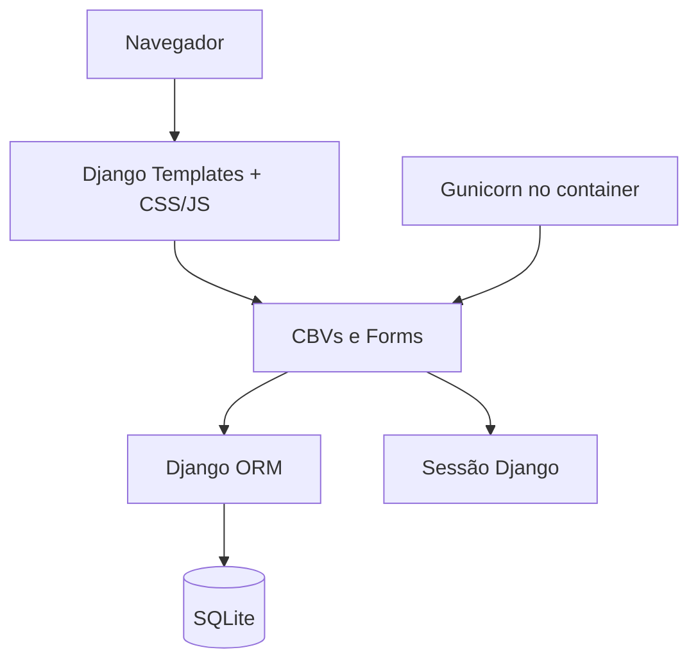
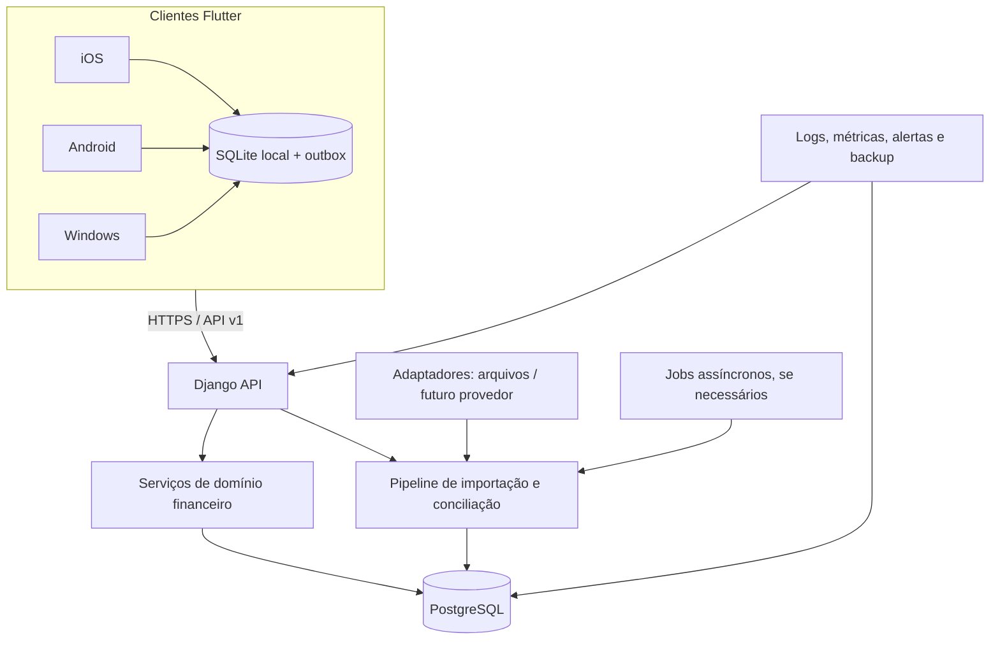
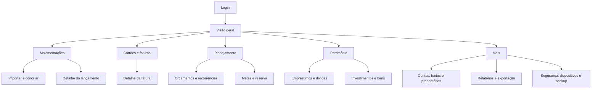

# Lar Finance — PRD do estado atual e evolução do produto

> Fonte única de verdade do produto. Atualizado em 14/08/2026 após a validação
> local da fundação Flutter; produção permanece no estado EasyPanel/R2 já
> registrado, sem deploy da Sprint 4.

## Status e convenções

- **Nome oficial:** Lar Finance.
- **Nome técnico legado:** Finanpy, mantido temporariamente no repositório, módulos Django e implantação até uma migração segura.
- **Estado atual:** aplicação web Django privada e cliente Flutter somente leitura, com Lar compartilhado, responsáveis financeiros, API privada v1, sincronização incremental, cache offline, Home Casa de Valores e piloto OFX Nubank de prévia/confirmação.
- **Produto alvo:** aplicativo Flutter para iOS, Android e Windows, sincronizado com o backend Django no servidor Linux/EasyPanel.
- **Estratégia de dados aprovada:** importação de arquivos primeiro; integração paga automática somente após o produto estar maduro e em uso.
- **Usuários do produto:** uma família no mesmo Lar, com um único login compartilhado nesta fase. Cada dispositivo terá sessão própria e revogável. O domínio mantém credenciais de acesso separadas dos responsáveis financeiros `Eu`, `Esposa` e `Conjunto`, permitindo dois logins no futuro sem migrar o ledger.
- **Identidade visual:** direção **Casa de Valores** aprovada: fintech doméstica premium, grafite esverdeado, marfim quente, champanhe restrito e verde mineral. C6 Bank permanece apenas referência de acabamento, sem copiar marca ou componentes.
- **Regra visual irrevogável:** não usar roxo.
- **`[INVESTIGAR]`:** decisão ou comportamento sem evidência suficiente. Não deve ser implementado por suposição.
- **`As-is`:** comportamento comprovado no código atual.
- **`To-be`:** comportamento alvo aprovado para construção incremental.

## 1. Visão geral

### 1.1 Problema

As informações financeiras do casal estão fragmentadas entre Nubank, Inter, Santander e Mercado Pago. O controle precisa reunir movimentações, cartões, faturas, limites, empréstimos, investimentos, patrimônio, compromissos e objetivos sem depender de uma assinatura cara na primeira fase.

### 1.2 Proposta de valor

O Lar Finance será o painel financeiro privado da família: uma visão confiável do que entrou, saiu, está comprometido, deve ser pago, pertence a cada pessoa e compõe o patrimônio conjunto. O sistema ajuda a tomar decisões, mas não movimenta dinheiro, não guarda senhas bancárias e não substitui aconselhamento financeiro profissional.

### 1.3 Escopo funcional alvo

- Visão individual, da esposa e consolidada do lar.
- Contas, carteiras e saldos.
- Cartões, limites, faturas, vencimentos, fechamentos, parcelamentos e cartões adicionais.
- Receitas, despesas, transferências, estornos, juros, tarifas e ajustes.
- Importação OFX e CSV; PDF e planilhas por adaptadores específicos quando viável.
- Conciliação, deduplicação e trilha de auditoria de toda importação.
- Categorias, tags, favorecidos, regras de categorização e recorrências.
- Orçamentos, metas, reserva de emergência e previsão de caixa.
- Empréstimos e financiamentos, incluindo saldo, parcelas, taxa e CET quando disponíveis.
- Investimentos, bens, direitos, dívidas e patrimônio líquido.
- Relatórios e indicadores explicáveis, sem “score” opaco.
- Sincronização entre Windows, iOS e Android.
- Exportação e backup dos próprios dados.
- Adaptador futuro para Pierre ou outro provedor, sem acoplar o domínio ao fornecedor.

### 1.4 Fora de escopo inicial

- Iniciar pagamentos, Pix, transferências ou operações de investimento.
- Web scraping de internet banking ou armazenamento de credenciais bancárias.
- Cadastro público, landing page, marketing, múltiplas famílias ou cobrança de assinatura.
- Open Finance direto como participante regulado.
- Recomendações personalizadas tratadas como consultoria financeira.

### 1.5 Critérios de sucesso

- O casal consegue responder quanto possui, deve, gastou e terá comprometido em um único lugar.
- Toda quantia mostra origem, proprietário, data de atualização e nível de confiança.
- Reimportar o mesmo arquivo não duplica lançamentos.
- O app abre a visão inicial em menos de 2 segundos com dados locais já sincronizados.
- Operações feitas offline sincronizam depois sem perda silenciosa.
- O usuário consegue exportar e restaurar os dados.

## 2. Personas e jornadas

### 2.1 Administrador do lar

Pessoa que instala, configura fontes, importa arquivos, resolve conflitos, acompanha o consolidado e mantém backup. No primeiro uso será o titular do login.

### 2.2 Proprietário financeiro

Pessoa a quem pertencem contas, cartões, dívidas, investimentos e transações. Inicialmente existem “Eu” e “Esposa”. Proprietário financeiro não é uma credencial separada.

### 2.3 Jornada principal

```mermaid
flowchart LR
    A["Entrar no Lar Finance"] --> B["Ver resumo sincronizado"]
    B --> C["Importar arquivo do banco"]
    C --> D["Identificar instituição, conta e proprietário"]
    D --> E["Revisar duplicatas e pendências"]
    E --> F["Confirmar importação"]
    F --> G["Categorizar e conciliar"]
    G --> H["Acompanhar caixa, faturas, dívidas e patrimônio"]
    H --> I["Planejar orçamento e metas"]
```

## 3. Stack atual com versões exatas

### 3.1 As-is comprovado

| Camada | Tecnologia e versão | Evidência |
|---|---|---|
| Linguagem | Python 3.12, imagem `python:3.12-slim` | `Dockerfile` |
| Framework | Django 5.2.13 | `requirements.txt` |
| API | Django REST Framework 3.17.1; OpenAPI 3.1.0, contrato 1.0.0 | `requirements.txt`, `docs/openapi-v1.yaml` |
| WSGI | Gunicorn 23.0.0, 1 worker | requirements, Docker e Compose |
| Imagens | Pillow 12.2.0 | `requirements.txt` |
| Ambiente | python-dotenv 1.2.2 | `requirements.txt` |
| Runtime indireto | asgiref 3.11.1, sqlparse 0.5.5, tzdata 2026.1 | `requirements.txt` |
| Qualidade | Ruff 0.15.11, Coverage 7.13.5 | `requirements.txt` |
| Backup remoto | boto3 1.43.53, filelock 3.32.0, Supervisor 4.3.0 e R2 S3 API | `requirements.txt`, `deploy/supervisord.conf`, `core/remote_backup.py` |
| Banco | SQLite, caminho absoluto configurável; `/app/data/db.sqlite3` no container | `core/settings.py`, Docker e Compose |
| Frontend | Django Templates, HTML/CSS/JavaScript e Tailwind via CDN | templates e documentação |
| Fila/cache | inexistentes | settings e dependências |
| Container | Docker multi-stage + Docker Compose | arquivos raiz |
| Produção informada | Linux em EasyPanel, servidor doméstico | informação do proprietário; configuração externa não versionada `[INVESTIGAR]` |

Flutter está instalado no workspace `mobile/`; PostgreSQL, fila e provedor
financeiro continuam ausentes. A API REST privada usa Django REST Framework. Há
parser OFX interno e restrito ao piloto Nubank; CSV e demais fontes não foram
implementados.

### 3.2 Stack cliente e direções ainda pendentes

| Camada | Direção | Estado |
|---|---|---|
| Cliente | Flutter 3.47.0 stable e Dart 3.13.0, um código-base para iOS, Android e Windows | workspace e lockfile entregues na Sprint 4; Windows/Android/iOS comprovados pela CI multiplataforma |
| Backend | Django preservado e transformado em API versionada | API v1 entregue na Sprint 2 |
| API | Django REST Framework 3.17.1 | entregue na Sprint 2 |
| Banco servidor | PostgreSQL | aprovado como direção; versão/imagem EasyPanel `[INVESTIGAR]` |
| Banco local | SQLite com Drift 2.34.3/drift_flutter 0.3.1 e pull atômico | entregue na Sprint 4; nenhuma escrita offline |
| Autenticação | login familiar único; token opaco e renovação rotativa por dispositivo | backend e cliente entregues; tokens no secure storage nativo, dados financeiros no Drift |
| Importação | OFX Nubank de conta/cartão; CSV/PDF/XLSX por adaptadores futuros | piloto OFX entregue |
| Automação futura | adaptador de provedor, inicialmente candidato Pierre | contratação e suporte a dois CPFs `[INVESTIGAR]` |

Versões do cliente são fixadas em `mobile/tool/flutter-version.json`,
`mobile/pubspec.yaml` e `mobile/pubspec.lock`. Componentes ainda ausentes, como
PostgreSQL, continuam sem versão inventada.

## 4. Arquitetura

### 4.1 As-is

Monólito Django que preserva a interface server-rendered e adiciona API privada DRF. A API autentica sessões por dispositivo, aplica a fronteira do Lar e compartilha os models de domínio com o serviço de sincronização append-only.

```mermaid
flowchart TB
    Browser["Navegador"] --> Templates["Django Templates + CSS/JS"]
    Templates --> Views["CBVs e Forms"]
    Views --> ORM["Django ORM"]
    ORM --> SQLite[("SQLite")]
    Views --> Auth["Sessão Django"]
    Gunicorn["Gunicorn no container"] --> Views
```

Apps: `core`, `users`, `profiles`, `households`, `accounts`, `categories`, `transactions`, `api`, `sync` e `ai`. O app `ai` está instalado, porém sua função produtiva precisa ser validada `[INVESTIGAR]`.

### 4.2 To-be incremental

```mermaid
flowchart TB
    subgraph Clients["Clientes Flutter"]
        IOS["iOS"]
        Android["Android"]
        Windows["Windows"]
        Local[("SQLite local + outbox")]
        IOS --> Local
        Android --> Local
        Windows --> Local
    end
    Clients -->|"HTTPS / API v1"| API["Django API"]
    API --> Domain["Serviços de domínio financeiro"]
    Domain --> PG[("PostgreSQL")]
    API --> Import["Pipeline de importação e conciliação"]
    Import --> PG
    Provider["Adaptadores: arquivos / futuro provedor"] --> Import
    Worker["Jobs assíncronos, se necessários"] --> Import
    Ops["Logs, métricas, alertas e backup"] --> API
    Ops --> PG
```

Princípios:

- evolução por módulos, sem rewrite total do backend;
- API e domínio não conhecem widgets Flutter;
- importadores e provedores implementam contratos substituíveis;
- PostgreSQL no servidor é a fonte canônica;
- SQLite local sustenta leitura rápida, offline e fila de mudanças;
- todo registro sincronizável recebe UUID, versão, timestamps e marcador de exclusão;
- conflitos financeiros nunca são sobrescritos silenciosamente.

Detalhes: [arquitetura](docs/architecture.md) e [segurança/operação](docs/security-and-operations.md).

## 5. Modelo de dados

### 5.1 As-is extraído das migrations/models

| Entidade | Campos de domínio | Relações e restrições |
|---|---|---|
| `users.User` | email único; flags e senha do Django; timestamps | autenticação por email |
| `profiles.Profile` | nome, sobrenome, nascimento, avatar, timestamps | 1:1 com User |
| `households.Household` | nome, UUID, status e timestamps | fronteira de autorização e consolidação |
| `households.HouseholdMembership` | papel, status e timestamps | liga User ao Lar; um Lar ativo por usuário |
| `households.FinancialOwner` | nome, código `self/spouse/shared`, UUID e status | responsável financeiro dentro do Lar |
| `accounts.Account` | UUID, `sync_version`, nome, tipo, saldo inicial, moeda, timestamps | N:1 Household, User legado e FinancialOwner |
| `categories.Category` | UUID, `sync_version`, nome, tipo receita/despesa, cor, ícone | N:1 Household e User legado; único no escopo definido |
| `transactions.Transaction` | UUID, `sync_version`, descrição, valor, data, tipo, timestamps | N:1 Household, User legado, FinancialOwner, Account e Category |
| `api.DeviceSession` / `UsedRefreshToken` | UUID da sessão, plataforma, digests, expiração, revogação e refresh consumido | escopo imutável por User, Household e owner padrão |
| `sync.SyncChange` / `IdempotentOperation` | cursor, entidade/UUID/versão, operação, payload e resposta idempotente | ledger append-only por Household e operação por dispositivo |

Lacunas comprovadas: não há instituição normalizada, transferência com duas pontas, fatura, limite, parcela, recorrência, dívida, investimento, moeda por cotação, anexo ou `AuditEvent` de negócio. O piloto acrescenta lotes, registros e referências de importação/deduplicação, mas não substitui auditoria financeira de negócio.

### 5.2 To-be

Núcleo proposto: `Household`, `FinancialOwner`, `Institution`, `FinancialAccount`, `CreditCard`, `CardStatement`, `CardTransaction`, `Transaction`, `Transfer`, `Category`, `Tag`, `Counterparty`, `RecurringRule`, `Budget`, `Goal`, `Loan`, `LoanInstallment`, `InvestmentPosition`, `Asset`, `Liability`, `ImportBatch`, `ImportRecord`, `ReconciliationIssue`, `ProviderConnection`, `SyncDevice` e `AuditEvent`.

Regras essenciais:

- valores monetários usam decimal e moeda explícita, nunca ponto flutuante;
- cartão não é tratado como conta corrente;
- compra no cartão afeta fatura/limite, não o caixa imediatamente;
- pagamento da fatura liga saída da conta à quitação da fatura;
- transferência liga débito e crédito, sem contar como receita/despesa do lar;
- toda entidade financeira pertence a um `FinancialOwner` e a um `Household`;
- campos ausentes no arquivo ficam “não informado”, jamais zero presumido;
- saldo calculado e saldo informado pela fonte são distintos;
- importações preservam arquivo hash, linha original normalizada e decisões de conciliação.

Diagrama e campos: [modelo de dados](docs/data-model.md).

## 6. Endpoints, rotas e comandos expostos

### 6.1 Rotas web atuais

| Método | Rota | Acesso | Função |
|---|---|---|---|
| GET | `/` | público/autenticado | redireciona para login ou dashboard |
| — | `/signup/` | indisponível | cadastro público removido |
| GET/POST | `/login/` | público | login |
| POST/GET `[INVESTIGAR]` | `/logout/` | autenticado | logout |
| GET | `/dashboard/` | autenticado | resumo financeiro |
| GET/POST | `/profile/edit/` | autenticado | edição do perfil |
| GET/POST | `/accounts/`, `/accounts/new/` | autenticado | listar/criar contas |
| GET/POST | `/accounts/<id>/edit/`, `/delete/` | autenticado | editar/excluir conta |
| GET/POST | `/categories/`, `/categories/novo/` | autenticado | listar/criar categorias |
| GET/POST | `/categories/<id>/editar/`, `/excluir/` | autenticado | editar/excluir categoria |
| GET/POST | `/transacoes/`, `/transacoes/nova/` | autenticado | listar/criar transações |
| GET/POST | `/transacoes/<id>/editar/`, `/excluir/` | autenticado | editar/excluir transação |
| vários | `/admin/` | staff | Django Admin |
| GET | `/media/*` | conforme settings | mídia servida pelo Django na configuração atual |

### 6.2 API privada atual

O prefixo entregue é `/api/v1/`, com 21 rotas para health, login/refresh/logout, dispositivos, household/owners, contas, categorias, transações, resumo, bootstrap, sincronização push/pull e cinco operações privadas de importação OFX. O contrato normativo OpenAPI 3.1.0 versão 1.0.0 está em [`docs/openapi-v1.yaml`](docs/openapi-v1.yaml).

Access tokens duram 15 minutos e refresh tokens 30 dias; ambos são opacos, rotacionados e persistidos somente como digest. Login usa throttle de 5/minuto e refresh 30/minuto. Push aceita de 1 a 100 operações idempotentes com versão otimista e retorna resultados/estado/versão sem cursor. O cliente preserva o cursor anterior e só o avança com o cursor de um pull bem-sucedido, após aplicar atomicamente a página; cada pull retorna até 100 mudanças e tombstones após cursor assinado vinculado ao Lar.

Instituições, cartões/faturas completos, transferências, tags, recorrências,
orçamentos/metas, empréstimos, investimentos/patrimônio, CSV/outros bancos e
conciliação continuam fora da API atual. O cliente Flutter consome autenticação,
bootstrap, recursos de leitura e sync pull; não chama sync push nesta Sprint.

### 6.3 Comandos atuais

`manage.py migrate`, `collectstatic`, `runserver`, `test`, `check`,
`makemigrations --check`, `createsuperuser`, `backup_sqlite`, `backup_to_r2`,
`run_backup_scheduler`, `audit_household_integrity`, `coverage` e `ruff`. Os
scripts de QA foram neutralizados no HEAD; a credencial histórica foi rotacionada
pelo proprietário no EasyPanel em 2026-08-12.

## 7. Integrações backend e externas

### 7.1 Comprovadas hoje

- SMTP, Open Finance, webhooks, filas e analytics: ausentes.
- Docker/EasyPanel: implantação informada; manifesto real do EasyPanel não está versionado `[INVESTIGAR]`.
- Tailwind e fontes por CDN: dependência de rede no frontend web atual.

### 7.2 Importação aprovada

- **OFX:** primeira opção para extrato de conta e movimentações quando o banco oferece.
- **CSV:** suportado por perfis de instituição e mapeamento revisável.
- **PDF:** útil para faturas/extratos, mas exige parser específico; não entra no primeiro importador genérico.
- **XLS/XLSX:** útil para exportações e planilhas existentes; esquema varia por origem.
- **Manual:** obrigatório para limite, CET, bens ou posições que a fonte não exportar.

Arquivos transacionais normalmente não garantem limite de cartão, empréstimos, investimentos ou patrimônio. A cobertura de Nubank, Inter, Santander e Mercado Pago será testada com arquivos reais anonimizados `[INVESTIGAR]`.

### 7.3 Automação futura

Pierre é candidato por caber aproximadamente no teto informado de R$40/mês para uma conta, mas a cobertura de sete conexões e dois CPFs/consentimentos precisa de confirmação contratual `[INVESTIGAR]`. O domínio deve aceitar qualquer provedor que implemente o contrato interno e nunca depender do formato proprietário.

Detalhes: [importação e sincronização](docs/imports-and-sync.md).

## 8. Débitos técnicos

| Severidade | Evidência | Impacto | Tratamento |
|---|---|---|---|
| Mitigado externamente | credencial existiu no histórico Git; valores foram removidos do HEAD e a senha foi rotacionada no EasyPanel em 2026-08-12 | reutilização futura do valor antigo ainda seria insegura | não reutilizar; avaliar reescrita destrutiva do histórico separadamente |
| Resolvido | volume SQLite antes apontava para caminho de arquivo | persistência/boot não confiáveis | Sprint 1 passou a montar `/app/data`; mount, integridade e restart foram validados no EasyPanel real em 2026-08-13 |
| Parcialmente resolvido | flags e headers de segurança de produção | exposição em produção | settings, proxy confiável e `check --deploy --fail-level WARNING` validados; rate limit persistente de login permanece `[INVESTIGAR]` |
| Resolvido operacionalmente | ausência de backup real fora do servidor | perda do único disco/host impediria recuperação | SQLite real enviado a bucket R2 privado e restaurado com hash, migrations, auditoria e integridade em 2026-08-12 |
| Resolvido operacionalmente | job nativo do EasyPanel incompatível com o volume Docker legado | perda de backups automáticos | scheduler supervisionado ativo usa a API do SQLite, confirma o objeto no R2, aplica retenção `14/8/12` e teve restart/idempotência/restauração comprovados em 2026-08-13 |
| Alto `[INVESTIGAR]` | EasyPanel acompanha `main` sem digest de imagem selecionável registrado | rollback de código pode depender de rebuild de referência mutável | materializar e ensaiar rollback por digest/tag imutável |
| Alto | SQLite com múltiplos clientes e sincronização futura | concorrência, lock e backup frágil | PostgreSQL incremental |
| Resolvido no backend e cliente read-only | API privada v1/OpenAPI 1.0.0 e fundação Flutter entregues | escrita Flutter permanece fora do escopo | manter testes de contrato, integração sintética e compatibilidade |
| Alto | modelo mistura cartão e conta | saldos/faturas incorretos | separar agregados antes da importação completa |
| Resolvido no piloto | ausência de importação/deduplicação | trabalho manual e dados duplicados | pipeline OFX Nubank idempotente; outras fontes e auditoria de negócio permanecem pendentes |
| Médio | documentação de arquitetura diz que só `/admin/` existe | onboarding e operação incorretos | documentação atualizada neste PRD |
| Médio | UI por CDN e assets remotos | indisponibilidade/CSP | bundle local no fallback web |
| Médio | cálculos no dashboard e propriedade `current_balance` podem causar consultas repetidas | degradação com volume | consultas agregadas/testes de performance |
| Resolvido | cobertura percentual não estava configurada como gate | regressões invisíveis | CI exige no mínimo 90%; resultado atual 97% |
| Resolvido | screenshots/relatórios privados estavam versionados | PII e ruído no repositório | artefatos removidos e padrões adicionados ao `.gitignore` |

## 9. Riscos de segurança e privacidade

- Dados financeiros do casal são dados pessoais sensíveis no contexto do produto, mesmo quando a classificação legal exata deve ser confirmada `[INVESTIGAR LGPD]`.
- O app não deve armazenar senha bancária, cookie de internet banking ou token bruto em logs.
- Tokens móveis ficam em Keychain/Keystore/Credential Locker com fallback seguro documentado.
- Biometria apenas desbloqueia credencial local já autorizada; senha do Lar Finance permanece fallback.
- Arquivos importados são criptografados em repouso ou descartados depois de normalizados conforme política escolhida `[INVESTIGAR]`.
- Backup deve ser criptografado, testado por restauração e mantido fora do mesmo disco do servidor doméstico.
- Acesso externo exige HTTPS, proxy confiável, rate limit e allowlist administrativa quando possível.
- Cadastro público e landing foram removidos; criação de usuário é administrativa.
- Exclusões financeiras usam retenção/auditoria e confirmação; nada relevante some sem trilha.

## 10. Cobertura de testes atual

Na branch da Sprint 4, 461 testes Django passaram com 97% de cobertura (8.925
statements, 228 não cobertos), e 185 testes Flutter mais uma jornada integrada
Windows passaram. Ruff com a configuração oficial, warnings/deprecations,
Django check, migrations check, deploy check estrito, format e análise Flutter
também passaram. Há testes de isolamento por Lar, tokens/dispositivos, reutilização de
refresh, idempotência, conflitos, tombstones, cursors, contrato OpenAPI,
observabilidade, migrations fresh/legadas/rollback/replay, backup consistente,
gateway R2, retenção, scheduler, concorrência e logs sanitizados.

Sem cobertura comprovada:

- rollback por digest imutável da imagem no EasyPanel real;
- concorrência além da topologia suportada de uma réplica/um worker;
- CSV/outros bancos, cartões/faturas completos e escrita offline Flutter;
- instalação em iPhone físico, assinatura e distribuição iOS;
- testes end-to-end autenticados no EasyPanel; a prova atual cobre health e login
  público, processos, integridade e backup, sem navegar nos dados financeiros;
- rate limit persistente de `POST /login/` e alertas externos de backup.

Novos recursos seguirão TDD: teste falha, implementação mínima, refatoração e suíte completa.

## 11. Observabilidade atual

As-is: a API emite um log JSON seguro por request, propaga/gera `X-Request-ID` UUID e expõe `/api/v1/health/`. Backup SQLite e auditoria de integridade continuam disponíveis sem PII. Não há métricas, tracing, readiness externo, alertas, rastreamento de erros ou auditoria de eventos financeiros.

To-be mínimo:

- logs JSON com `request_id`, sem valores financeiros completos nem PII;
- health, readiness e métrica de última sincronização/backup;
- auditoria separada de eventos financeiros;
- alertas para falha repetida de importação, backup, banco, login suspeito e indisponibilidade;
- painel local ou solução gratuita/self-hosted antes de serviço pago `[INVESTIGAR]`.

## 12. Mapa de telas

```mermaid
flowchart TB
    Login["Login"] --> Home["Visão geral"]
    Home --> Activity["Movimentações"]
    Home --> Cards["Cartões e faturas"]
    Home --> Plan["Planejamento"]
    Home --> Wealth["Patrimônio"]
    Activity --> Import["Importar e conciliar"]
    Activity --> Detail["Detalhe do lançamento"]
    Cards --> Statement["Detalhe da fatura"]
    Plan --> Budgets["Orçamentos e recorrências"]
    Plan --> Goals["Metas e reserva"]
    Wealth --> Loans["Empréstimos e dívidas"]
    Wealth --> Investments["Investimentos e bens"]
    Home --> More["Mais"]
    More --> Sources["Contas, fontes e proprietários"]
    More --> Reports["Relatórios e exportação"]
    More --> Settings["Segurança, dispositivos e backup"]
```

Navegação mobile: no máximo cinco destinos, com hierarquia a validar em protótipo. Windows usa rail/sidebar adaptativa preservando os mesmos nomes e fluxos. Especificações: [UX mobile](docs/mobile-ux.md).

## 13. Especificação resumida das telas e estados

- **Login:** email, senha, estado carregando/erro/offline e biometria depois do primeiro acesso. Sem cadastro público.
- **Visão geral:** patrimônio, caixa disponível, compromissos próximos, faturas, evolução e origem/atualização dos dados.
- **Movimentações:** busca, filtros por proprietário/conta/período/tipo, agrupamento por data, pendências de categorização.
- **Importar:** seleção do arquivo, prévia, mapeamento, duplicatas, erros por linha, confirmação e recibo.
- **Cartões:** limite informado, utilizado, disponível, fatura atual, melhor data, fechamento, vencimento e parcelas. Campo desconhecido aparece como “não informado”.
- **Planejamento:** orçamento realizado/previsto, recorrências, calendário e metas.
- **Patrimônio:** ativos, passivos, investimentos, empréstimos e evolução do patrimônio líquido.
- **Relatórios:** fluxo de caixa, categorias, favorecidos, comparação mensal, exportação.
- **Configurações:** proprietários, instituições, dispositivos, segurança, backups, fonte futura e tema.

Toda tela deve ter loading, vazio útil, erro recuperável, offline, dado desatualizado, acesso negado e sucesso. Gráficos só entram quando respondem uma pergunta clara.

## 14. Integrações nativas, offline e storage

| Capacidade | Uso | Permissão/fallback |
|---|---|---|
| Arquivos | importar OFX/CSV/PDF/XLSX | seletor nativo; digitação manual como fallback |
| Câmera | fotografar documento/fatura em fase posterior | só ao acionar; seleção de arquivo como fallback |
| Biometria | desbloqueio rápido do token local | opt-in; senha como fallback |
| Push | avisos de sincronização, vencimento e backup | opt-in; central interna como fallback |
| Share | receber/compartilhar arquivo financeiro/exportação | seletor de arquivo como fallback |
| Geolocalização | sem necessidade comprovada | não solicitar |

Offline-first:

- leitura vem do SQLite local;
- mudanças entram em outbox com UUID e versão;
- sincronização ocorre ao abrir, por ação manual e em segundo plano quando permitido;
- iOS/Android podem limitar execução em background, portanto “sincronização imediata” não é garantida `[INVESTIGAR]`;
- importação pesada deve subir o arquivo/manifesto e acompanhar o job;
- conflitos são apresentados ao usuário quando não houver regra determinística segura.

## 15. Autenticação, i18n, acessibilidade e telemetria

- Interface inicial em `pt-BR`, moeda BRL e datas locais; arquitetura preparada para outros idiomas/moedas sem prometer lançamento.
- VoiceOver, TalkBack e Narrator; alvos de toque, foco visível, contraste WCAG AA, escala de fonte e redução de movimento.
- Valores não dependem apenas de cor; receitas/despesas têm sinal, texto e ícone.
- Analytics será privativo e opt-in quando possível, sem descrição de transação, saldo, CPF, arquivo ou token.
- Eventos úteis: tempo de abertura, importação iniciada/concluída/falha, conflito resolvido, sync concluído/falhou. Eventos não carregam valores financeiros.

## 16. CI/CD e publicação

- GitHub Actions para lint, testes Django, migrations, segurança de dependências, testes Flutter e builds por plataforma.
- Imagens do backend identificadas por commit e implantadas no EasyPanel com migração controlada.
- Windows: MSIX piloto gerado com certificado de teste; distribuição ainda exige
  certificado privado compatível com `CN=Lar Finance Private`.
- Android: distribuição privada primeiro; Play Store depois se fizer sentido `[INVESTIGAR conta e política]`.
- iOS: instalação privada exige Apple Developer/TestFlight ou alternativa permitida; custo e método serão confirmados antes do Sprint de distribuição `[INVESTIGAR]`.
- Segredos ficam no ambiente/secret store, nunca no repositório ou no app.

## 17. Roadmap em sprints

O roteiro completo, dependências, riscos e critérios de aceite estão em [ROADMAP.md](docs/ROADMAP.md). Ordem resumida:

- [x] Sprint 1: acesso por Lar, responsáveis, backfill e integridade do ledger legado.
- [ ] Fundação operacional restante: backup externo e automação R2 estão ativos e
  restaurados; deploy, restart, proxy e smoke público foram provados. Ainda faltam
  rate limit persistente, alertas e rollback por imagem imutável.
- [x] Sprint 2: API v1, autenticação e contrato de sincronização — concluída após revisão independente final sem achados.
- [x] Sprint 3: piloto OFX Nubank, deduplicação, prévia e confirmação atômica.
- [x] Sprint 4: fundação Flutter concluída; CI comprovou Windows, Android e iOS sem assinatura.
- [ ] Sprint 5: movimentações, contas, importação e rotina diária no Flutter.
- [ ] Sprint 6: cartões, faturas, limites e parcelamentos.
- [ ] Sprint 7: orçamento, recorrências, calendário e metas.
- [ ] Sprint 8: empréstimos, financiamentos e dívidas.
- [ ] Sprint 9: investimentos, bens e patrimônio líquido.
- [ ] Sprint 10: relatórios, previsões e saúde financeira explicável.
- [ ] Sprint 11: PostgreSQL, EasyPanel, backup e observabilidade.
- [ ] Sprint 12: performance, acessibilidade, segurança e testes finais.
- [ ] Sprint 13: distribuição Windows, Android e iOS.
- [ ] Sprint 14: piloto opcional do adaptador Pierre/provedor.

## 18. Quick wins

Concluídos: remoção de PII do HEAD, secret scanning, correção do volume
SQLite, remoção de signup/landing, criação do Lar e responsáveis, backup
consistente, auditoria de integridade, rotação externa da credencial histórica,
restauração real off-host em R2 e implementação testada do backup diário R2 com
retenção `14/8/12`. Em 2026-08-13, a automação também foi ativada no EasyPanel e
teve objeto, restart, idempotência e restauração descartável comprovados.

Pendentes:

- Materializar rollback de imagem imutável, configurar rate limit persistente de
  login e alertar falha/ausência do backup automático.
- Adicionar hash idempotente e `ImportBatch` antes do primeiro importador.
- Separar “cartão” de “conta” antes de calcular saldos.
- Exibir “não informado” em vez de `R$ 0,00` para dados ausentes.
- Corrigir documentação divergente e padronizar UTF-8.

## 19. Riscos por eixo

- **Dados:** arquivos de cada banco mudam de formato. Mitigação: fixtures anonimizadas, perfis versionados e falha explícita.
- **Sincronização:** conflitos e exclusões podem corromper o histórico. Mitigação: versões, tombstones e auditoria.
- **Cartões:** compra, fatura e pagamento podem ser contados duas vezes. Mitigação: agregados separados e conciliação de duas pontas.
- **Servidor doméstico:** energia, internet e disco são pontos únicos de falha. Mitigação: modo offline, UPS `[INVESTIGAR]`, backup externo e monitoramento.
- **Distribuição iOS:** publicação/instalação tem exigências e custo Apple. Mitigação: validar antes de comprometer o sprint.
- **Fornecedor futuro:** preço, cobertura e regra de dois CPFs podem inviabilizar Pierre. Mitigação: adapter portável e importação manual mantida.
- **Escopo:** “trazer tudo” pode virar promessa impossível. Mitigação: matriz de cobertura por fonte e estado “não informado”.
- **Design:** copiar marca de banco cria risco legal e produto sem identidade. Mitigação: inspiração por princípios, identidade própria e gate de aprovação.

## 20. Glossário

- **Household/Lar:** contêiner dos dados financeiros da família.
- **Proprietário financeiro:** pessoa a quem um ativo, passivo ou lançamento pertence; não é login.
- **Fonte:** origem do dado, como manual, OFX, CSV ou provedor.
- **ImportBatch:** lote imutável que registra uma importação.
- **Conciliação:** ligação entre registros que representam o mesmo evento ou duas pontas relacionadas.
- **Idempotência:** reexecutar uma importação sem duplicar o efeito.
- **Outbox:** fila local de alterações ainda não confirmadas pelo servidor.
- **Tombstone:** marcador de exclusão sincronizável.
- **Saldo informado:** saldo declarado pela fonte em uma data.
- **Saldo calculado:** saldo reconstruído a partir de lançamentos.
- **CET:** custo efetivo total de uma operação de crédito.
- **Fatura:** ciclo de compras e ajustes de um cartão, fechado em uma data e vencendo em outra.
- **Patrimônio líquido:** ativos menos passivos.
- **ADR:** registro de decisão arquitetural com contexto e consequências.

## 21. Decisões pendentes `[INVESTIGAR]`

- Arquivos reais exportados por cada instituição e campos disponíveis.
- Titularidade exata das sete conexões e nomes dos cartões adicionais.
- Política de retenção dos arquivos originais.
- SLA doméstico, mecanismo de rollback por digest e rate limit persistente no
  EasyPanel/Cloudflare.
- Versão/imagem do PostgreSQL.
- Estratégia de resolução de conflitos no cliente e retenção de tombstones.
- Método/custo de distribuição privada no iPhone.
- Cobertura, preço e regra familiar de Pierre no momento do piloto.
- Necessidade real de PDF/OCR após medir OFX/CSV.

## 22. Evidências de auditoria

- A Sprint 1 foi mesclada em `origin/main` no commit `20a9c42bc6140fa8576f79b0687420fde283d029`.
- Branches remotas `final-sprints`, `finapy-pwa` e `fix/easytunnel-deploy` foram auditadas por diff em 2026-08-12. Nenhuma deve ser mesclada ou receber cherry-pick no estado atual; evidências e ideias preserváveis estão em `docs/audits/2026-08-12-remote-branches.md`.
- O SQLite real do EasyPanel foi enviado a bucket R2 privado e restaurado em cópia descartável em 2026-08-12; hash, migrations, auditoria e integridade passaram. Evidência: `docs/audits/2026-08-12-production-backup-restore.md`.
- A Sprint 1 registrou 151 testes; a Sprint 2 foi concluída com 277 testes e 98% de cobertura.
- O `main` em `0d85999f4e66290fa06484d802d08fbb310ad164` passou 383 testes e
  98% de cobertura. Em 2026-08-13, foi implantado no EasyPanel `v2.33.1`; a
  automação R2 criou uma única chave, permaneceu idempotente após restart e o
  objeto foi restaurado em cópia descartável com tamanho, SHA-256, migrations,
  auditoria e integridade aprovados. Evidência:
  `docs/audits/automatic-r2-backup-production.md`.
- Ruff com `pyproject.toml`, warnings, Django check, migrations check e deploy
  check passaram localmente; a CI mantém esses gates e secret scan. O Ruff sem
  `--config` ainda encontra dívida legada sob `ruff.toml`.
- Cadastro público e landing foram removidos; login e fallback web privado permanecem.
- O servidor EasyPanel foi atualizado de forma controlada em 2026-08-13. O ensaio
  de restauração nunca apontou para a base real; a base permaneceu íntegra.
