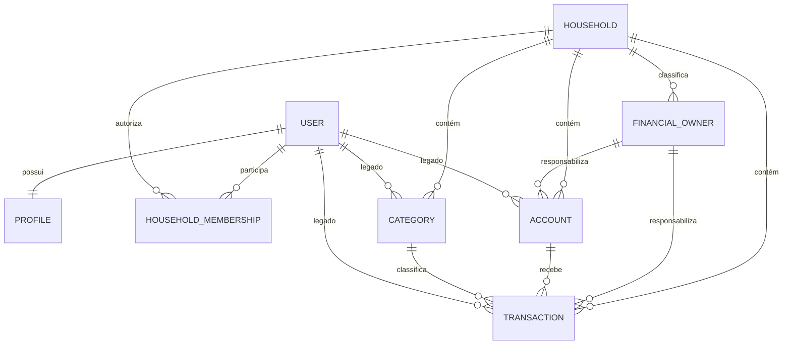

# Arquitetura atual

## Stack

| Camada | Tecnologia |
|---|---|
| Linguagem | Python 3.12 |
| Framework | Django 5.2.13 |
| Servidor WSGI | Gunicorn 23.0.0, um worker |
| Interface web | Django Templates + TailwindCSS via CDN |
| Banco | SQLite, caminho definido por `SQLITE_PATH` |
| Autenticação | `django.contrib.auth`, login por e-mail |
| Testes/qualidade | Django TestCase, coverage 7.13.5, Ruff 0.15.11 |
| Infra | Docker/Compose; produção caseira no EasyPanel [VALIDAR NO AMBIENTE REAL] |

As demais versões exatas estão em `requirements.txt`.

## Estilo arquitetural

Monólito Django organizado por apps de domínio, com Class-Based Views,
ModelForms e ORM. Não é uma API mobile neste estado: a interface é renderizada
no servidor. A migração futura para Flutter deve consumir uma API a ser
projetada sem remover o backend nem o banco do servidor.

## Apps

| App | Responsabilidade |
|---|---|
| `core` | settings, URLs raiz, dashboard e backup |
| `users` | usuário customizado, login e logout |
| `profiles` | perfil 1:1 |
| `households` | Lar, memberships, responsáveis, bootstrap e auditoria |
| `accounts` | contas financeiras |
| `categories` | categorias de receita/despesa |
| `transactions` | movimentações financeiras |
| `ai` | instalado, mas sem comportamento de produto confirmado [INVESTIGAR] |

## Fronteira de segurança

`Household` é a unidade de autorização e consolidação. O acesso exige uma
`HouseholdMembership` ativa. Os responsáveis `self`, `spouse` e `shared`
servem para classificação financeira; não concedem acesso.

As views usam `HouseholdContextMixin` e filtram pelo Lar. Contas, categorias e
movimentações validam a participação ativa do usuário legado e a coerência de
Lar. As FKs legadas `user` usam `PROTECT` para evitar apagar o livro
financeiro ao excluir um usuário.

## Modelo de dados

Regras principais:

- único par `(household, user)` de membership;
- no máximo uma membership ativa por usuário;
- um responsável ativo de cada tipo esperado por Lar;
- categoria única por `(household, name, type)`;
- conta, categoria, responsável e transação devem apontar para o mesmo Lar.

## Rotas web

| Método principal | Caminho | Finalidade |
|---|---|---|
| GET | `/` | redireciona para login ou dashboard |
| GET/POST | `/login/` | autenticação privada |
| POST | `/logout/` | encerrar sessão |
| GET | `/dashboard/` | painel consolidado do Lar |
| GET/POST | `/profile/edit/` | edição de perfil |
| GET | `/accounts/` | listar contas |
| GET/POST | `/accounts/new/` | criar conta |
| GET/POST | `/accounts/<id>/edit/` | editar conta |
| GET/POST | `/accounts/<id>/delete/` | excluir conta |
| GET | `/categories/` | listar categorias |
| GET/POST | `/categories/novo/` | criar categoria |
| GET/POST | `/categories/<id>/editar/` | editar categoria |
| GET/POST | `/categories/<id>/excluir/` | excluir categoria |
| GET | `/transacoes/` | listar e filtrar movimentações |
| GET/POST | `/transacoes/nova/` | criar movimentação |
| GET/POST | `/transacoes/<id>/editar/` | editar movimentação |
| GET/POST | `/transacoes/<id>/excluir/` | excluir movimentação |
| GET/POST | `/admin/` | administração Django |

Não há endpoints REST versionados no estado atual.

## Persistência e operação

`SQLITE_PATH` pode apontar para qualquer caminho; produção deve usar o caminho
absoluto `/app/data/db.sqlite3` em volume persistente. O Compose monta o
volume, mas o EasyPanel precisa de configuração manual.

`backup_sqlite` usa a API de backup do SQLite e verifica a cópia.
`audit_household_integrity` é somente leitura, produz contagens sem PII e
falha quando encontra inconsistências.

## Limites atuais

- SQLite limita escala horizontal e exige uma réplica/worker.
- Não existe rate limit dentro do Django; o controle deve ser configurado no
  proxy/EasyPanel.
- Não há API para Flutter.
- Observabilidade está baseada em logs do processo/proxy; métricas e alertas
  continuam [INVESTIGAR].
- A operação real do runbook no EasyPanel ainda não foi validada.
