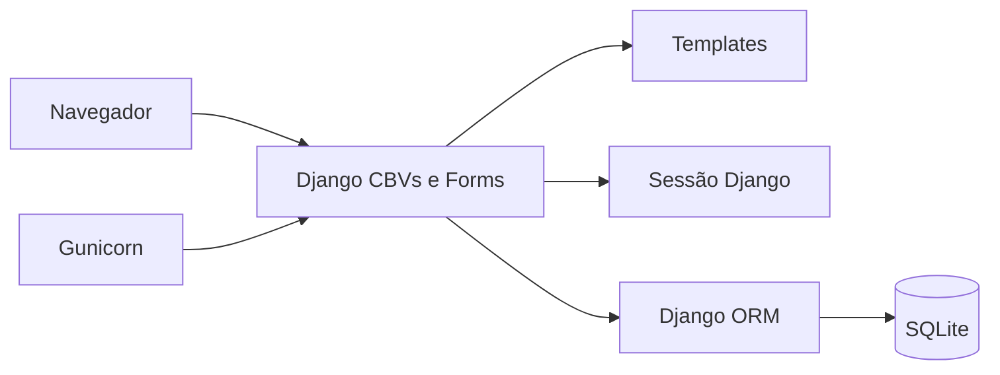
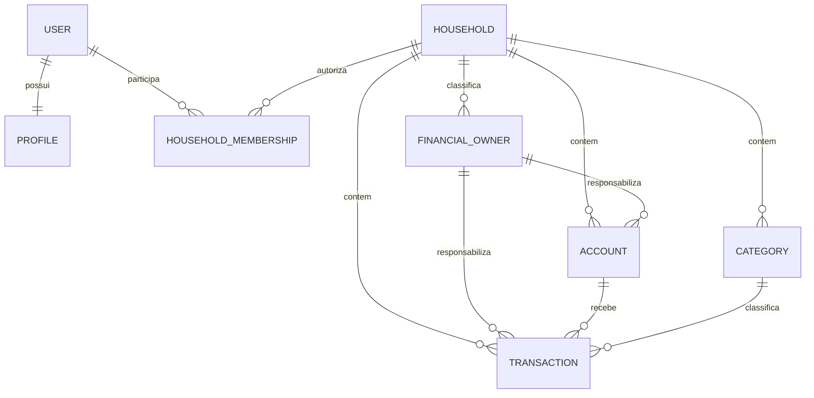
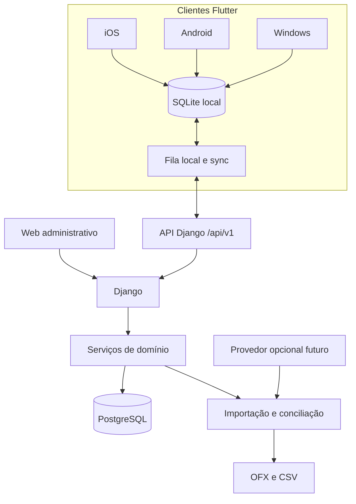

# Arquitetura do Lar Finance

## Objetivo

Evoluir incrementalmente o monólito Django para uma plataforma financeira
privada e multiplataforma. O backend continua no Linux/EasyPanel; Flutter será
a interface principal para iOS, Android e Windows depois da criação da API.

## Estado atual comprovado

| Camada | Tecnologia |
|---|---|
| Linguagem | Python 3.12 |
| Framework | Django 5.2.13 |
| Servidor | Gunicorn 23.0.0, um worker no container |
| Interface | Django Templates e TailwindCSS via CDN |
| Banco | SQLite em caminho absoluto definido por `SQLITE_PATH` |
| Autenticação | sessão Django e login por email |
| Qualidade | Django TestCase, Coverage 7.13.5 e Ruff 0.15.11 |
| Infra | Docker/Compose; EasyPanel doméstico ainda não validado nesta sprint |

Não existe API mobile, fila, cache, importador bancário ou protocolo de
sincronização no código atual.

## Domínios atuais

| App | Responsabilidade |
|---|---|
| `users` e `profiles` | identidade e perfil |
| `households` | Lar, associações, responsáveis, autorização e auditoria |
| `accounts` | contas financeiras |
| `categories` | categorias do Lar |
| `transactions` | movimentações |
| `core` | dashboard, configuração, backup e rotas principais |
| `ai` | instalado, sem comportamento produtivo confirmado `[INVESTIGAR]` |

## Fronteira de segurança entregue na Sprint 1

`Household` é a unidade de autorização e consolidação. O acesso exige uma
`HouseholdMembership` ativa. Os responsáveis `self`, `spouse` e `shared`
classificam a responsabilidade financeira; eles não concedem acesso.

As views financeiras usam `HouseholdContextMixin` e filtram pelo Lar. Models e
forms validam coerência entre Lar, usuário legado, conta, categoria e responsável.
As FKs legadas de usuário usam `PROTECT` para impedir a exclusão acidental do
livro financeiro.

O dashboard consolida os três responsáveis. Um usuário não pode manter mais de
uma associação ativa, mas o modelo aceita mais de um usuário dentro do mesmo
Lar. A decisão de usar um ou dois logins no cotidiano será registrada na
especificação da autenticação `[INVESTIGAR]`.

## Operação atual

- SQLite fica em `/app/data/db.sqlite3` no container.
- O diretório `/app/data` deve ser volume persistente.
- Enquanto houver SQLite, operar com uma réplica e um worker.
- `backup_sqlite` cria uma cópia consistente e verifica sua integridade.
- `audit_household_integrity` consulta apenas contagens e falha diante de
  inconsistências.
- O runbook real do EasyPanel ainda precisa ser validado sem tocar a base real.

## O que será preservado

- autenticação por email e validadores de senha;
- Lar, membros e responsáveis financeiros;
- entidades de conta, categoria e movimentação como base de migração;
- regras de integridade, suíte Django, Docker e operação documentada;
- interface web como fallback administrativo durante a transição.

## O que não é arquitetura alvo

- templates web reutilizados como interface Flutter;
- sessão/cookie como autenticação mobile;
- SQLite como banco definitivo para concorrência e sincronização;
- cartão de crédito representado somente como tipo de conta;
- scraping bancário ou armazenamento de credenciais dos bancos.

## Arquitetura alvo incremental

### Limites propostos

- A API controla autenticação de dispositivos, escopo por Lar e serialização.
- Serviços de domínio concentram regras reutilizáveis por web, API e imports.
- Importadores convertem fontes para um contrato interno estável.
- O ledger armazena fatos confirmados; previsões ficam separadas.
- O cliente Flutter lê primeiro do banco local e sincroniza pela API.
- O provedor futuro usa o mesmo pipeline de normalização e deduplicação.

## Fluxo de sincronização alvo

1. O cliente registra uma operação local com UUID e versão conhecida.
2. A operação entra na outbox com chave idempotente.
3. A API valida membro ativo, Lar, versão e idempotência.
4. O servidor confirma a versão ou devolve conflito estruturado.
5. O cliente busca deltas desde o cursor confirmado.
6. Conflitos financeiros relevantes exigem resolução explícita.

Exclusões serão tombstones por período definido. `updated_at` do dispositivo não
decide sozinho qual versão vence.

## Evolução segura dos dados

- Novas migrations são aditivas e testadas em banco novo e legado.
- Backfills têm preflight, contagens e rollback documentado.
- A migração futura de SQLite para PostgreSQL exige backup restaurado em ensaio.
- Nenhuma migration destrutiva é aplicada automaticamente na base real.

## Limites e pontos para investigar

- contrato exato da API, tokens e revogação de dispositivos;
- escolha e versão dos pacotes Flutter, API e banco local;
- proxy, domínio, TLS, volumes e rate limit no EasyPanel real;
- política de conflito para edição simultânea;
- amostras anonimizadas de OFX/CSV das instituições do casal;
- necessidade de fila/worker após medir importações;
- função real do app `ai`;
- método de distribuição privada em iOS, Android e Windows.
