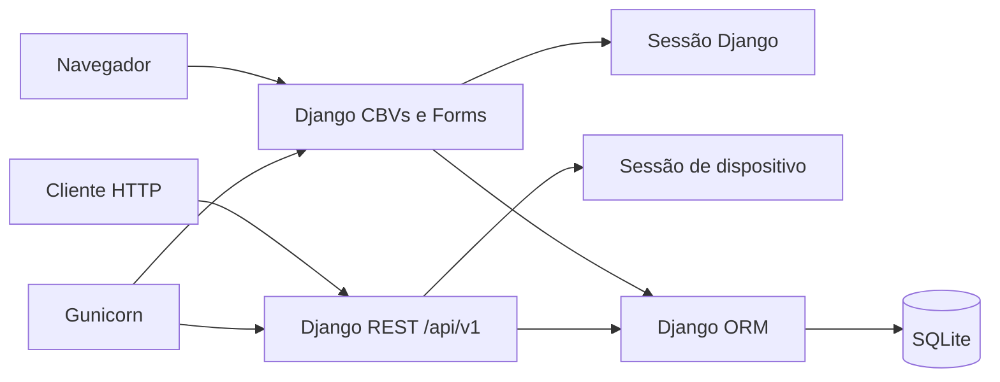
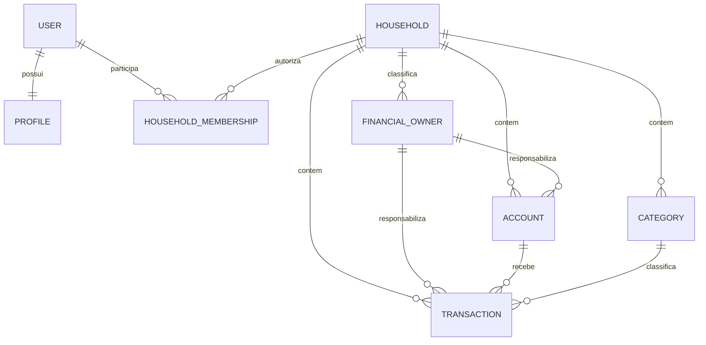
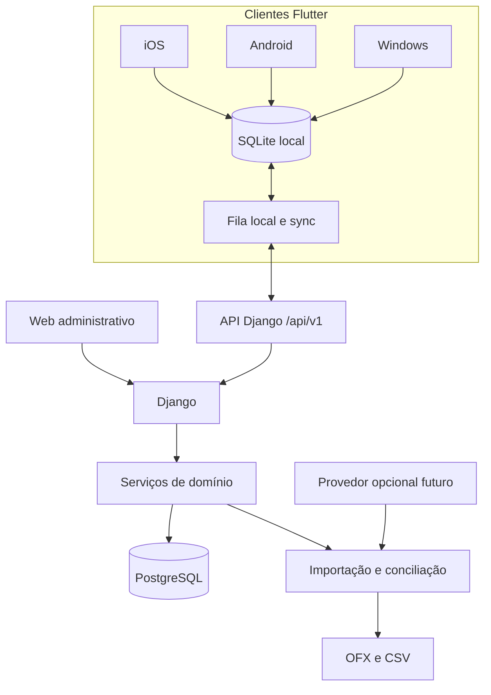

# Arquitetura do Lar Finance

## Objetivo

Evoluir incrementalmente o monólito Django para uma plataforma financeira
privada e multiplataforma. O backend continua no Linux/EasyPanel; Flutter será
a interface principal para iOS, Android e Windows depois da criação da API.

## Estado atual comprovado

| Camada | Tecnologia |
|---|---|
| Linguagem | Python 3.12 |
| Framework | Django 5.2.13 |
| Servidor | Gunicorn 23.0.0, um worker no container |
| Interface | Django Templates e TailwindCSS via CDN |
| Banco | SQLite em caminho absoluto definido por `SQLITE_PATH` |
| Autenticação | sessão Django no web; tokens opacos por dispositivo na API v1 |
| Qualidade | Django TestCase, Coverage 7.13.5 e Ruff 0.15.11 |
| Infra | Docker/Compose; EasyPanel doméstico ainda não validado nesta sprint |

A API v1 e o protocolo de sincronização existem no backend. Não há cliente
Flutter entregue, fila/worker, cache compartilhado, importador bancário nem
deploy EasyPanel validado nesta sprint.

## API v1 entregue

O contrato publicado em `docs/openapi-v1.yaml` é a fonte única OpenAPI 3.1 das
16 rotas atuais:

- saúde: `GET /health/`;
- autenticação: `POST /auth/login/`, `/auth/refresh/` e `/auth/logout/`;
- dispositivos: `GET /devices/`, `PATCH /devices/current/` e
  `POST /devices/{device_uuid}/revoke/`;
- leitura do Lar: `GET /household/`, `/owners/`, `/accounts/`, `/categories/`,
  `/transactions/`, `/summary/` e `/bootstrap/`;
- sincronização: `POST /sync/push/` e `GET /sync/changes/`.

As rotas privadas autenticam uma `DeviceSession` e restringem recursos ao Lar
da sessão. O push aceita até 100 operações, mantém idempotência por dispositivo
e `operation_id` e devolve validações/conflitos na posição correspondente do
lote. O pull devolve até 100 mudanças ordenadas depois de um cursor assinado;
exclusões são representadas por tombstones. As listas simples de recursos ainda
não oferecem filtros ou paginação.

## Domínios atuais

| App | Responsabilidade |
|---|---|
| `users` e `profiles` | identidade e perfil |
| `households` | Lar, associações, responsáveis, autorização e auditoria |
| `accounts` | contas financeiras |
| `categories` | categorias do Lar |
| `transactions` | movimentações |
| `core` | dashboard, configuração, backup e rotas principais |
| `ai` | instalado, sem comportamento produtivo confirmado `[INVESTIGAR]` |

## Fronteira de segurança entregue na Sprint 1

`Household` é a unidade de autorização e consolidação. O acesso exige uma
`HouseholdMembership` ativa. Os responsáveis `self`, `spouse` e `shared`
classificam a responsabilidade financeira; eles não concedem acesso.

As views financeiras usam `HouseholdContextMixin` e filtram pelo Lar. Models e
forms validam coerência entre Lar, usuário legado, conta, categoria e responsável.
As FKs legadas de usuário usam `PROTECT` para impedir a exclusão acidental do
livro financeiro.

O dashboard consolida os três responsáveis. Um usuário não pode manter mais de
uma associação ativa, mas o modelo aceita mais de um usuário dentro do mesmo
Lar. Nesta fase, o casal usará um login compartilhado com sessões independentes
por dispositivo. A separação do modelo permite adotar dois logins no futuro sem
migrar os registros financeiros.

## Operação atual

- SQLite fica em `/app/data/db.sqlite3` no container.
- O diretório `/app/data` deve ser volume persistente.
- Enquanto houver SQLite, operar com uma réplica e um worker.
- `backup_sqlite` cria uma cópia consistente e verifica sua integridade.
- `audit_household_integrity` consulta apenas contagens e falha diante de
  inconsistências.
- O runbook real do EasyPanel ainda precisa ser validado sem tocar a base real.

## O que será preservado

- autenticação por email e validadores de senha;
- Lar, membros e responsáveis financeiros;
- entidades de conta, categoria e movimentação como base de migração;
- regras de integridade, suíte Django, Docker e operação documentada;
- interface web como fallback administrativo durante a transição.

## O que não é arquitetura alvo

- templates web reutilizados como interface Flutter;
- sessão/cookie como autenticação mobile;
- SQLite como banco definitivo para concorrência e sincronização;
- cartão de crédito representado somente como tipo de conta;
- scraping bancário ou armazenamento de credenciais dos bancos.

## Arquitetura alvo incremental

### Limites atuais e direção

- A API controla autenticação de dispositivos, escopo por Lar e serialização.
- Serviços de domínio concentram regras reutilizáveis por web, API e imports.
- Importadores convertem fontes para um contrato interno estável.
- O ledger armazena fatos confirmados; previsões ficam separadas.
- Um futuro cliente Flutter deverá ler primeiro do banco local e sincronizar pela API.
- O provedor futuro usa o mesmo pipeline de normalização e deduplicação.

## Contrato de sincronização do backend

1. Um cliente envia uma operação com UUID, `operation_id` e versão conhecida.
2. Uma futura outbox local poderá repetir a mesma operação com segurança.
3. A API valida membro ativo, Lar, versão e idempotência.
4. O servidor confirma a versão ou devolve conflito estruturado.
5. O cliente busca deltas desde o cursor confirmado.
6. A resolução de conflito no cliente ainda não foi implementada.

Exclusões são emitidas como tombstones no delta. A política de retenção desses
eventos ainda não foi definida. `updated_at` do dispositivo não decide sozinho
qual versão vence.

## Evolução segura dos dados

- Novas migrations são aditivas e testadas em banco novo e legado.
- Backfills têm preflight, contagens e rollback documentado.
- A migração futura de SQLite para PostgreSQL exige backup restaurado em ensaio.
- Nenhuma migration destrutiva é aplicada automaticamente na base real.

## Limites e pontos para investigar

- escolha e versão dos pacotes Flutter, API e banco local;
- proxy, domínio, TLS, volumes e rate limit no EasyPanel real;
- experiência de resolução de conflito no cliente;
- amostras anonimizadas de OFX/CSV das instituições do casal;
- necessidade de fila/worker após medir importações;
- função real do app `ai`;
- método de distribuição privada em iOS, Android e Windows.
