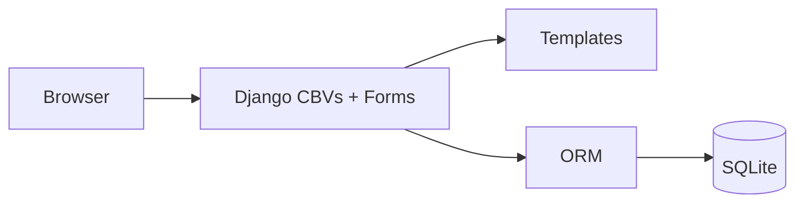
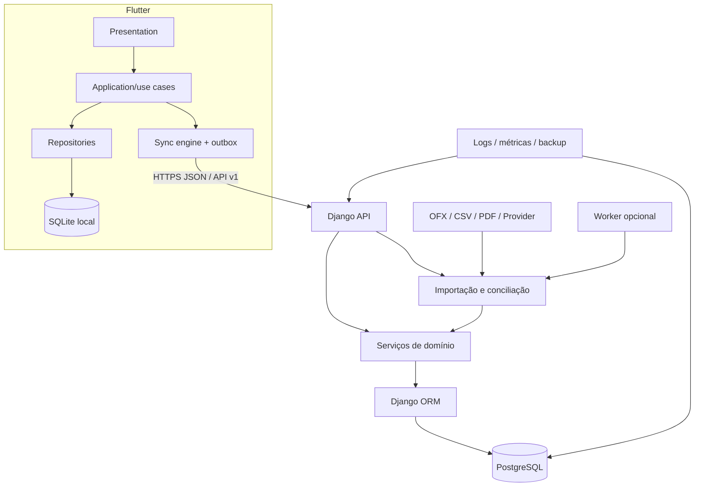

# Arquitetura do Lar Finance

## Objetivo

Evoluir o monólito Django existente para uma plataforma privada, sincronizada e multiplataforma sem descartar o código funcional. O backend continua no Linux/EasyPanel; Flutter passa a ser a interface principal para iOS, Android e Windows.

## Estado atual

O repositório é um monólito Django 5.2.13/Python 3.12 server-rendered com SQLite. Os apps `accounts`, `categories`, `transactions`, `users` e `profiles` implementam CRUD e autenticação por sessão. O `core` agrega dashboard, settings e rotas. Não existe API, fila, cache, importador ou protocolo de sincronização.

### O que será preservado

- custom user por email e validação de senha;
- isolamento por usuário presente nas views e testes;
- entidades de conta, categoria e transação como ponto de migração;
- regras básicas de saldo, reescritas para o novo domínio;
- suíte Django, Docker e implantação EasyPanel;
- fallback web administrativo durante a transição.

### O que não deve ser reaproveitado como arquitetura alvo

- templates web como UI Flutter;
- sessão/cookie como autenticação mobile;
- SQLite do servidor para concorrência e sincronização;
- cartão de crédito representado como um tipo de conta;
- landing e signup públicos;
- scripts de QA com dados/credenciais fixos.

## Arquitetura alvo

## Limites de domínio propostos

| Módulo | Responsabilidade | Origem atual |
|---|---|---|
| Identity | login, sessão, dispositivos e segurança | `users`, `profiles` |
| Household | lar e proprietários financeiros | novo |
| Ledger | contas, transações, transferências e categorias | `accounts`, `transactions`, `categories` |
| Cards | cartões, limites, faturas e parcelas | novo; extrair `Account.CREDIT` |
| Planning | recorrências, orçamento, calendário e metas | novo |
| Credit | empréstimos, financiamentos e parcelas | novo |
| Wealth | investimentos, bens, passivos e patrimônio | novo |
| Imports | parsing, normalização, deduplicação e conciliação | novo |
| Sync | delta, outbox, conflitos e dispositivos | novo |
| Reporting | projeções e indicadores explicáveis | parte do dashboard atual |
| Audit | eventos imutáveis relevantes | novo |

Separação em apps Django deve ocorrer quando o modelo de cada domínio existir. Não criar microserviços; o custo operacional não se justifica para uma família.

## Contratos principais

### API

- prefixo `/api/v1/`;
- OpenAPI versionado antes do cliente;
- IDs externos em UUID;
- timestamps ISO 8601 em UTC e timezone do lar separado;
- dinheiro como string decimal + código ISO de moeda;
- paginação por cursor para movimentações;
- `Idempotency-Key` para criação/importação;
- erro estruturado com código, mensagem segura e campos;
- ETag/versão para atualização otimista `[INVESTIGAR decisão final]`.

### Sincronização

1. cliente grava mudança local e item na outbox numa única transação;
2. cliente envia operações com ID idempotente;
3. servidor valida versão e aplica ou responde conflito;
4. cliente busca delta depois do cursor confirmado;
5. exclusões usam tombstone até todos os dispositivos avançarem;
6. conflito financeiro não determinístico vira `ReconciliationIssue`.

### Importadores

Todo importador implementa:

- `detect(source)`: confiança de que conhece o arquivo;
- `parse(source)`: registros brutos sem alterar o ledger;
- `normalize(record)`: estrutura canônica;
- `fingerprint(record)`: chave estável para deduplicação;
- `validate(record)`: erros e avisos;
- `preview(batch)`: resumo antes de confirmar;
- `commit(batch)`: aplicação atômica e auditada.

## Migração incremental

1. conter segurança e estabilizar backup;
2. criar `Household` e `FinancialOwner`, migrando todos os dados atuais para o proprietário padrão;
3. introduzir UUID/versionamento sem remover PKs internos;
4. separar cartões das contas por migração de dados testada;
5. criar API sobre o domínio existente;
6. implementar importador e cliente Flutter em paralelo ao web fallback;
7. migrar SQLite para PostgreSQL com janela e rollback;
8. retirar telas web de uso diário apenas quando Flutter atingir paridade.

## ADRs obrigatórios

- ADR-001: pacote e estratégia de API/autenticação.
- ADR-002: PostgreSQL e plano de migração no EasyPanel.
- ADR-003: SQLite local e gerenciamento de estado Flutter.
- ADR-004: protocolo de sync, conflito e tombstones.
- ADR-005: retenção/criptografia de arquivos importados.
- ADR-006: jobs assíncronos ou processamento síncrono.
- ADR-007: distribuição privada iOS/Android/Windows.
- ADR-008: design system final.

## Restrições de operação

- servidor doméstico pode ficar offline; clientes devem continuar em leitura e cadastro local;
- backup fora do host é requisito antes de migrar dados reais;
- tarefas de importação não podem bloquear workers HTTP por tempo indefinido;
- nenhuma mudança destrutiva de migrations ocorre sem backup e ensaio de restauração;
- configurações externas do EasyPanel precisam ser documentadas sem segredos.

## Pontos para investigar

- função real e maturidade do app `ai`.
- proxy, domínio, TLS, volumes e política de restart no EasyPanel.
- volume real de transações e tamanho esperado dos arquivos.
- necessidade de worker/Redis depois de medir a duração dos imports.
- política de conflito para edição simultânea da mesma transação.
- disponibilidade de push/background sync em cada forma de distribuição.
