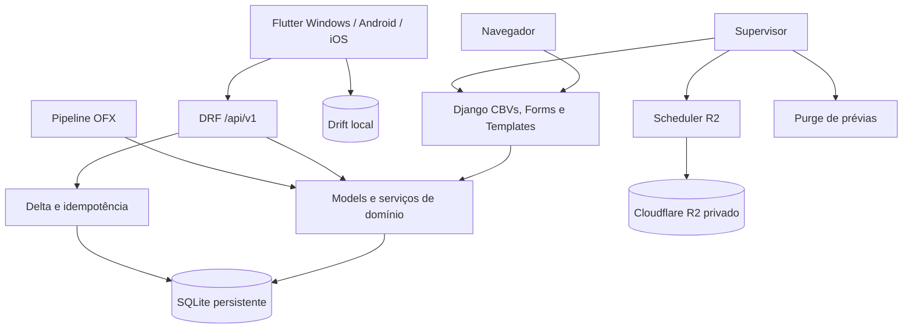
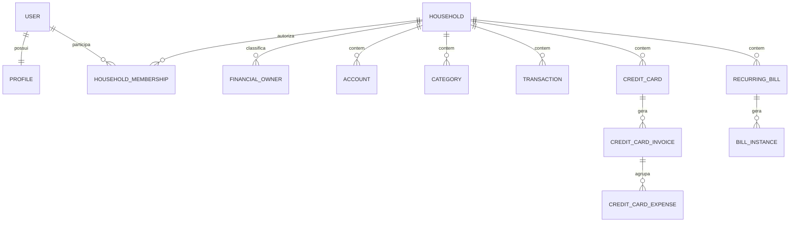
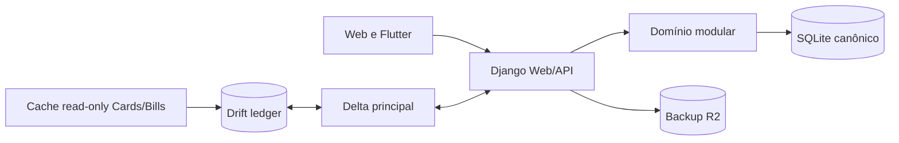

# Arquitetura do Lar Finance

> Estado revalidado em 20/08/2026 no `main` `4810af4`. O alvo imediato é uma
> versão pessoal confiável; não há rewrite ou migração obrigatória para
> PostgreSQL.

## Visão geral

Lar Finance é um monólito modular Django com duas interfaces:

- Web server-rendered com sessão Django;
- Flutter para Windows, Android e iOS com API privada e sessão por dispositivo.

SQLite no EasyPanel é a fonte canônica. A topologia suportada é uma réplica e um
worker Gunicorn. Supervisor inicia web, backup R2 e purge de prévias OFX. O
cliente Flutter usa Drift para o ledger principal e Secure Storage para tokens.

## Stack atual

| Camada | Tecnologia |
|---|---|
| Backend | Python 3.12, Django 5.2.13 e DRF 3.17.1 |
| Servidor | Gunicorn 23.0.0, um worker |
| Banco canônico | SQLite por `SQLITE_PATH` |
| Web | Django Templates, Tailwind CDN, Alpine CDN e Chart.js CDN |
| Flutter | Flutter 3.47.0 / Dart 3.13.0 |
| Estado cliente | Riverpod 3.4.2 |
| Banco cliente | Drift 2.34.3 / SQLite |
| Transporte | Dio 5.11.0 e tokens opacos rotativos |
| Operação | Docker, Supervisor 4.3.0, EasyPanel e R2 |

## Módulos Django

| App | Responsabilidade |
|---|---|
| `core` | settings, dashboard, backup e comandos globais |
| `users`, `profiles` | autenticação por email e perfil |
| `households` | Lar, membership, owners, autorização e auditoria |
| `accounts` | contas e saldo inicial |
| `categories` | categorias e orçamento |
| `transactions` | receitas, despesas, lançamento rápido e OFX Web |
| `imports` | lote, prévia, vínculo, deduplicação e confirmação OFX |
| `cards` | cartões, despesas, faturas, importação e pagamento |
| `bills` | contas fixas, ocorrências, vencimento e pagamento |
| `api` | autenticação por dispositivo e 32 rotas privadas/públicas |
| `sync` | delta/idempotência do ledger principal |
| `ai` | instalado sem fluxo produtivo comprovado `[INVESTIGAR]` |

## Fronteira de segurança

`Household` é a unidade de autorização e consolidação. Acesso exige
`HouseholdMembership` ativa. `FinancialOwner` classifica `self`, `spouse` e
`shared`; não concede acesso.

Views financeiras devem usar `HouseholdContextMixin`, filtrar pelo Lar e validar
que conta, categoria, cartão, conta fixa e owner pertencem ao mesmo Lar. FKs
legadas de usuário usam `PROTECT` quando necessário para rastreabilidade.

## API e sincronização

O OpenAPI em `docs/openapi-v1.yaml` possui 32 paths. A API cobre health,
autenticação, dispositivos, Lar/owners, ledger, bootstrap, push/pull, OFX,
cartões/faturas e contas fixas.

### Ledger sincronizável

`sync/registry.py` registra somente:

- Account;
- Category;
- Transaction.

Essas entidades usam UUID, versão, mudanças incrementais, tombstones e aplicação
atômica no Drift. O cliente mantém metadata de sessão para impedir cache de uma
sessão anterior.

### Recursos online

Cartões, faturas e contas fixas usam endpoints REST diretos e IDs inteiros. Não
possuem tabelas Drift nem participação no delta central. O servidor é a
autoridade; escrita requer internet. O ciclo R4 pode adicionar cache de última
leitura, sem criar uma segunda outbox.

Essa distinção deve aparecer na UI e na documentação. Não alegar offline-first
para um recurso apenas porque existe no Flutter.

## Importação

O fluxo OFX limita upload, descarta o arquivo bruto após normalização, cria
prévia temporária, vincula conta/owner, deduplica e confirma atomicamente. Há
fluxos Web e Flutter e importação específica de extrato de cartão. Campos não
presentes no arquivo não são inferidos.

CSV, PDF/OCR, outros bancos e Open Finance permanecem opcionais.

## Operação e observabilidade

- SQLite: `/app/data/db.sqlite3` em volume persistente;
- uma réplica e um worker enquanto SQLite for canônico;
- backup consistente e verificado enviado ao R2;
- retenção R2 `14/8/12` e restauração ensaiada;
- logs JSON e `X-Request-ID` na API;
- `/api/v1/health/` sem SHA no estado atual;
- sem métricas/tracing/alertas externos completos.

### Dívida de inicialização

`core/wsgi.py` executa `migrate` durante o startup Gunicorn e captura a exceção.
Esse comportamento é fail-open e deve ser substituído no ciclo R1 por:

1. backup/preflight;
2. auditoria;
3. migration única e fail-fast;
4. inicialização do Supervisor somente após sucesso.

## Arquitetura alvo de fechamento

Princípios:

- evolução incremental, sem rewrite;
- SQLite permanece enquanto atender uma família/um worker;
- dinheiro usa Decimal no backend e minor units/exatidão no cliente;
- conflitos financeiros não são sobrescritos silenciosamente;
- Web e Flutter seguem Casa de Valores 2.0;
- tecnologia opcional só entra por dor comprovada.

## Não bloqueia a V1

- PostgreSQL, fila e múltiplas réplicas;
- escrita offline para cartões/contas fixas;
- empréstimos, investimentos e patrimônio avançado;
- Open Finance/Pierre;
- lojas públicas e telemetria complexa.

## Decisões pendentes

- rollback por imagem/tag imutável;
- cache de leitura de cartões/contas fixas;
- retenção de tombstones;
- rate limit persistente e alertas externos;
- método de instalação privada no iPhone;
- função real do app `ai`.
