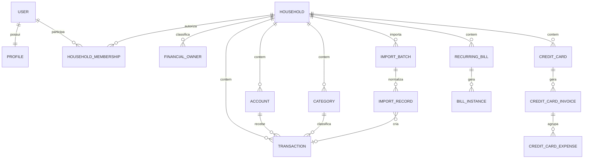

# Modelo de dados do Lar Finance

> Estado extraído dos models e migrations no `main` `4810af4`, em 20/08/2026.
> Propostas antigas de cartão, recorrência, empréstimos e investimentos não devem
> ser confundidas com o schema atual.

## Princípios

- `Household` é a fronteira de autorização e consolidação;
- `FinancialOwner` representa `Eu`, `Esposa` e `Conjunto`, não uma credencial;
- dinheiro usa `Decimal` no backend e representação exata no cliente;
- campos ausentes não viram zero por conveniência;
- importação preserva hash/referência, não o arquivo OFX bruto;
- entidades sincronizáveis usam UUID, versão e mudança/tombstone;
- vínculos entre Lar, owner, conta e categoria são validados.

## Schema atual

## Identidade, Lar e sessão

| Entidade | Campos/regras principais |
|---|---|
| `users.User` | email único, senha/flags Django e timestamps |
| `profiles.Profile` | dados de perfil e avatar, 1:1 com User |
| `Household` | UUID, nome, ativo e timestamps |
| `HouseholdMembership` | user, Lar, papel, ativo; uma associação ativa por usuário |
| `FinancialOwner` | UUID, Lar, nome, código `self/spouse/shared`, ativo |
| `DeviceSession` | UUID, user, Lar, owner padrão, plataforma, digests, expiração e revogação |
| `UsedRefreshToken` | digest de refresh consumido e sessão relacionada |

O primeiro uso mantém um login familiar compartilhado e owners separados. O
modelo aceita evolução futura para dois logins sem migrar o ledger.

## Ledger principal

| Entidade | Campos/regras principais |
|---|---|
| `Account` | UUID, versão, Lar, owner, nome, tipo, saldo inicial e moeda |
| `Category` | UUID, versão, Lar, nome, tipo, cor, ícone e teto mensal |
| `Transaction` | UUID, versão, Lar, owner, conta, categoria, descrição, Decimal, data e tipo |
| `SyncChange` | cursor, entidade, UUID, versão, operação e payload por Lar |
| `IdempotentOperation` | dispositivo, operation ID, hash, resposta e status |

Account, Category e Transaction são as únicas entidades registradas atualmente
em `sync/registry.py`. Elas formam o ledger com pull/delta, idempotência e
tombstones.

## Importação OFX

| Entidade | Campos/regras principais |
|---|---|
| `ImportAccountLink` | Lar, conta, provider, tipo de produto e conta externa; chave única |
| `ImportBatch` | UUID, Lar, sessão, conta/owner opcionais, provider, produto, hash, período, expiração, status e contagens |
| `ImportRecord` | UUID, lote, linha, external ID, data, Decimal, descrição, tipo, fingerprint, resultado e Transaction opcional |
| `SourceReference` | conta, provider, external ID e Transaction; chave única |

Prévia fica acionável pelo prazo definido no fluxo, pode ser cancelada/expirada e
só altera o ledger após confirmação atômica. OFX bruto é descartado depois da
normalização.

## Cartões e faturas

| Entidade | Campos/regras principais |
|---|---|
| `CreditCard` | Lar, user legado, owner, nome, limite Decimal > 0, fechamento, vencimento, cor, bandeira, últimos dígitos e ativo |
| `CreditCardInvoice` | cartão, Lar, mês/ano único, fechamento, vencimento, status, valor pago, conta e Transaction de pagamento |
| `CreditCardExpense` | cartão, fatura, Lar, user, owner, categoria, descrição, Decimal > 0, data, parcela atual/total, grupo e external ID |

O total da fatura é agregado das despesas. Pagamento pode gerar vínculo com conta
e Transaction. Cartões usam IDs inteiros e não participam do registro central de
sync/Drift.

## Contas fixas

| Entidade | Campos/regras principais |
|---|---|
| `RecurringBill` | Lar, user, owner, nome, Decimal > 0, vencimento, receita/despesa, categoria, conta padrão, ativo e notas |
| `BillInstance` | regra, Lar, owner, mês/ano único, data, Decimal > 0, status, pagamento, conta e Transaction vinculada |

As instâncias representam o compromisso mensal e podem ser pagas ou reabertas.
Contas fixas também usam IDs inteiros e API direta, sem delta central/Drift.

## Restrições essenciais

- owner pertence ao mesmo Lar da entidade;
- conta, categoria, cartão e conta fixa não atravessam Lar;
- dinheiro persistido no backend é Decimal com duas casas;
- limite, despesa de cartão e conta fixa exigem valor positivo;
- uma fatura é única por cartão/mês/ano;
- uma instância é única por regra/mês/ano;
- parcela atual/total fica entre 1 e 48;
- SourceReference impede external ID repetido na mesma conta/provider;
- refresh consumido não pode ser reutilizado;
- timestamp do cliente não decide sozinho qual versão vence.

## Dívidas atuais

- Flutter Cards/Bills representa quantias com `double`; migrar para minor units
  ou decimal exato no ciclo R1;
- cartões e contas fixas não possuem UUID, versão, tombstone ou cache Drift;
- não existe `Institution` normalizada;
- transferência não possui duas pontas explícitas;
- não existe auditoria financeira genérica além de import/sync;
- migration automática dentro do WSGI é fail-open e será retirada.

## Evolução aprovada para a V1

1. corrigir precisão monetária no Flutter sem migration destrutiva do backend;
2. manter servidor como autoridade de Cards/Bills;
3. adicionar cache somente leitura desses módulos se necessário;
4. preservar o ledger atual e suas migrations;
5. não introduzir PostgreSQL, empréstimos ou investimentos sem dor real.

## Backlog opcional

`Institution`, `Transfer`, `AuditEvent`, `Loan`, `LoanInstallment`,
`InvestmentPosition`, `Asset`, `Liability`, `ProviderConnection`, múltiplas
moedas e novas fontes de importação não bloqueiam a primeira versão pessoal.
