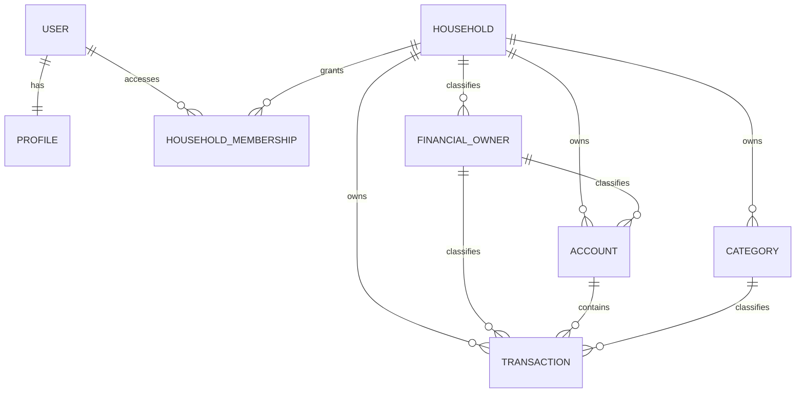
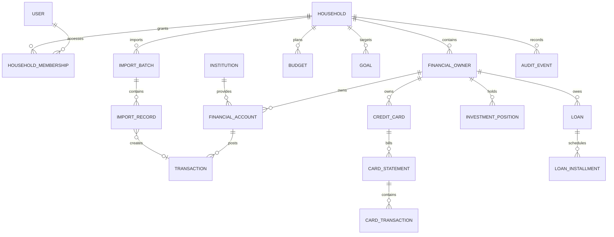

# Modelo de dados do Lar Finance

## Princípios

- fonte canônica no servidor e cache operacional local;
- valores monetários em decimal, moeda obrigatória;
- nenhum dado ausente é convertido em zero;
- evento importado preserva origem e hash;
- propriedade individual e consolidação familiar coexistem;
- lançamentos contábeis relacionados têm vínculo explícito;
- exclusão sincronizada e auditável.

## Estado atual

O modelo atual cobre usuário, perfil, Lar, associação ativa, responsáveis `self`, `spouse` e `shared`, conta genérica, categoria e transação receita/despesa. As entidades financeiras ainda preservam a FK legada de usuário com `PROTECT` para migração e auditoria.

## Modelo alvo conceitual

## Entidades e campos mínimos

### Identidade e lar

| Entidade | Campos mínimos |
|---|---|
| `Household` | UUID, nome, timezone, moeda base, timestamps, versão |
| `HouseholdMembership` | user, household, role, status, timestamps |
| `FinancialOwner` | UUID, household, nome de exibição, tipo pessoa/conjunto, ativo |
| `SyncDevice` | UUID, user, plataforma, nome, último cursor, revogado em |

O backfill entregue cria um `Household`, uma associação ativa e os responsáveis `Eu`, `Esposa` e `Conjunto`, ligando os dados existentes ao Lar e ao responsável padrão. Nesta fase haverá um login familiar compartilhado, com sessão e responsável padrão independentes por dispositivo. O modelo aceita mais de um usuário para uma evolução futura sem migrar o ledger.

### Instituições, contas e caixa

| Entidade | Campos mínimos |
|---|---|
| `Institution` | UUID, código interno, nome, país, aliases, ativo |
| `FinancialAccount` | UUID, owner, institution opcional, nome, tipo, moeda, saldo inicial, saldo informado, data do saldo, status |
| `Transaction` | UUID, account, owner, data efetiva, data de lançamento, descrição original/normalizada, valor assinado, moeda, status, categoria, contraparte, origem, fingerprint |
| `Transfer` | UUID, transação de origem, transação de destino, status de conciliação |
| `BalanceSnapshot` | account, instante, saldo informado, origem, import batch |

O tipo do lançamento alvo é derivado pelo sinal/contexto. Manter `income/expense` como classificação gerencial, não como único mecanismo contábil.

### Cartões

| Entidade | Campos mínimos |
|---|---|
| `CreditCard` | UUID, owner, institution, apelido, final opcional, bandeira opcional, limite informado, moeda, fechamento, vencimento, status |
| `CardStatement` | UUID, card, competência, abertura, fechamento, vencimento, total informado, total calculado, pagamento mínimo opcional, status |
| `CardTransaction` | UUID, statement, data compra/lançamento, descrição, valor, categoria, parcela atual/total, compra raiz, status |
| `StatementPayment` | statement, transaction da conta pagadora, valor, data, status de conciliação |

Limite disponível nunca é calculado se limite total estiver ausente. Parcelas futuras devem alimentar previsão, sem duplicar o valor já lançado.

### Planejamento

| Entidade | Campos mínimos |
|---|---|
| `RecurringRule` | household/owner, tipo, frequência, próxima data, valor previsto, variação, ativo |
| `Budget` | household, período, categoria/owner, valor planejado, rollover |
| `Goal` | household/owner, nome, alvo, prazo, valor atual calculado/manual, status |
| `PlannedCashFlow` | data, valor, origem recorrência/fatura/parcela/manual, confiança |

### Crédito e patrimônio

| Entidade | Campos mínimos |
|---|---|
| `Loan` | owner, institution, tipo, principal, saldo devedor informado, taxa, CET, sistema amortização, início/fim, status |
| `LoanInstallment` | loan, número, vencimento, principal, juros, encargos, total, pago em, status |
| `InvestmentPosition` | owner, institution, classe, ativo/ticker opcional, quantidade, custo, valor informado, data de referência, moeda |
| `Asset` | owner/household, tipo, descrição, valor estimado, data de avaliação, método |
| `Liability` | owner/household, tipo, descrição, saldo, data de referência; pode referenciar Loan |

Taxa, CET, amortização, posição e cotação podem não existir em exportações. São opcionais e exibidos como não informados.

### Importação e auditoria

| Entidade | Campos mínimos |
|---|---|
| `ImportBatch` | UUID, household, owner, institution, formato, arquivo hash, período, estado, contagens, timestamps |
| `ImportRecord` | batch, índice, payload normalizado, fingerprint, estado, warnings, entidade criada |
| `ReconciliationIssue` | tipo, entidades candidatas, severidade, estado, decisão e autor |
| `SourceReference` | provider/arquivo, external_id opcional, entidade, capturado em |
| `AuditEvent` | actor, device, ação, entidade/id, metadados seguros, instante |

## Restrições de integridade

- owner precisa pertencer ao mesmo household da entidade;
- conta/cartão e instituição precisam estar ativos para novos lançamentos;
- `amount != 0`, salvo ajuste explicitamente justificado `[INVESTIGAR]`;
- categoria pertence ao household e é compatível com a classificação;
- fingerprint é único no escopo de fonte+conta quando confiável;
- um pagamento não quita mais que o saldo da fatura sem registrar crédito;
- soma de parcelas deve reconciliar com a compra dentro da regra de arredondamento;
- moeda de valores comparados deve coincidir ou haver cotação explícita;
- `updated_at` do cliente não decide sozinho qual versão vence.

## Migrações planejadas

1. adicionar UUID, versionamento e soft delete às entidades existentes;
2. criar lar/owner e backfill transacional;
3. criar instituição e ligar contas quando conhecidas;
4. criar entidades de cartão e migrar `Account.type=credit` com relatório de exceções;
5. introduzir transferências e rever saldos;
6. criar importação/auditoria;
7. acrescentar planejamento, crédito e patrimônio em sprints separados.

Cada data migration deve ter teste, dry-run, contagem antes/depois e rollback documentado.

## Investigar com dados reais

- identificadores persistentes presentes em OFX/CSV de cada banco;
- representação de parcelamento e cartão adicional;
- saldo/limite disponível nas exportações;
- formato de empréstimos e investimentos;
- necessidade de múltiplas moedas;
- tratamento de compras pendentes e estornos.
