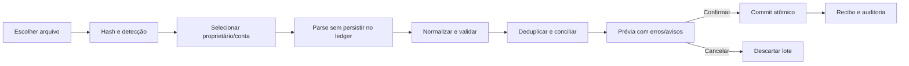
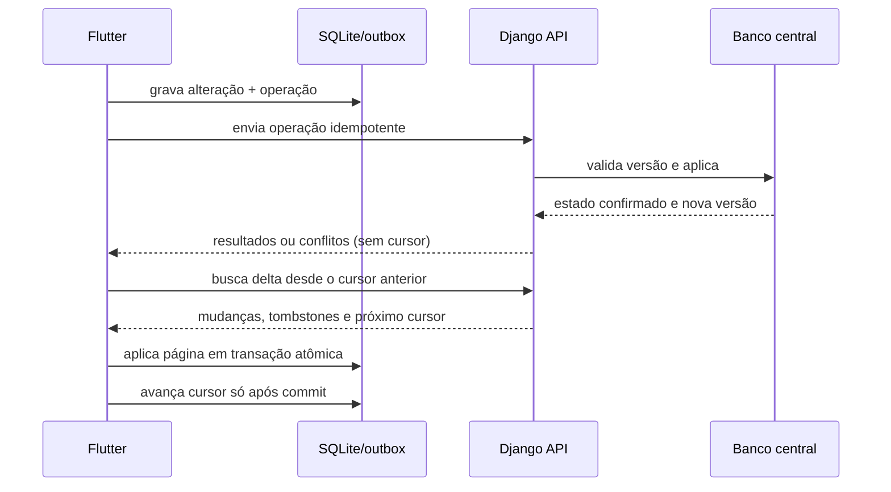

# Importação e sincronização

## Estratégia aprovada

O Lar Finance começa com exportação/importação manual porque é a alternativa de menor custo e menor dependência. Quando a experiência estiver confiável, um provedor automático poderá ser conectado sem substituir o ledger, os importadores ou a conciliação.

## Implementação atual: piloto OFX Nubank

O backend aceita OFX BRL estruturalmente compatível com o perfil Nubank testado
para extrato de conta e cartão (`bank_account` e `credit_card`). O limite é 10 MiB. O servidor calcula
SHA-256, analisa e armazena somente os dados normalizados da prévia; o OFX bruto
é descartado. A prévia deixa de ser acionável em 23 horas e nunca altera o ledger antes da
confirmação explícita.

Os arquivos cobertos não oferecem um marcador institucional confiável. Assim,
o rótulo interno `nubank` indica o perfil de compatibilidade, não autentica a
origem. O parser exige `CURDEF=BRL`, estrutura conta/cartão e limites que cabem
nos models; outro banco com estrutura idêntica pode ser aceito.

A conta é encontrada pelo identificador OFX vinculado. Sem vínculo, o servidor
cria de forma idempotente a conta padrão do produto detectado —
`Nubank — Conta` (`checking`) ou `Nubank — Cartão` (`credit`), em BRL, com
saldo inicial zero e responsável ativo `Eu`. Uma conta já existente só é
reaproveitada quando há exatamente um candidato idêntico; dois candidatos
param a importação em vez de escolher. A rota de vínculo manual permanece
para compatibilidade e não é usada pelo app. O responsável financeiro é
sempre o da conta. A confirmação cria lançamentos de modo
atômico, referências de origem e eventos de sincronização. Categorias
`Não categorizado` são separadas para receita e despesa dentro do Lar.

A deduplicação é feita por SHA do arquivo por Lar, FITID por conta/provedor e
aviso por fingerprint. Arquivo/FITID repetido é ignorado; fingerprint semelhante
é só aviso e requer confirmação. A API privada oferece criar prévia, consultar,
vincular conta, confirmar e cancelar. A consulta aceita `after` e `limit`
(padrão 50, máximo 100) e devolve uma página estável ordenada por
`line_number, pk`, com `next_cursor` decimal, contagens e totais. Cada item
traz apenas UUID, data, descrição, magnitude, tipo e resultado; FITID,
identificador da conta, fingerprint, hash e número de linha nunca saem. Cursor
ou limite inválidos recebem `invalid_import_page`. O contrato está em
`docs/openapi-v1.yaml`.

Cancelar remove imediatamente as linhas normalizadas, mantendo apenas o recibo
técnico do lote. Linhas de previews expirados são removidas no início de
criação/consulta de importação, pelo comando idempotente
`python manage.py purge_import_previews` e pelo processo independente
`run_import_preview_purge_scheduler`, executado pelo Supervisor imediatamente no
start e novamente na expiração mais próxima, com espera limitada a uma hora.
Esse processo não depende do backup/R2.

Enquanto o banco for SQLite, criação, vínculo, confirmação, cancelamento e purge
usam o mesmo file lock cooperativo. Contenção transitória recebe tentativas
limitadas; a API responde `503 import_temporarily_unavailable` sem expor detalhes
do banco, e o scheduler tenta novamente em 60 segundos. A validade de 23 horas
reserva a margem do polling para remover linhas normalizadas em até 24 horas.

O cliente Flutter usa essas mesmas rotas: seleciona o arquivo pelo seletor
nativo de documentos, recusa extensão diferente de `.ofx` e tamanho acima de
10 MiB antes da rede, envia o multipart com o nome constante `statement.ofx` e
descarta os bytes assim que o upload termina. Ele não interpreta OFX, não
deduplica e não cria lançamento local; após a confirmação, o pull existente
atualiza o cache e a Home.

Fora deste piloto: CSV, outros bancos, Open Finance, limite, fatura futura,
parcelas, empréstimos, categorização inteligente e conciliação de
transferências. Campos ausentes não são inferidos.

## O que cada fonte pode trazer

| Fonte | Movimentações | Saldo | Cartão/fatura | Limite | Empréstimo | Investimentos | Observação |
|---|---:|---:|---:|---:|---:|---:|---|
| OFX | comum | às vezes | varia | raro | raro | raro | melhor para extrato; cobertura por banco `[INVESTIGAR]` |
| CSV | comum | varia | varia | raro | raro | raro | cabeçalhos e sinais mudam por instituição |
| PDF | comum | comum | comum | às vezes | às vezes | às vezes | layout visual muda; parser específico |
| XLS/XLSX | varia | varia | varia | varia | varia | varia | útil quando o banco fornece planilha |
| Cadastro manual | sim | sim | sim | sim | sim | sim | exige data de referência e origem manual |
| Provedor futuro | provável | provável | provável | varia | varia | varia | validar por instituição/produto/CPF |

“Importar tudo” significa aproveitar todo campo realmente presente e representar claramente o que não veio. Não significa inventar limite, CET, saldo ou posição.

## Instituições iniciais

- Nubank: titular e esposa.
- Banco Inter: titular e esposa.
- Santander: titular e esposa.
- Mercado Pago: titular.

Existem sete combinações pessoa+instituição informadas. O número real de contas, cartões e produtos por instituição será inventariado com arquivos anonimizados `[INVESTIGAR]`.

## Fluxo de importação

### Estados do lote

`uploaded`, `detected`, `parsed`, `needs_mapping`, `preview_ready`, `committing`, `completed`, `completed_with_warnings`, `failed`, `cancelled`.

### Regras de deduplicação

Ordem de confiança:

1. identificador externo estável da fonte;
2. hash do arquivo + número/posição do registro;
3. fingerprint composto por conta, data, valor, descrição normalizada e documento;
4. similaridade com janela temporal, sempre como sugestão, nunca exclusão silenciosa.

Reimportar o mesmo arquivo deve resultar em zero novos lançamentos e um recibo explicando os ignorados.

### Conciliação

- transferência: saída de uma conta + entrada em outra;
- fatura: pagamento em conta + fatura/cartão;
- estorno: lançamento original + reversão;
- parcela: compra raiz + parcelas/faturas;
- saldo: snapshot informado + saldo calculado;
- duplicata provável: registros parecidos com decisão humana.

## Perfis de importador

Os adaptadores devem ser versionados por instituição e produto, por exemplo `nubank_card_csv_v1`. Mudança de layout cria nova versão e fixtures. Nunca alterar um parser antigo de forma que lotes passados deixem de ser reproduzíveis.

Fixture de teste:

- arquivo mínimo válido anonimizado;
- acentos e descrições longas;
- entrada, saída, tarifa, estorno, transferência e parcela;
- registro duplicado;
- data inválida/coluna ausente;
- valores com vírgula/ponto e sinais diferentes;
- arquivo grande para performance.

## Política de arquivos

Decisão pendente `[INVESTIGAR]`:

- **reter criptografado:** melhor auditoria/reprocessamento, maior risco e armazenamento;
- **reter só hash + normalizado:** menor exposição, pior reprodução;
- **retenção curta:** compromisso recomendado para piloto, com prazo a definir.

Pré-requisitos: limite de tamanho, MIME real, antivírus/validação, nome aleatório, acesso privado e exclusão segura.

## Sincronização de dispositivos

O mesmo login familiar pode manter sessões independentes no Windows, iPhone e Android. Cada dispositivo é revogável e guarda seu próprio responsável padrão. Uma importação poderá ser iniciada em qualquer plataforma; depois da revisão e confirmação no servidor, o resultado será sincronizado automaticamente para as demais.

O diagrama abaixo representa o fluxo futuro, depois da implementação do cliente
Flutter e da importação. O servidor atual usa SQLite, uma réplica e um worker. O
banco central poderá migrar para PostgreSQL no futuro `[INVESTIGAR]`.

O cliente nunca avança o cursor a partir da resposta do push. Ele mantém o
cursor anterior, executa o pull e só persiste o cursor devolvido por esse pull
depois da aplicação atômica de toda a página.

Gatilhos: login, abertura do app, pull-to-refresh, retorno da rede, depois de alteração e background quando o sistema operacional permitir. A interface sempre mostra “Atualizado há...” e oferece sincronização manual.

## Conflitos

- categoria/nota: possível last-write-wins apenas se auditável `[INVESTIGAR]`;
- valor, conta, proprietário, fatura, dívida e exclusão: revisão obrigatória quando versões divergem;
- importação versus edição manual: preservar valor original e valor ajustado;
- duas fontes para o mesmo evento: conciliar, não duplicar.

## Adaptador futuro de provedor

Contrato interno:

- autorizar/revogar conexão;
- listar instituições e capacidades;
- sincronizar contas, saldos e transações por cursor;
- receber webhook idempotente;
- mapear estado/erro sem vazar payload sensível;
- apagar tokens ao revogar;
- registrar cobertura por campo.

Pierre é apenas o primeiro candidato. Antes de contratar: confirmar dois CPFs, sete conexões, Nubank/Inter/Santander/Mercado Pago, cartões/faturas/limites, histórico, frequência, API, webhooks, LGPD, exportação e preço total.

## Critérios de aceite

- arquivo inválido não altera o ledger;
- lote confirmado é atômico;
- reimportação é idempotente;
- toda linha tem resultado rastreável;
- erros mostram como corrigir sem expor dados em logs;
- nenhum campo ausente vira zero;
- conflito entre dispositivos nunca é descartado silenciosamente.
