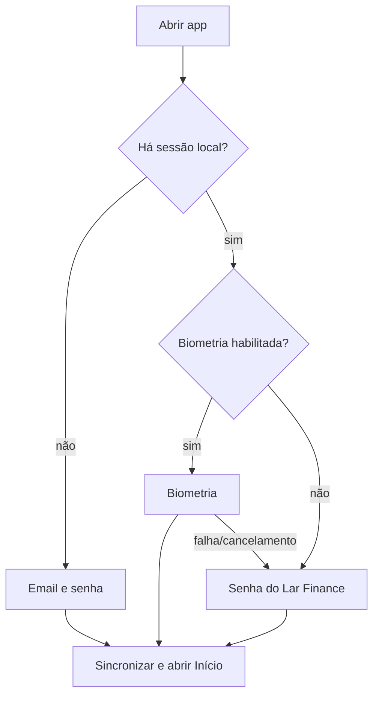

# UX multiplataforma do Lar Finance

## Plataforma e princípios

- Flutter para iOS, Android e Windows.
- Linguagem cross-platform consistente, respeitando safe areas, navegação, teclado, voltar, sheets e acessibilidade de cada plataforma.
- Conteúdo financeiro e confiança antes de efeitos visuais.
- Offline-first, com origem e atualização do dado sempre visíveis.
- Uma família no mesmo Lar, com um login compartilhado e responsáveis `Eu`, `Esposa` e `Conjunto`.
- Cada dispositivo possui sessão revogável e escolhe `Eu` ou `Esposa` como padrão; `Conjunto` permanece disponível em cada lançamento.
- Sem landing e sem cadastro público.

A direção **Casa de Valores** foi aprovada. A Sprint 4 implementará e validará os tokens finais conforme [design-system.md](design-system.md) e a [especificação Flutter](superpowers/specs/2026-08-13-lar-finance-flutter-foundation-design.md).

## Arquitetura da informação

### Navegação aprovada

| Destino | Conteúdo |
|---|---|
| Início | visão do lar, compromissos e atalhos |
| Movimentações | extrato, busca, filtros, importação e conciliação |
| Contas | contas; cartões, dívidas, investimentos e bens entram progressivamente |
| Mais | importação, planejamento, fontes, relatórios, segurança, dispositivos e backup |

No Windows, a barra inferior vira sidebar e detalhes podem usar master-detail. Destinos sem tela entregue não aparecem como controles mortos; a navegação cresce progressivamente.

## Fluxos críticos

### Login e desbloqueio

### Importação

Selecionar arquivo, detectar formato, escolher proprietário/fonte, revisar mapeamento, visualizar novos/duplicados/erros, confirmar e receber resumo. Importação em andamento pode ser fechada e retomada.

### Revisão diária

Abrir Início, verificar atualização, ver pendências, abrir movimentação, corrigir proprietário/categoria, reconciliar e voltar ao resumo atualizado.

## Especificação de telas

### Login

Componentes: marca Lar Finance, email, senha, mostrar/ocultar, entrar, recuperação administrativa `[INVESTIGAR]`, status do servidor e opção biométrica após primeiro login. Estados: inicial, preenchendo, validando, credencial inválida, servidor indisponível, dispositivo revogado e offline sem sessão.

O primeiro login não exige que o cliente conheça previamente os responsáveis do Lar: ao enviar email, senha, plataforma e nome do dispositivo, o servidor seleciona `Eu` ativo como padrão. Clientes existentes podem continuar enviando explicitamente o UUID de `Eu` ou `Esposa`; a escolha também pode ser alterada depois em dispositivos.

### Início

Ordem recomendada:

1. contexto “Lar / Eu / Esposa”;
2. patrimônio líquido e data de referência;
3. caixa disponível e compromissos até próximo recebimento;
4. faturas e vencimentos próximos;
5. pendências de importação/conciliação;
6. tendência curta e explicável;
7. atalhos contextuais.

Evitar grade de cartões genéricos. Um número sem origem ou data é considerado incompleto.

### Movimentações

Lista agrupada por data, busca imediata, filtros em sheet, filtros ativos legíveis, avatar/indicador do proprietário, instituição/conta, categoria, valor e estado. Swipe só para ação reversível; exclusão exige confirmação. Desktop oferece tabela adaptada, não tabela comprimida no celular.

### Detalhe de movimentação

Valor, descrição original e editada, datas, proprietário, conta/cartão, categoria/tags, contraparte, parcela, recorrência, fonte, lote e histórico de alterações. Ações: editar, conciliar, dividir `[INVESTIGAR]`, anexar e excluir.

### Importação e conciliação

Stepper curto, progresso persistente, resumo antes de confirmar e problemas priorizados. Cada erro indica linha/campo e ação possível. Um lote nunca apresenta apenas “falhou”.

Entregue na Sprint 5 para OFX Nubank, em `Mais › Importar OFX`. A tela mostra,
nesta ordem, o produto detectado com a ressalva de que o rótulo não prova a
origem, o período do extrato, a validade da prévia, o resumo de contagens e
totais e a lista item a item com entrada/saída e novo/duplicado/aviso. As
ações Confirmar e Cancelar ficam num rodapé persistente no mobile e num painel
lateral no Windows a partir de 900 px, sem cobrir o conteúdo. Confirmar fica
bloqueado para prévia vazia, arquivo repetido ou página ainda pendente.
`Escape` cancela e o foco vai sozinho para a recuperação quando há erro.

### Cartões e faturas

Cada cartão mostra proprietário, instituição, final opcional, limite e data de referência. Fatura mostra status, total calculado/informado, fechamento, vencimento, parcelas futuras e pagamento conciliado. “Não informado” substitui zeros artificiais.

### Planejamento

Orçamento por mês e categoria, compromissos fixos, calendário de entradas/saídas, metas e reserva. Projeção diferencia confirmado, recorrente e estimado.

### Empréstimos e dívidas

Saldo devedor, instituição, titular, parcelas pagas/restantes, próxima parcela, taxa/CET quando conhecida e custo total. Não calcular CET ausente a partir de dados insuficientes.

### Investimentos e patrimônio

Ativos e passivos por proprietário/classe, valor e data de referência, origem manual/importada e evolução. Cotação automática está fora do primeiro escopo `[INVESTIGAR]`.

### Relatórios

Fluxo de caixa, categorias, favorecidos, evolução patrimonial, dívidas e comparação mensal. Gráficos têm tabela/texto alternativo e exportação.

### Configurações

Proprietários, instituições, contas/cartões, categorias/regras, dispositivos, biometria, notificações, tema, servidor, exportação, backup e sessão.

## Estados globais obrigatórios

- skeleton/loading sem bloquear navegação;
- vazio com explicação e ação útil;
- offline com dados locais e fila pendente;
- sincronizando com progresso discreto;
- desatualizado com timestamp;
- erro parcial preservando conteúdo conhecido;
- conflito que exige decisão;
- acesso expirado/revogado;
- sucesso com confirmação não intrusiva.

## Integrações nativas

### Biometria

Opt-in após login válido. Motivo: proteger acesso local. Fallback: senha. Não enviar template biométrico ao servidor.

### Arquivos e compartilhamento

Permissão apenas durante a seleção. Suportar receber arquivo pelo share sheet se viável. Fallback: seletor interno.

### Câmera

Somente fase de PDF/OCR, após ação explícita. Motivo exibido antes do prompt. Fallback: escolher arquivo. Não pedir na instalação.

### Notificações

Opt-in para vencimentos, sync/backup e pendências. Sem mostrar valor/saldo na tela bloqueada por padrão. Fallback: central interna.

### Geolocalização e contatos

Sem caso de uso aprovado; não solicitar.

## Performance

- Início percebido em menos de 2s usando cache local.
- Primeiro quadro útil, não tela vazia aguardando servidor.
- listas paginadas/virtualizadas;
- agregações pré-computadas no backend quando necessário;
- importação não bloqueia a UI;
- metas técnicas exatas de hardware/rede serão medidas na Sprint 4 `[INVESTIGAR]`.

## Acessibilidade

- VoiceOver, TalkBack e Narrator;
- ordem de foco e atalhos de teclado no Windows;
- escala de texto sem truncar valores críticos;
- contraste AA e foco visível;
- mínimo de toque conforme plataforma;
- receita/despesa não depende de verde/vermelho;
- gráficos com descrição e tabela;
- `Reduce Motion` elimina transições não essenciais.

## Privacidade na interface

- botão para ocultar valores em todas as plataformas;
- blur no app switcher `[INVESTIGAR suporte por plataforma]`;
- notificações sem conteúdo sensível por padrão;
- confirmação antes de exportar/compartilhar;
- aviso claro quando dado é manual, importado ou desatualizado.

## Critérios de aceite do design

- tarefa principal alcançável sem conhecer termos bancários técnicos;
- nenhuma tela parece website reduzido;
- navegação funciona com uma mão no mobile e teclado/mouse no Windows;
- texto real pt-BR cabe em tamanhos acessíveis;
- todos os estados têm protótipo;
- nenhum tom roxo em UI, ilustração, gráfico ou marca;
- identidade própria, sem copiar logo, tipografia proprietária ou componentes do C6.
