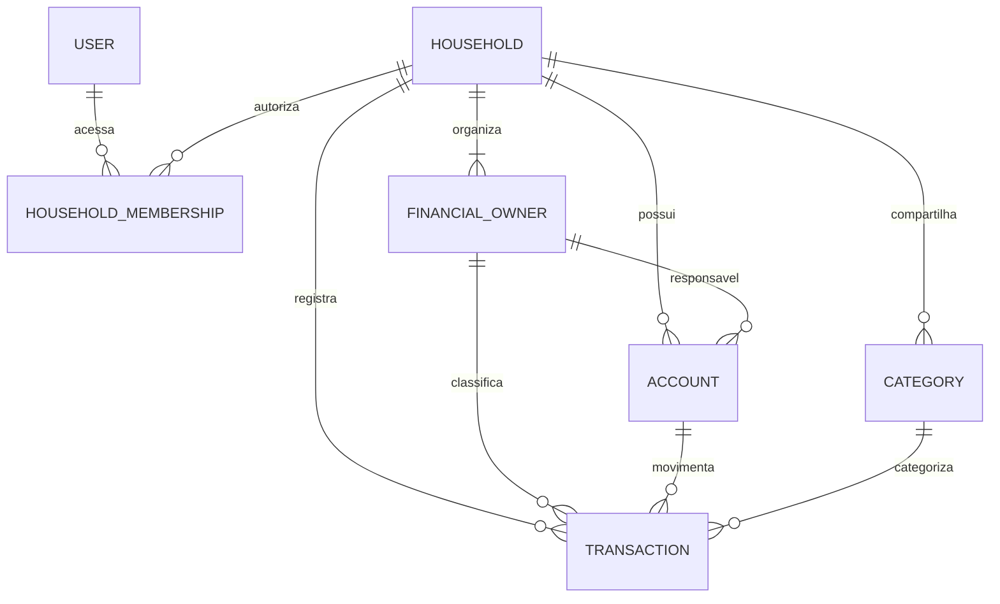

# Lar Finance — Design do Lar e responsáveis financeiros

Status: aprovado pelo usuário em 10 de agosto de 2026.

## Contexto

O Lar Finance será usado por um casal como uma única vida financeira. Nesta fase, existe apenas um login, mas os dados precisam indicar quando uma conta, cartão ou movimentação está associado a “Eu”, “Esposa” ou “Conjunto”. A visão principal deve permanecer consolidada; a separação individual é apenas um filtro ou relatório secundário.

## Objetivos

- Tornar o Lar a fronteira principal de segurança e consolidação.
- Representar “Eu”, “Esposa” e “Conjunto” sem criar três carteiras isoladas.
- Preservar os dados atuais por meio de migração incremental e reversível.
- Preparar o domínio para importações, cartões, empréstimos, investimentos e sincronização Flutter.
- Impedir relações entre dados pertencentes a lares diferentes.

## Fora do escopo

- Criar um segundo login para a esposa.
- Implementar a tela visual de filtros ou o design system.
- Separar saldos em três ledgers independentes.
- Remover imediatamente os vínculos legados com `User`.
- Implementar API, Flutter, importação ou Open Finance nesta entrega.

## Abordagens consideradas

### 1. Lar como raiz, com responsáveis como classificação — escolhida

Todos os dados pertencem ao Lar. “Eu”, “Esposa” e “Conjunto” classificam a responsabilidade ou origem financeira. O painel soma os três por padrão e oferece filtros opcionais.

Essa abordagem corresponde ao uso real descrito, simplifica a consolidação e mantém a separação disponível sem criar silos.

### 2. Três ledgers independentes

Cada responsável teria contas, categorias e totais separados. O consolidado dependeria de agregação posterior. A abordagem foi rejeitada porque aumenta a complexidade e trata o casal como três finanças distintas.

### 3. Dois usuários com compartilhamento

Cada pessoa teria login e permissões próprias. Foi rejeitada nesta fase porque somente uma pessoa utilizará o sistema e um segundo fluxo de autenticação não agrega valor agora.

## Arquitetura de domínio

### `Household`

Representa o Lar e é a fronteira obrigatória para autorização e consultas financeiras.

Campos iniciais:

- chave primária inteira preservada pelo padrão atual do Django;
- UUID público único e não editável;
- nome, inicialmente “Lar Finance”;
- indicador de ativo;
- datas de criação e atualização.

### `HouseholdMembership`

Liga um usuário autenticado ao Lar. O login atual terá o papel administrativo. A existência dessa tabela permite adicionar outro membro no futuro sem alterar a propriedade dos dados, mas nenhum segundo login será exposto nesta entrega.

Restrições:

- um usuário não pode aparecer duas vezes no mesmo Lar;
- toda associação exige usuário e Lar válidos;
- o papel inicial permitido é administrador.

### `FinancialOwner`

Classifica a responsabilidade financeira dentro do Lar.

Tipos estáveis:

- `self`: nome exibido “Eu”;
- `spouse`: nome exibido “Esposa”;
- `shared`: nome exibido “Conjunto”.

Cada Lar terá exatamente um registro ativo de cada tipo após a inicialização. O tipo será usado nas regras; o nome poderá ser apresentado de forma amigável sem virar identificador técnico.

Campos iniciais:

- Lar;
- UUID público único e não editável;
- tipo;
- nome de exibição;
- indicador de ativo;
- datas de criação e atualização.

Restrição principal: combinação única de Lar e tipo.

## Vínculos com o domínio existente

### Contas

Cada conta pertence a um Lar e possui um responsável financeiro. “Conjunto” será o padrão para dados migrados. O vínculo atual com `User` será mantido temporariamente para compatibilidade e removido apenas em uma migração futura, depois que todas as consultas estiverem limitadas pelo Lar.

### Categorias

Categorias pertencem ao Lar e são compartilhadas. Elas não terão responsável individual, evitando duplicações como “Mercado — Eu” e “Mercado — Esposa”. O vínculo legado com `User` também será mantido temporariamente.

### Movimentações

Cada movimentação pertence ao Lar e possui um responsável financeiro. Na criação, o serviço ou formulário sugere o responsável da conta; o usuário pode alterar para “Conjunto” ou outro responsável. Essa regra ficará explícita no serviço/formulário, sem efeito mágico no método `save()`.

Conta, categoria, movimentação e responsável devem pertencer ao mesmo Lar. A validação ocorrerá na camada de domínio e, quando possível, será reforçada por restrições de banco.

## Fluxo de dados

1. O usuário autentica com o login privado existente.
2. O sistema resolve a associação ativa ao Lar.
3. Toda consulta financeira recebe o Lar como escopo obrigatório.
4. A visão principal agrega “Eu”, “Esposa” e “Conjunto”.
5. Um filtro opcional limita a consulta a um responsável.
6. Novos registros usam “Conjunto” quando nenhuma escolha explícita for feita.
7. Tentativas de associar objetos de lares diferentes são rejeitadas.

## Estratégia de migração

A migração será feita em etapas para permitir rollback e conferência:

1. Criar `Household`, `HouseholdMembership` e `FinancialOwner`.
2. Adicionar campos de Lar e responsável como opcionais nas tabelas existentes.
3. Para cada usuário existente, criar um Lar, uma associação administrativa e os responsáveis “Eu”, “Esposa” e “Conjunto”.
4. Associar contas, categorias e movimentações existentes ao Lar desse usuário.
5. Associar contas e movimentações existentes ao responsável “Conjunto”.
6. Comparar contagens e saldos antes e depois do preenchimento.
7. Tornar os campos obrigatórios somente após comprovar que não restaram registros órfãos.

A migração reversa removerá os vínculos novos sem apagar os registros financeiros legados. Antes do ensaio, será criada uma cópia verificada do SQLite.

## Tratamento de erros

- Ausência de Lar ativo: negar a operação e registrar evento técnico sem valores financeiros ou dados pessoais.
- Responsável de outro Lar: rejeitar a gravação.
- Conta ou categoria de outro Lar: rejeitar a gravação.
- Migração com registro órfão: interromper antes de tornar campos obrigatórios e produzir contagem técnica para investigação.
- Duplicação de tipo de responsável: impedir pela restrição de unicidade.

## Administração e interface web provisória

O Django Admin permitirá consultar o Lar, a associação e os três responsáveis. A interface web existente continuará funcional. Uma seleção visual de responsável não faz parte desta task e só será desenhada depois da aprovação do design system; até lá, o consolidado permanece o comportamento principal.

## Estratégia de testes

- criação de Lar com UUID e timestamps;
- associação administrativa única entre usuário e Lar;
- existência e unicidade dos três tipos de responsável;
- criação de mais de um Lar sem vazamento de dados;
- rejeição de conta, categoria ou responsável pertencente a outro Lar;
- preenchimento reversível dos dados antigos como “Conjunto”;
- igualdade das contagens de contas, categorias e movimentações antes e depois;
- preservação dos saldos calculados após a migração;
- execução de ida e volta das migrations sobre cópia do banco;
- suíte completa, Ruff, verificação de migrations e coverage após cada task.

## Critérios de aceite

- O login existente possui acesso administrativo a exatamente um Lar ativo.
- O Lar contém “Eu”, “Esposa” e “Conjunto” sem duplicidade de tipo.
- Dados existentes são preservados e classificados como “Conjunto”.
- O consolidado continua representando o total do casal.
- Filtros futuros podem consultar um responsável sem remodelar o banco.
- Nenhuma relação entre lares diferentes é aceita.
- A interface existente continua utilizável.
- Nenhuma decisão visual ou segundo login é introduzido por esta entrega.
