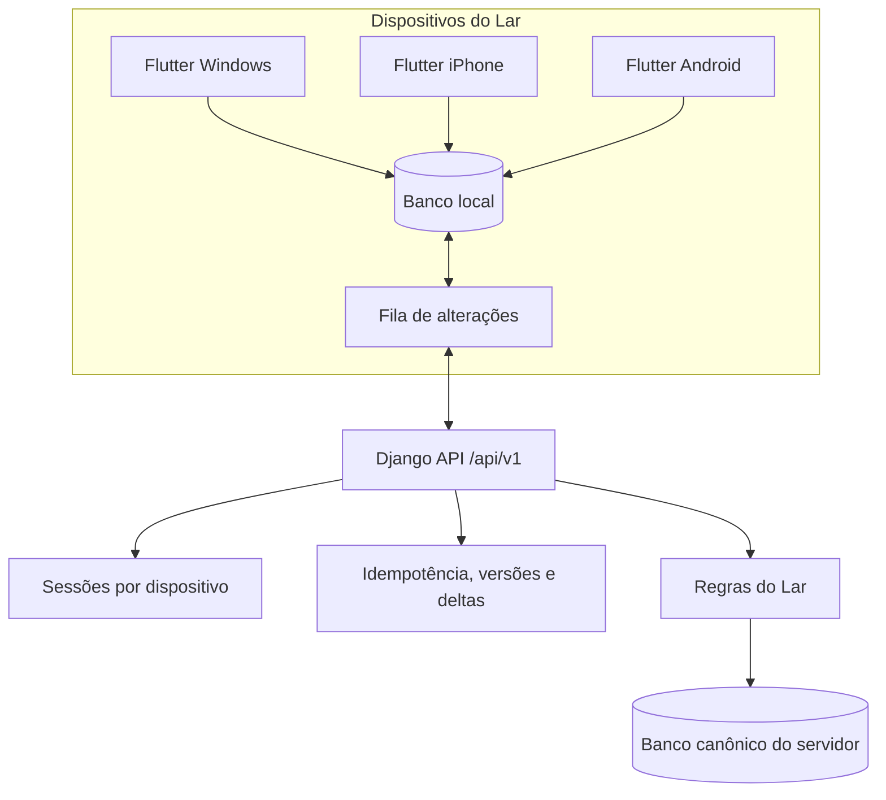
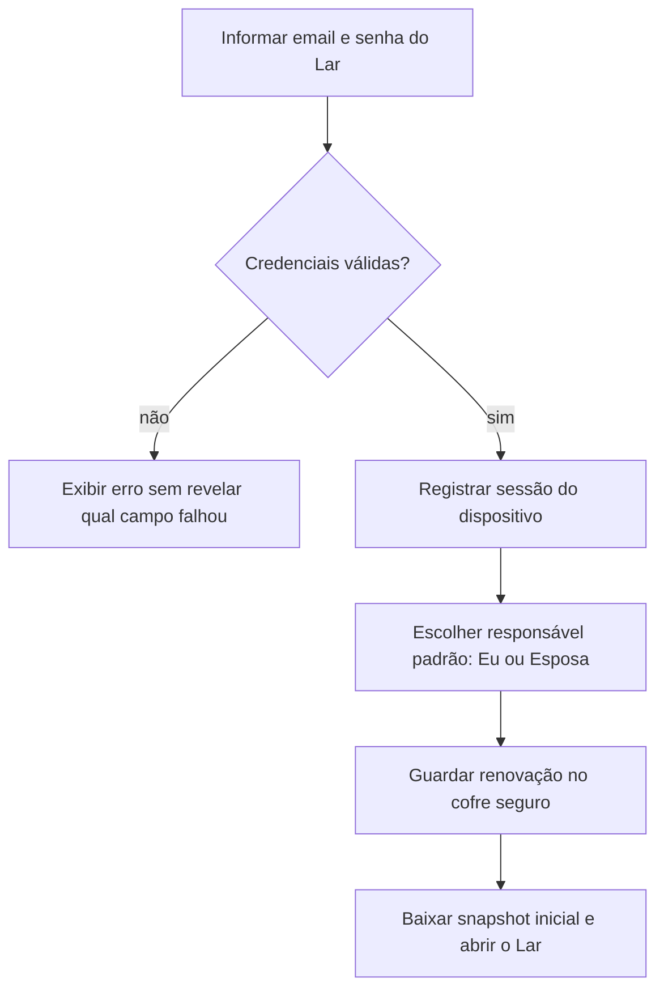
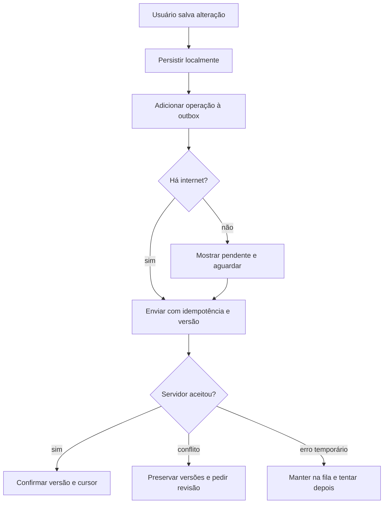

# Lar Finance — Single Login and Device Sync Design

**Status:** aprovado funcionalmente em 10/08/2026

**Escopo:** Sprint 2 — API privada, autenticação por dispositivo e contrato de sincronização

**Fora de escopo:** interface visual final, Flutter completo e importadores OFX/CSV

## 1. Contexto e decisões aprovadas

O Lar Finance será usado pelo casal como uma única vida financeira. Nesta fase,
existirá uma credencial familiar compartilhada, mas cada instalação no Windows,
iPhone ou Android terá uma sessão própria. O servidor Django no EasyPanel será a
fonte central e os clientes manterão uma cópia local para abertura rápida e uso
offline.

Decisões vinculantes:

- um email e uma senha para o Lar;
- múltiplos dispositivos conectados ao mesmo tempo;
- sessão identificável e revogável por dispositivo;
- cada dispositivo escolhe `Eu` ou `Esposa` como responsável padrão;
- novos registros também podem ser atribuídos a `Conjunto`;
- sincronização automática com ação manual de segurança;
- alterações offline nunca são descartadas silenciosamente;
- operações repetidas não duplicam efeitos;
- conflitos financeiros relevantes exigem escolha explícita;
- importações futuras poderão ser iniciadas em qualquer plataforma e sempre
  terão revisão antes da confirmação.

## 2. Arquitetura

O fallback web continua usando sessão Django. A API nativa usa credenciais
próprias para dispositivos e não reutiliza cookies/CSRF como mecanismo mobile.
Views web e endpoints chamam as mesmas regras de domínio para não criar dois
comportamentos financeiros diferentes.

## 3. Componentes e responsabilidades

### 3.1 Autenticação da API

Responsável por login, renovação rotativa, logout, listagem e revogação de
dispositivos. A senha é enviada somente no login por HTTPS e não é persistida no
cliente. O token de acesso é curto; a credencial de renovação é rotacionada e
fica no cofre seguro da plataforma. Tempos exatos serão fixados no ADR de
autenticação após validar o pacote suportado `[INVESTIGAR]`.

### 3.2 Registro de dispositivo

Cada instalação possui UUID aleatório, plataforma, nome editável, responsável
padrão, datas de criação/último uso e estado de revogação. Não usar hardware ID,
IMEI, serial ou fingerprint invasivo. Revogar um dispositivo invalida somente
aquela sessão.

### 3.3 API de recursos

Prefixo versionado `/api/v1/`. O primeiro contrato cobre:

- autenticação e dispositivos;
- Lar e responsáveis financeiros;
- contas;
- categorias;
- movimentações;
- resumo necessário para a abertura do app.

Todo endpoint valida sessão, associação ativa e escopo do Lar. IDs expostos à
API são UUIDs; IDs internos do banco não compõem o contrato público.

### 3.4 Sincronização

O cliente mantém banco local, cursor confirmado e outbox. Mutações carregam UUID
da operação, UUID da entidade, versão conhecida e chave idempotente. O servidor
responde com estado confirmado, nova versão e cursor. O pull retorna mudanças e
tombstones posteriores ao cursor, ordenados de forma estável.

### 3.5 Importação futura

A Sprint 2 define apenas a fronteira necessária para acompanhar upload/status e
receber o resultado sincronizado. Parsing, preview, deduplicação bancária e
commit do lote pertencem à Sprint 3. O fluxo futuro será igual em Windows, iOS e
Android: selecionar arquivo, enviar, revisar novos/duplicados/erros e confirmar.

## 4. Fluxos

### 4.1 Primeiro login no dispositivo

### 4.2 Alteração online ou offline

### 4.3 Gatilhos automáticos

- após login;
- ao abrir ou retomar o app;
- ao recuperar conectividade;
- depois de uma alteração;
- por atualização manual da tela;
- em segundo plano quando a plataforma permitir.

A interface sempre oferece `Sincronizar agora` e exibe o estado: atualizado,
sincronizando, offline, pendente, conflito ou sessão expirada.

## 5. Regras de conflito

- Reenvio da mesma operação retorna o resultado original e não cria duplicata.
- Alterações em campos independentes podem ser combinadas quando comprovadamente
  seguras.
- Divergência em valor, conta, responsável, categoria crítica ou exclusão gera
  conflito explícito.
- O cliente preserva a versão local e a versão do servidor até a decisão.
- Horário do dispositivo não decide qual valor vence.
- Exclusões sincronizáveis usam tombstone; não desaparecem apenas do aparelho.
- Revogação de membership ou dispositivo impede novos pushes e não apaga a fila
  local antes de o usuário receber orientação.

## 6. Segurança e privacidade

- HTTPS obrigatório; nenhum fallback HTTP.
- Senha nunca é salva no app, log, analytics ou banco local.
- Tokens nunca aparecem em logs, mensagens de erro ou relatórios.
- Renovação fica em Keychain, Android Keystore ou Windows Credential Locker.
- Biometria futura desbloqueia o cofre local e possui fallback por senha.
- Rate limit protege login e renovação sem bloquear permanentemente o dono.
- Respostas de login não revelam se o email ou a senha está incorreto.
- Lista de dispositivos não expõe identificadores invasivos.
- Logs usam request/operation ID e códigos de erro, sem email completo, valor,
  saldo ou descrição financeira.

O risco aceito do login compartilhado é não existir autoria pessoal forte entre
o casal. `responsável financeiro` identifica a quem o dado pertence, não prova
quem segurava o aparelho. Migrar futuramente para dois logins não deve exigir
migrar o ledger, pois memberships e responsáveis já são entidades separadas.

## 7. Estados de erro

| Situação | Comportamento |
|---|---|
| Sem internet | usar cache, manter outbox e informar última atualização |
| Credencial inválida | negar login com mensagem genérica |
| Renovação expirada | pedir senha sem apagar dados locais pendentes |
| Dispositivo revogado | bloquear sync, proteger cache e orientar novo login |
| Lar/membership inativo | negar acesso sem criar ou reativar associação |
| Operação repetida | retornar confirmação anterior |
| Versão divergente | criar conflito revisável |
| Erro 5xx/timeout | retry com espera progressiva, sem duplicar |
| Dados inválidos | rejeitar campo a campo, preservando rascunho local |

## 8. Performance e disponibilidade

- A abertura útil do app deve ocorrer em menos de 2 segundos usando dados locais.
- A API não é requisito para renderizar o primeiro quadro após o primeiro sync.
- Pull é paginado por cursor e pode ser retomado.
- Push aceita lotes limitados e confirma cada operação individualmente.
- Falha do servidor doméstico deixa o app em modo leitura/edição pendente; não
  promete sincronização até o serviço voltar.

## 9. Estratégia de testes

### Backend

- login válido/inválido e rate limit;
- renovação rotativa, reuse detection, expiração e logout;
- listagem e revogação isolada de dispositivos;
- membership/Lar inativo e tentativa de acesso cruzado;
- idempotência de create/update/delete;
- versão otimista, conflito e tombstone;
- pull paginado, cursor inválido e repetição;
- logs sem credencial, token, PII ou valor financeiro;
- compatibilidade do contrato `/api/v1/`.

### Contrato do cliente

- salvar offline e enviar depois;
- queda de rede antes/depois da resposta;
- reenvio após timeout sem duplicação;
- dois dispositivos alterando a mesma entidade;
- revogação de apenas um dispositivo;
- responsável padrão por dispositivo e troca manual para `Conjunto`;
- cache preservado durante sessão expirada;
- meta de abertura com snapshot local.

## 10. Critérios de aceite da Sprint 2

- Um cliente de teste entra com a credencial única do Lar e registra dispositivo.
- Windows, iPhone e Android podem manter sessões independentes no contrato.
- Revogar um dispositivo não encerra os demais.
- Cada dispositivo persiste `Eu` ou `Esposa` como padrão alterável.
- Operação repetida produz um único efeito.
- Alterações são recuperadas por cursor sem vazar outro Lar.
- Conflito financeiro não é sobrescrito silenciosamente.
- Falha de rede não perde a outbox.
- OpenAPI, testes e códigos de erro documentam o comportamento entregue.
- Fallback web e 151 testes existentes permanecem funcionais.

## 11. Fora de escopo da Sprint 2

- telas Flutter finais e design system;
- biometria nativa implementada;
- parser OFX/CSV e upload de arquivo real;
- cartões, faturas, limites e parcelas;
- PostgreSQL no servidor real;
- push notification;
- integração Pierre/Open Finance;
- deploy automático no EasyPanel.
