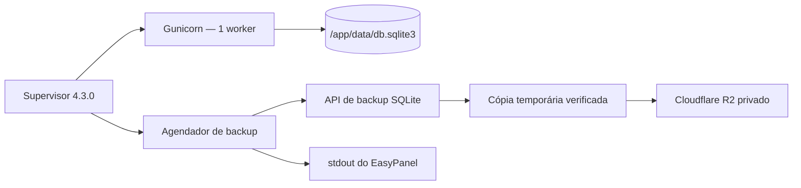

# Lar Finance — Backup automático do SQLite no Cloudflare R2

**Status:** aprovado funcionalmente em 12/08/2026

**Escopo:** gerar diariamente uma cópia consistente do SQLite, enviá-la ao bucket
privado R2, verificar o artefato remoto e aplicar retenção segura.

**Fora de escopo:** alertas externos, migração do volume legado, PostgreSQL,
alteração/restauração automática do banco de produção e exposição de rota pública.

## 1. Contexto e objetivos

O Lar Finance usa um SQLite persistente em `/app/data/db.sqlite3`, dentro de uma
única réplica no EasyPanel. O comando `backup_sqlite` já produz uma cópia pela API
de backup do SQLite e executa `PRAGMA integrity_check`. Um backup real foi enviado
ao bucket privado `lar-finance-backups` e restaurado com sucesso em 12/08/2026.

O job nativo de volume do EasyPanel não reconhece o volume Docker legado
`financeiro_sqlite_data`. A automação deve, portanto, reutilizar o mecanismo seguro
do aplicativo, sem copiar diretamente um banco aberto para escrita.

Objetivos vinculantes:

- executar automaticamente todos os dias às `03:00` em `America/Sao_Paulo`;
- recuperar uma execução perdida depois de restart ou deploy;
- preservar no máximo um backup válido por data e recuperar o dia corrente quando
  ainda não houver cópia confirmada;
- comprovar integridade local, tamanho e SHA-256 remoto antes da retenção;
- manter 14 diários, 8 semanais e 12 mensais;
- nunca remover o último backup válido;
- não interromper nem reiniciar o aplicativo durante o backup;
- manter credenciais e conteúdo financeiro fora dos logs e do repositório.

## 2. Arquitetura aprovada



O mesmo container executará dois processos independentes, supervisionados por
`supervisor==4.3.0`:

- Gunicorn continuará atendendo a aplicação com um worker;
- um comando Django de longa duração controlará a agenda diária.

O agendador será um componente interno, sem endpoint HTTP. Ele usará um comando de
execução única para que a mesma operação também possa ser acionada manualmente e
testada isoladamente. Uma trava exclusiva em `/app/data` impedirá duas execuções
simultâneas. Ao iniciar depois das `03:00`, o agendador verificará se o backup do
dia existe e, se não existir, executará a recuperação imediatamente.

O cliente S3 será `boto3==1.43.53`, versão compatível com Python 3.12 e com o
endpoint S3 do R2. Nenhuma credencial terá valor padrão no código.

## 3. Componentes e responsabilidades

### 3.1 Serviço de backup remoto

Responsável por:

1. adquirir a trava exclusiva;
2. consultar a chave determinística do dia e encerrar idempotentemente caso ela já
   represente um backup confirmado;
3. criar um arquivo temporário no volume persistente pela API SQLite existente;
4. confirmar `PRAGMA integrity_check`;
5. calcular tamanho e SHA-256;
6. enviar o objeto ao R2 por HTTPS;
7. executar `HeadObject` e comparar tamanho e metadado `sha256`;
8. aplicar retenção somente depois da confirmação remota;
9. remover a cópia temporária local em qualquer desfecho;
10. liberar a trava.

O serviço receberá cliente S3, relógio e paths por interfaces estreitas. Isso
permite testar decisões de retenção e falhas sem acessar o R2 real.

### 3.2 Comando de execução única

Um management command criará e enviará um backup imediatamente. Ele retornará
código zero apenas quando o objeto remoto tiver sido confirmado ou quando uma
execução idempotente encontrar o backup do dia já confirmado. Falhas de SQLite,
configuração, autenticação, rede, upload, confirmação ou retenção retornarão código
não zero e mensagem sanitizada.

### 3.3 Agendador

Um segundo management command permanecerá ativo, calculará a próxima ocorrência
das `03:00` na timezone configurada e chamará o comando de execução única. Ele não
duplicará a lógica de backup. Após uma falha, registrará o resultado e tentará
novamente a cada 60 minutos enquanto o dia corrente continuar sem backup
confirmado, sem encerrar o Gunicorn. Depois do sucesso, aguardará a janela do dia
seguinte.

### 3.4 Supervisor

O `supervisord` será o PID 1 do container, encaminhará sinais corretamente e
manterá Gunicorn e agendador ativos. A falha repetida do agendador ficará visível
nos logs, mas não provocará restart do processo web.

## 4. Chaves, metadados e idempotência

O prefixo será configurável e terá `production` como valor operacional. A chave
diária será determinística:

```text
production/backups/YYYY/MM/lar-finance-YYYY-MM-DD.sqlite3
```

Cada objeto conterá somente metadados técnicos ASCII:

- `sha256`: hash hexadecimal completo;
- `size`: tamanho em bytes;
- `backup-date`: data civil em São Paulo;
- `retention`: combinação de `daily`, `weekly` e `monthly`.

Domingo identifica a cópia semanal. O primeiro dia do mês identifica a mensal. Um
mesmo objeto pode pertencer a mais de uma classe; não serão criadas cópias físicas
duplicadas.

Antes de criar a cópia local, o serviço consultará a chave determinística. Se ela
existir, o `ContentLength` deve coincidir com o metadado `size`, a data deve
coincidir com a chave e o SHA-256 deve ter formato válido. Nesse caso, a operação
será concluída como repetição válida. Metadados ausentes ou incoerentes causarão
falha, sem sobrescrita. Depois de um upload novo, a confirmação comparará o tamanho
e o SHA-256 locais com o `HeadObject`. Uploads são tratados como atômicos pelo
contrato S3: um sucesso representa um objeto completo.

## 5. Retenção

Depois de um upload confirmado, o serviço listará todos os objetos sob
`production/backups/`, paginando a consulta. A seleção será calculada em memória:

- preservar as 14 datas diárias mais recentes;
- preservar os 8 domingos mais recentes;
- preservar os 12 primeiros dias de mês mais recentes;
- preservar a união das três seleções;
- preservar sempre o objeto mais recente, mesmo diante de dados legados ou
  configuração inconsistente.

Somente objetos cujo nome e metadados correspondam ao formato gerenciado serão
elegíveis para exclusão. O backup manual já existente em
`production/2026-08-12/` e qualquer objeto desconhecido serão ignorados. Erro em
listagem ou leitura de metadados interromperá o preflight antes de qualquer
exclusão. Depois do preflight completo, as exclusões serão individuais; a primeira
falha interromperá as restantes e tornará a execução falha. Objetos já removidos
nessa etapa serão apenas cópias expiradas que estavam fora da união `14/8/12` e
nunca incluirão o último backup válido.

## 6. Configuração e segredos

O EasyPanel fornecerá variáveis de ambiente secretas:

| Variável | Regra |
|---|---|
| `R2_BACKUP_ENDPOINT_URL` | endpoint HTTPS da conta R2 |
| `R2_BACKUP_ACCESS_KEY_ID` | chave limitada ao bucket |
| `R2_BACKUP_SECRET_ACCESS_KEY` | segredo limitado ao bucket |
| `R2_BACKUP_BUCKET` | `lar-finance-backups` em produção |
| `R2_BACKUP_PREFIX` | `production` em produção |
| `R2_BACKUP_TIME` | `03:00` por padrão |
| `R2_BACKUP_TIME_ZONE` | `America/Sao_Paulo` por padrão |

O token deve possuir somente listar, ler, criar e excluir objetos no bucket de
backup. Os valores não aparecerão em argumentos de processo, logs, exceptions,
testes, fixtures ou documentação.

## 7. Falhas, privacidade e operação

- Nenhum backup confirmado será sobrescrito.
- A retenção não executará antes de upload e confirmação completos.
- Uma falha anterior à confirmação remota não apagará backups anteriores.
- A cópia temporária local será removida inclusive após falha.
- O banco de produção nunca será substituído ou restaurado automaticamente.
- Logs registrarão horário, duração, chave lógica, tamanho, hash abreviado, etapa e
  resultado; não registrarão credenciais, conteúdo, descrições ou valores.
- Alertas externos serão tratados em task posterior; nesta entrega, o stdout do
  EasyPanel será a evidência operacional.

## 8. Estratégia de testes

### Testes automatizados

- backup SQLite válido e restauração local;
- configuração obrigatória e sanitização de erros;
- upload, `HeadObject` e comparação de tamanho/SHA-256;
- repetição idempotente no mesmo dia;
- recusa de sobrescrever objeto divergente;
- classificação diária, semanal e mensal;
- retenção `14/8/12`, união das classes e proteção do último válido;
- paginação e preservação de objetos desconhecidos;
- falhas em SQLite, rede, autenticação, confirmação e exclusão;
- trava concorrente e limpeza do temporário;
- cálculo de agenda, timezone, recuperação após restart e isolamento do web;
- ausência de segredo e dados financeiros nos logs.

### Validação operacional

Depois dos testes locais, uma execução manual usará uma cópia descartável do banco
e as credenciais reais do EasyPanel. O objeto será baixado para ambiente isolado,
terá SHA-256 e `integrity_check` verificados e será restaurado sem apontar para
`/app/data/db.sqlite3`. A agenda somente será considerada ativa após confirmar logs,
reinício do agendador e recuperação de execução perdida.

## 9. Critérios de aceite

- A suíte anterior continua verde.
- Backup manual e automático compartilham a mesma regra de domínio.
- Uma cópia íntegra chega ao bucket privado e é confirmada remotamente.
- Segunda execução no mesmo dia não cria nem sobrescreve objeto.
- Retenção mantém 14 diários, 8 semanais, 12 mensais e o último válido.
- Objetos fora do prefixo/formato gerenciado permanecem intactos.
- Falha do backup não interrompe o Lar Finance.
- Restart/deploy posterior às `03:00` recupera o backup ausente do dia.
- Logs são úteis e não contêm credenciais nem conteúdo financeiro.
- Restauração descartável real comprova que o artefato continua utilizável.

## 10. Rollback

O rollback da aplicação restaura o comando anterior do container, no qual apenas o
Gunicorn é iniciado. Nenhuma migration de banco é necessária. Objetos já enviados
ao R2 permanecem preservados; não serão apagados durante rollback. As variáveis R2
podem continuar cadastradas, mas ficam sem consumidor até uma nova implantação.

## 11. Referências verificadas

- [Cron no EasyPanel](https://easypanel.io/docs/guides/cron-job)
- [Serviços e mounts no EasyPanel](https://easypanel.io/docs/services/app)
- [Cloudflare R2 com boto3](https://developers.cloudflare.com/r2/examples/aws/boto3/)
- [Compatibilidade da API S3 do R2](https://developers.cloudflare.com/r2/api/s3/api/)
- [Boto3 1.43.53 no PyPI](https://pypi.org/project/boto3/1.43.53/)
- [Supervisor 4.3.0 no PyPI](https://pypi.org/project/supervisor/4.3.0/)
