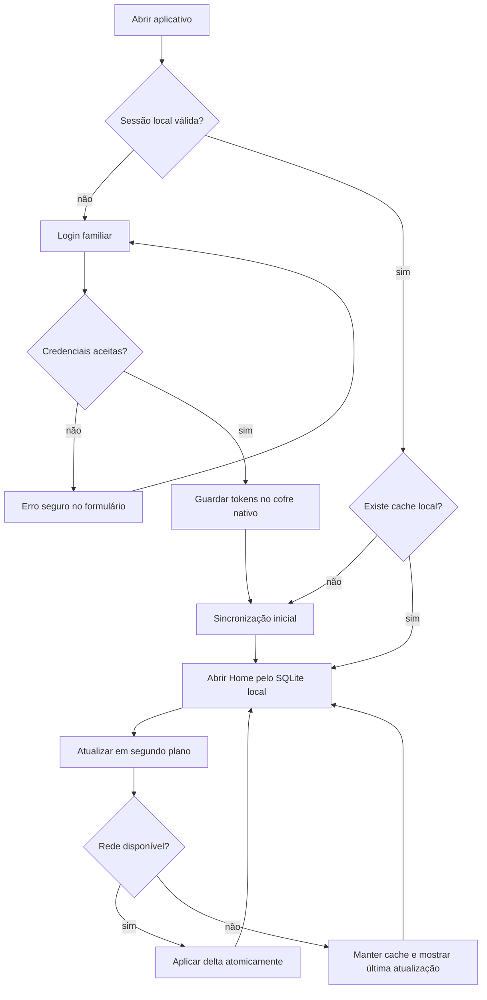
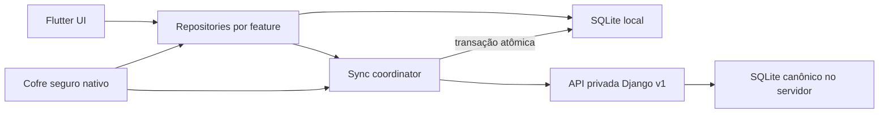

# Sprint 4 — Fundação Flutter e Casa de Valores

> Status: **design aprovado em 13/08/2026**. Esta especificação autoriza o planejamento técnico, mas não inicia implementação.

## 1. Objetivo

Criar a primeira experiência instalável do Lar Finance em Flutter para Windows, Android e iOS, preservando o backend Django já implantado. A Sprint 4 deve provar login privado, sessão por dispositivo, sincronização online, cache local e uma Home real somente leitura que responda rapidamente: **“como está nossa vida financeira hoje?”**

O produto continua sendo usado pelo proprietário e sua esposa como um único Lar, com um login compartilhado. `Eu`, `Esposa` e `Conjunto` são responsáveis financeiros, não novas credenciais.

## 2. Decisões aprovadas

- Framework: Flutter, com um workspace para Windows, Android e iOS.
- Ordem de entrega: Windows instalável primeiro; Android e configuração iOS no mesmo workspace. Build e validação reais de iOS exigem macOS/Xcode.
- Backend Django/EasyPanel permanece canônico e online.
- Home lê o SQLite local; sincronização atualiza esse banco de forma atômica.
- Sprint 4 é somente leitura no cliente. Escritas offline e outbox ficam para sprint posterior.
- Direção visual: **Casa de Valores**.
- Navegação mobile: `Início`, `Movimentações`, `Contas`, `Mais`; nesta sprint, somente destinos realmente entregues ficam interativos.
- Windows usa sidebar, mouse, teclado, foco visível e densidade própria. Não será apenas um telefone esticado.
- macOS terá uma sprint de adaptação dedicada depois de Windows, Android e iOS estarem funcionando.
- Método de construção desta sessão: code-first, comparando o resultado com a referência visual aprovada.

## 3. Evidência e referências

Princípios estudados, sem copiar identidade ou composição:

- [C6 Bank — controle de gastos e limites](https://www.c6bank.com.br/blog/como-estabelecer-limite-gastos-cartao-credito): confiança, sobriedade e controle.
- [Monarch — dashboard customizável](https://help.monarch.com/hc/en-us/articles/360058127551-Customize-Your-Dashboard): consolidação familiar e patrimônio.
- [Copilot — dashboard](https://help.copilot.money/en/articles/6045480-dashboard-tab-overview): leitura financeira clara e hierarquia curta.
- [Monzo — Trends](https://monzo.com/help/monzo-perks/trends-spending-and-balance-web): equilíbrio entre saldo e tendência.
- [YNAB — Spaces](https://support.ynab.com/en_us/spaces-in-the-mobile-app-S1iIZQoqgg): foco, contexto e ação.

Referência visual aprovada: [Casa de Valores — Home](../../design-assets/casa-de-valores-home-reference.png). A imagem contém dados sintéticos e serve como alvo de atmosfera, hierarquia e acabamento. O logo, a tipografia, os ícones e ornamentos gerados não são autoridade final e devem ser refinados na implementação.

## 4. Identidade Casa de Valores

### 4.1 Personalidade

O Lar Finance deve parecer uma instituição financeira privada do casal: adulto, calmo, preciso e confiável. A interface não deve parecer planilha, template genérico ou produto “feito por IA”.

### 4.2 Paleta conceitual

| Papel | Direção aprovada | Uso |
|---|---|---|
| Fundo escuro | grafite esverdeado próximo de `#091311` | canvas e superfícies principais |
| Fundo claro | marfim quente | tema claro, áreas de leitura |
| Identidade | champanhe próximo de `#C7A35A` | seleção, marca e informação principal, com parcimônia |
| Ação/positivo | verde mineral próximo de `#2F756A` | ações, sincronização e estados positivos |
| Texto escuro | marfim próximo de `#E8E3D8` | contraste no tema escuro |
| Alerta | âmbar | compromissos e atenção |
| Erro | vermelho sóbrio | falha e risco real |

Os valores hexadecimais são referência visual, não tokens finais. O plano técnico deve validar contraste e derivar escalas completas de cor.

### 4.3 Regras visuais

- Números financeiros grandes, precisos e tabulares.
- Divisores finos, poucas superfícies elevadas e ausência de pilhas de cards.
- Espaço negativo deliberado; densidade média no celular e ajustável no desktop.
- Sem roxo, neon, gradientes chamativos, glassmorphism ou gráficos decorativos.
- Champanhe não representa sucesso; estados positivos usam verde mineral.
- Claro e escuro são projetados juntos, seguindo o sistema. Alternância manual pode vir depois.
- Motion curto e funcional, sem elasticidade ornamental; respeitar redução de movimento.

## 5. Arquitetura da informação adaptativa

### 5.1 Home

Ordem aprovada:

1. estado de sincronização e ação para ocultar valores;
2. seletor `Lar`, `Eu`, `Esposa`;
3. valor financeiro dominante: posição disponível/consolidada;
4. compromissos próximos e gasto do mês;
5. pendências que exigem atenção;
6. movimentações recentes.

A importação OFX não ocupa um destino permanente na navegação principal. Ela será uma ação contextual em `Início` ou `Movimentações` quando o fluxo Flutter for implementado.

### 5.2 Navegação por plataforma

| Plataforma | Estrutura |
|---|---|
| iOS | barra inferior, safe areas, gestos e voltar nativos |
| Android | Material 3 adaptado à marca, alvos mínimos de 48 dp e predictive back |
| Windows | sidebar persistente, conteúdo central e painel contextual opcional à direita |

Destinos futuros não devem aparecer como controles mortos. Nesta sprint, o shell pode apresentar apenas `Início` e `Mais` até que as demais telas existam.

## 6. Fluxo principal



## 7. Telas e estados

### 7.1 Inicialização

- Exibe marca discreta, sem landing page.
- Não mostra dados financeiros antes de determinar preferência de privacidade.
- Restaura cache e sessão sem bloquear a abertura desnecessariamente.

### 7.2 Login

- Campos de e-mail e senha, mostrar/ocultar senha, ação principal e erro seguro.
- Sem cadastro público, recuperação inventada ou conteúdo comercial.
- Evitar revelar se o usuário ou a senha foi o elemento incorreto.
- Teclado, autofill e gerenciador de senhas devem funcionar por plataforma.

### 7.3 Sincronização inicial

- Estado claro de progresso sem porcentagem falsa.
- Permite repetir falha recuperável.
- Não promete modo offline antes de existir um primeiro cache válido.

### 7.4 Home

- Dados reais vindos da API/cache, nunca valores de demonstração em produção.
- Seletor `Lar`, `Eu`, `Esposa` altera todos os blocos coerentemente.
- `Conjunto` aparece na origem de lançamentos, mas não é uma quarta visão principal.
- Todos os blocos exibem estado carregando, vazio, erro, offline e conteúdo.
- Pendências devem ser acionáveis quando houver destino implementado; caso contrário, apenas informativas e sem affordance falsa.

### 7.5 Mais/conta

- Identificação do dispositivo, última sincronização e logout.
- Revogação de outros dispositivos permanece na administração existente se não houver endpoint/tela aprovada para o cliente.

## 8. Arquitetura Flutter alvo

```text
mobile/
  app/
  design_system/
  core/
    network/
    storage/
    sync/
  features/
    auth/
    home/
```

Usar organização por feature e fronteiras simples. Não introduzir camadas de Clean Architecture sem necessidade comprovada.



O plano técnico deve selecionar e fixar versões mantidas do Flutter, gerência de estado, HTTP, SQLite, secure storage e navegação. As versões exatas estão `[INVESTIGAR]` até a checagem do ambiente e dos pacotes; não devem ser inventadas na especificação.

## 9. Sincronização, cache e sessão

- O servidor é a fonte canônica.
- A Home deve abrir pelo cache local em menos de 2 segundos após a primeira sincronização.
- Sync inicial baixa o estado necessário; sync incremental usa o contrato de cursor já entregue.
- Uma atualização do cache é publicada apenas após completar a transação local.
- O cliente exibe a última sincronização bem-sucedida e distingue offline de erro do servidor.
- Expiração de acesso tenta uma única renovação coordenada. Requisições concorrentes não iniciam múltiplos refreshes.
- Falha definitiva de renovação volta ao login sem apagar automaticamente o cache financeiro.
- Tokens de acesso/renovação ficam somente no armazenamento seguro nativo, nunca no SQLite, analytics ou logs.
- Escritas offline, fila de saída e resolução visual de conflitos não entram nesta sprint.

## 10. Componentes fundamentais

- valor financeiro tabular e opção global de ocultação;
- seletor de responsável `Lar/Eu/Esposa`;
- indicador de sincronização/freshness;
- resumo disponível/comprometido/gasto;
- linha de atenção;
- linha de movimentação;
- shell adaptativo mobile/desktop;
- estados vazio, carregando, offline e erro;
- formulário e botão de login;
- foco, tooltip e feedback próprios para desktop.

## 11. Privacidade, segurança e permissões

- Ocultar valores persiste localmente e vale para todas as telas financeiras.
- Ao ir para o seletor de aplicativos, conteúdo financeiro deve ser obscurecido quando a plataforma permitir.
- Logs não contêm tokens, senha, valores, descrições bancárias, UUID de dispositivo ou conteúdo OFX.
- Certificados TLS não podem ser ignorados.
- Nenhuma permissão de câmera, geolocalização, contatos, notificações ou biometria é solicitada nesta sprint.
- O seletor de arquivo para OFX só será documentado e solicitado na sprint que implementar importação no Flutter.

## 12. Acessibilidade e internacionalização

- Português do Brasil nesta fase, com strings externas aos widgets para permitir futura internacionalização.
- Valores em BRL, datas e números com locale explícito.
- Compatível com VoiceOver, TalkBack e leitor de tela do Windows.
- Escala de texto não corta números ou ações essenciais.
- Ordem semântica acompanha a ordem visual.
- Contraste mínimo AA; foco visível no Windows; estado nunca comunicado apenas por cor.

## 13. Testes e CI

- Unitários: parsing de envelopes, estado de sessão, refresh coordenado, cursor e transformação de dados.
- Banco local: migrations, transação atômica, rollback e cache compatível entre versões.
- Widgets: login e Home em claro/escuro, tamanhos compactos/amplos e estados críticos.
- Golden tests: componentes fundamentais e referências de Home; tolerância controlada por plataforma.
- Integração: login → sync inicial → Home → offline → reconexão → logout.
- Acessibilidade: labels, ordem, escala de texto e contraste automatizável.
- CI: análise, testes e builds possíveis sem segredos; iOS real depende de runner macOS.

## 14. Critérios de aceite da Sprint 4

- [ ] Workspace Flutter cria targets Windows, Android e iOS com versões fixadas.
- [ ] Temas Casa de Valores claro/escuro e shell adaptativo existem.
- [ ] Login e logout funcionam contra a API real; tokens ficam no cofre nativo.
- [ ] Sync inicial e incremental gravam SQLite local atomicamente.
- [ ] Home real abre pelo cache em menos de 2 segundos no dispositivo de referência definido pelo plano.
- [ ] `Lar`, `Eu` e `Esposa` apresentam dados coerentes.
- [ ] Ocultar valores persiste e o app switcher não expõe a Home quando suportado.
- [ ] Offline mantém dados e mostra a última sincronização.
- [ ] Refresh expirado é coordenado e falha segura leva ao login sem destruir o cache.
- [ ] Primeiro instalável Windows é produzido.
- [ ] Android compila e executa em ambiente de teste.
- [ ] Target iOS está configurado; build real permanece condicionado a Mac/Xcode.
- [ ] Testes unitários, de widget, golden e integração passam na CI aplicável.
- [ ] Resultado visual é comparado à referência Casa de Valores e não copia marca de terceiro.

## 15. Fora do escopo

- importação OFX no Flutter;
- criação/edição offline e outbox;
- biometria, push, câmera ou geolocalização;
- cartões, faturas, limites e parcelas completos;
- empréstimos, investimentos e patrimônio ampliado;
- publicação em App Store ou Play Store;
- cliente macOS;
- redesign final específico de desktop, reservado para depois das três plataformas iniciais funcionarem.

## 16. Riscos e investigações antes da implementação

| Item | Estado/mitigação |
|---|---|
| Flutter, Android SDK e ferramentas Visual Studio ainda não comprovados nesta máquina | primeira task instala/verifica o ambiente antes de criar código |
| Versões e suporte Windows dos pacotes | `[INVESTIGAR]` no plano com fontes oficiais e prova mínima |
| Formato do instalador Windows | `[INVESTIGAR]` após primeiro build executável; não bloquear o shell |
| Build iOS sem Mac local | manter target versionado e validar depois em Mac/runner macOS |
| Cache financeiro no dispositivo | proteção por sandbox + análise do pacote SQLite; não alegar criptografia sem evidência |
| Diferenças de layout | breakpoints e componentes adaptativos, sem forçar uma composição idêntica |
| Dados parciais atuais | mostrar indisponível/sem informação; nunca preencher zero presumido |

## 17. Próximo gate

Após a aprovação deste arquivo, elaborar um plano técnico em tasks pequenas, cada uma com testes, revisão, commit e push. A execução de qualquer task depende de autorização explícita do usuário.
