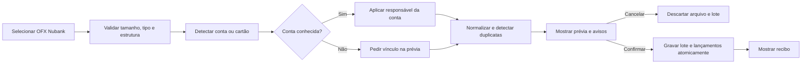

# Lar Finance — Importação OFX Nubank

**Status:** aprovado funcionalmente em 13/08/2026

**Escopo:** primeira task da Sprint 3 — importação manual de OFX Nubank

**Fora de escopo:** CSV, PDF, outros bancos, conciliação automática, limite de
cartão, parcelas futuras, próximas faturas, Open Finance e telas Flutter.

## 1. Objetivo

Permitir que o Lar Finance receba um OFX exportado manualmente pelo Nubank,
mostre uma prévia confiável e só grave os lançamentos depois da confirmação do
usuário. A importação deve atender tanto extratos de conta quanto OFX de cartão
quando o arquivo trouxer movimentos do cartão.

O primeiro piloto usa somente a estrutura de arquivos reais fornecidos pelo
proprietário. Esses arquivos nunca entram no Git, nos testes ou nos logs. Os
testes usam somente fixtures sintéticas e anonimizadas.

## 2. Decisões aprovadas

- O início é por exportação/importação manual, sem provedor pago de Open Finance.
- O primeiro formato é OFX do Nubank; conta e cartão são detectados pela estrutura
  do arquivo.
- Todo arquivo passa por prévia e exige o botão **Confirmar importação**. Não há
  importação automática, mesmo para conta conhecida.
- A conta é identificada pelo identificador estável informado no OFX. Quando ela
  já existe no Lar Finance, o responsável financeiro cadastrado nela é aplicado
  automaticamente.
- Se a conta não for conhecida, a prévia pede o vínculo a conta e responsável;
  enquanto isso não ocorrer, nada é gravado no ledger.
- O OFX original é descartado após a análise ou a confirmação. O sistema retém
  apenas lançamentos normalizados e assinaturas técnicas para idempotência.
- Mesmo arquivo ou mesmo identificador externo do Nubank é ignorado
  automaticamente e explicado no recibo.
- Lançamentos apenas semelhantes são avisos para decisão humana; nunca são
  excluídos silenciosamente.
- Campos não presentes no OFX, como limite, parcelas futuras, total de parcelas
  ou próximas faturas, ficam como “não informado”; o sistema nunca os estima.

## 3. Fluxo do usuário

## 4. Componentes

### 4.1 Analisador OFX Nubank

Lê o arquivo sem persistir lançamentos. Valida a estrutura OFX, identifica se o
bloco é de conta (`BANKACCT`) ou cartão (`CCACCT`), extrai período, identificador
de conta, saldo quando disponível e movimentos. Cada movimento normalizado contém
data, valor, descrição, tipo e identificador externo (`FITID`) quando fornecido.

O analisador deve aceitar encoding comum de OFX e retornar erros acionáveis para
arquivo inválido, incompleto ou incompatível, sem incluir conteúdo financeiro no
log.

### 4.2 Lote de importação e prévia

Um lote temporário mantém somente o resultado normalizado necessário para a
prévia, seu hash SHA-256 e avisos por até 24 horas. Ele não recebe o arquivo
bruto. Arquivos acima de 10 MiB são recusados antes do parse. A prévia mostra
quantidades de lançamentos novos, ignorados e que exigem atenção, além de conta,
tipo do OFX e período detectados.

Confirmar um lote é uma única transação: todos os lançamentos válidos entram no
ledger ou nenhum entra. Cancelar ou falhar descarta o lote sem alterar o ledger.

### 4.3 Idempotência e duplicidade

O hash do arquivo impede reimportar o mesmo OFX. Para linhas individuais, a ordem
de confiança é `FITID` da mesma conta e, na ausência dele, fingerprint composto
por conta, data, valor e descrição normalizada. Um possível similar, sem prova de
identidade, permanece visível como aviso e requer confirmação humana.

### 4.4 Recibo e sincronização

Após a confirmação, o recibo informa contagens e avisos sem expor dados em logs.
Os lançamentos criados recebem a metadata de sincronização já existente e ficam
disponíveis pela API de delta para os futuros clientes Flutter. A task não cria
uma tela Flutter.

## 5. Dados e limites

- Contas já cadastradas são a fonte da associação a `Household` e
  `FinancialOwner`; um OFX jamais pode escolher outro Lar.
- O cartão OFX é tratado como movimentos de crédito existentes; não cria modelo
  de fatura, limite ou parcelamento.
- Não existirão valores padrão para dados ausentes.
- Nome original, caminho local, conteúdo, valores e descrições do OFX não podem
  aparecer nos logs técnicos.
- O arquivo bruto não é persistido em nenhum estado; o lote de prévia expira em
  24 horas e o tamanho máximo do arquivo é 10 MiB.

## 6. Erros esperados

| Situação | Resultado |
| --- | --- |
| Arquivo não é OFX válido | erro de prévia; ledger inalterado |
| Estrutura OFX não é Nubank suportada | erro claro; ledger inalterado |
| Conta não identificada | prévia bloqueada até vínculo manual; ledger inalterado |
| Mesmo arquivo | prévia/recibo indica reimportação; zero novos lançamentos |
| Mesmo `FITID` | linha ignorada e explicada |
| Similaridade sem identificação inequívoca | aviso, nunca exclusão automática |
| Erro ao confirmar | rollback integral e recibo de falha sem dados sensíveis |

## 7. Critérios de aceite e testes

- fixture sintética de OFX de conta Nubank e fixture sintética de OFX de cartão;
- parsing de encoding, data, sinal de valor, descrição e `FITID`;
- reconhecimento de conta conhecida e bloqueio de conta desconhecida;
- prévia não altera o ledger;
- confirmação cria lançamentos de modo atômico;
- reimportação do arquivo e de uma linha com mesmo `FITID` não duplica efeitos;
- similaridade apenas gera aviso;
- cancelamento, erro de parse e erro de confirmação não deixam registros parciais;
- testes de isolamento entre Lares e de logs sem PII/valores/tokens;
- suíte existente, lint, checks Django e migrations permanecem verdes.

## 8. Próximas evoluções deliberadamente separadas

1. CSV versionado do Nubank e, depois, Inter, Santander e Mercado Pago.
2. Conciliação de transferências, estornos e pagamentos de fatura.
3. Modelos de cartão, fatura, limite e parcelas na Sprint 4, com exportações que
   tragam realmente esses campos.
4. Fluxo visual Flutter depois que a fundação mobile for iniciada na Sprint 5.
