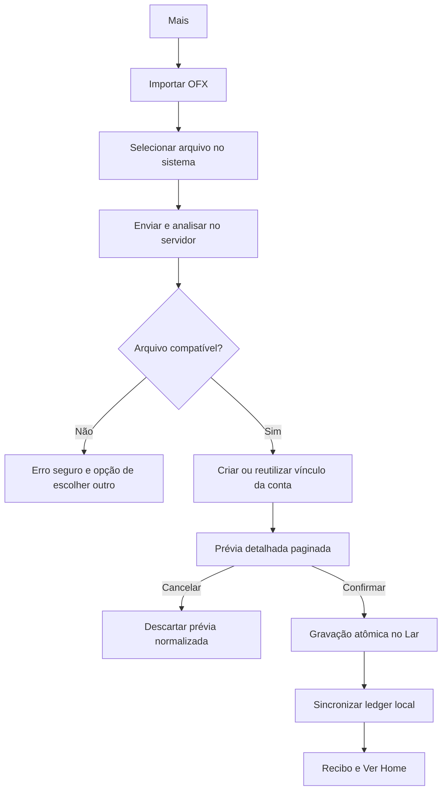

# Lar Finance — Importação OFX Nubank no Flutter

**Status:** aprovado pelo proprietário em 15/08/2026

**Data:** 15/08/2026

**Escopo:** primeira task da Sprint 5 — importar no app Flutter os OFX de conta
e cartão Nubank já exportados pelo proprietário

**Base existente:** esta especificação evolui a importação backend definida em
`2026-08-13-nubank-ofx-import-design.md`; não substitui seus requisitos de
atomicidade, isolamento por Lar, idempotência, descarte do arquivo bruto e
retenção máxima da prévia.

## 1. Objetivo e resultado esperado

Permitir que o único usuário do Lar Finance selecione um OFX no Windows, iPhone
ou Android, confira detalhadamente os movimentos e confirme a importação sem
precisar cadastrar ou vincular a conta manualmente no primeiro uso.

A primeira validação ocorrerá com dois arquivos locais reais do Nubank:

- extrato de conta com 36 movimentos;
- extrato de cartão com 28 movimentos.

Os arquivos reais servem somente para validação local e nunca podem entrar no
Git, nos logs, em relatórios ou em fixtures. A feature estará concluída quando o
arquivo de conta chegar à prévia no app instalado. A gravação dos 36 movimentos
só ocorrerá depois de uma autorização separada do proprietário. O cartão será
validado em seguida pelo mesmo procedimento.

## 2. Escopo aprovado

### Incluído

- selecionar arquivo OFX pelo seletor nativo de Windows, iOS e Android;
- aceitar o formato real de conta com `ENCODING=UTF-8` e `CHARSET=NONE`;
- aceitar o formato SGML real de cartão com `ENCODING=USASCII` e
  `CHARSET=1252`;
- manter validação estrita de estrutura, BRL, datas, valores e limites;
- detectar conta versus cartão pela estrutura OFX;
- criar e vincular automaticamente, no primeiro uso:
  - `Nubank — Conta`, tipo conta corrente, responsável `Eu`;
  - `Nubank — Cartão`, tipo cartão de crédito, responsável `Eu`;
- reutilizar o vínculo estável nas próximas importações;
- listar cada movimento normalizado antes da confirmação;
- confirmar atomicamente, cancelar ou repetir uma prévia expirada;
- sincronizar a Home local após confirmação bem-sucedida.

### Fora de escopo

- limite do cartão;
- parcelamento e quantidade de parcelas;
- faturas atuais ou futuras;
- pagamento e conciliação de fatura;
- Open Finance ou importação automática;
- CSV, PDF e outros bancos;
- alteração da navegação principal;
- classificação inteligente dos movimentos.

Esses dados não são inferidos quando não existem no OFX. Cartão, limite,
parcelas e faturas terão modelagem própria na Sprint 6.

## 3. Experiência do usuário

O acesso será por **Mais → Importar OFX**. A navegação principal continua com as
áreas já existentes.

### 3.1 Seleção e envio

- O botão **Selecionar OFX** abre o file picker nativo.
- Apenas um arquivo `.ofx` é selecionado por vez.
- O cliente recusa arquivo acima de 10 MiB antes do upload; o servidor repete a
  validação como autoridade.
- Durante envio e análise, a tela mostra progresso indeterminado, sem simular
  percentual que a API não fornece.
- Perda de rede preserva o ledger local e permite tentar novamente.

### 3.2 Prévia

A prévia mostra:

- origem visual `Nubank — Conta` ou `Nubank — Cartão`;
- período detectado e quantidade total;
- totais de novos, duplicados, avisos, entradas e saídas;
- cada item com data, descrição normalizada, valor e tipo;
- resultado por item: novo, duplicado ignorado ou aviso;
- paginação/infinite loading sem carregar o lote inteiro na memória;
- ações persistentes **Cancelar** e **Confirmar importação**.

O identificador bancário da conta, `FITID`, hashes e outros dados técnicos nunca
são exibidos. A descrição e o valor aparecem somente na tela autenticada e não
entram em logs ou telemetria.

### 3.3 Estados e retorno

| Estado | Comportamento |
| --- | --- |
| arquivo inválido ou incompatível | mensagem clara, ledger inalterado |
| arquivo maior que 10 MiB | bloqueio antes do parse |
| offline durante upload | tentar novamente; nenhum dado parcial |
| prévia expirada | informar expiração e pedir novo upload |
| serviço ocupado | erro temporário e retry seguro |
| arquivo já importado | mostrar duplicidade e zero novas gravações |
| confirmação falha | rollback integral e prévia continua segura |
| confirmação concluída | recibo, sincronização e ação **Ver Home** |

No Windows, a largura disponível usa lista e resumo lateral. Em iOS e Android,
o conteúdo é vertical, dentro de SafeArea, com ações acessíveis próximas ao fim
da tela. O visual segue Casa de Valores: financeiro, sóbrio, sem roxo, claro e
escuro conforme o sistema.

## 4. Arquitetura

O servidor continua sendo a autoridade financeira. O Flutter seleciona o
arquivo, envia, apresenta a prévia e solicita cancelamento ou confirmação; ele
não interpreta OFX nem cria movimentos localmente.

```mermaid
flowchart LR
    FP["File picker nativo"] --> FL["Flutter ImportRepository"]
    FL -->|"multipart HTTPS"| API["API Django de imports"]
    API --> PARSER["Parser OFX estrito"]
    PARSER --> BATCH["ImportBatch + ImportRecord temporários"]
    BATCH --> LINK["Criação/reuso atômico de AccountLink"]
    LINK --> PREVIEW["Prévia paginada"]
    PREVIEW --> CONFIRM["Confirmação transacional"]
    CONFIRM --> LEDGER["Account, Transaction e SyncChange"]
    LEDGER --> PULL["Pull de sincronização Flutter"]
    PULL --> DB["Drift local e Home"]
```

### 4.1 Backend

O parser deve reconhecer exatamente as duas variantes reais sem enfraquecer as
proteções existentes. A identificação institucional continua estrutural: o OFX
não autentica que o emissor é o Nubank.

Ao criar a primeira prévia de uma fonte ainda não vinculada, o backend cria ou
reutiliza de forma idempotente a conta padrão correspondente e seu vínculo. A
operação precisa ser segura sob concorrência no SQLite e limitada ao Lar ativo.
Cancelar a prévia remove os registros temporários, mas preserva a conta criada,
evitando contas duplicadas em nova tentativa.

A confirmação reutiliza a transação atômica existente, cria os movimentos e os
eventos de sincronização, ou não cria nada. Categorias continuam seguindo o
contrato atual de `Não categorizado` compatível com entrada ou saída.

### 4.2 API

As cinco rotas de importação existentes permanecem privadas por device token:

- criar prévia OFX;
- consultar lote;
- vincular conta;
- confirmar lote;
- cancelar lote.

O detalhe do lote será ampliado com paginação de registros normalizados. O
contrato deve retornar apenas os campos necessários à tela: UUID público do
registro, data, descrição normalizada, valor decimal, tipo e resultado. Nenhum
identificador externo de banco ou conteúdo bruto será retornado.

Erros seguem o envelope da API e incluem `request_id`, sem conteúdo financeiro.
Mutadores continuam idempotentes e retornam erro temporário seguro em contenção.

### 4.3 Flutter

Serão adicionados:

- `ImportRepository` e transporte multipart autenticado;
- modelos de lote, totais, item e paginação;
- controller com estados idle, picking, uploading, preview, confirming,
  completed e failure;
- tela adaptativa acessada por Mais;
- sincronização pull depois da confirmação;
- estado preservado em memória durante a navegação, sem persistir OFX bruto.

O arquivo selecionado não é copiado para o Drift nem para secure storage. Tokens
continuam somente no cofre seguro. Não haverá upload em background nesta task.

## 5. Segurança, privacidade e retenção

- upload exclusivamente por HTTPS para a API configurada;
- autenticação por device token e isolamento pelo Lar ativo;
- nome/caminho do arquivo, identificadores bancários, descrições, valores,
  e-mail e conteúdo OFX proibidos em logs;
- arquivo bruto mantido apenas durante a requisição e descartado após o parse;
- lote normalizado acionável por até 23 horas e removido em até 24 horas pelo
  processo de purge existente;
- prévia só acessível pelo mesmo Lar e sessão autenticada;
- cancelamento e expiração não alteram o ledger;
- confirmação com rollback integral;
- fixtures versionadas obrigatoriamente sintéticas e anonimizadas.

## 6. Acessibilidade e plataformas

- targets mínimos: 48 dp em Android, 44 pt em iOS;
- navegação completa por teclado, foco visível e ordem lógica no Windows;
- VoiceOver e TalkBack com rótulos para origem, tipo, valor, resultado e ações;
- valores não dependem apenas de cor ou sinal visual;
- escala de texto de 200% sem corte ou sobreposição;
- contraste mínimo WCAG AA nos estados relevantes;
- fallback acessível quando file picker é cancelado ou indisponível;
- claro/escuro e redução de animação respeitam preferências do sistema.

## 7. Estratégia de testes

### Backend

- fixtures anônimas equivalentes às variantes reais conta UTF-8/NONE e cartão
  SGML USASCII/1252;
- parse de encoding, SGML, BRL, data, valor, sinal, descrição e `FITID`;
- rejeição de moeda, estrutura, data, valor e limites inválidos;
- criação/reuso das duas contas padrão e vínculo com `Eu`;
- idempotência e concorrência de conta, link, cancelamento e confirmação;
- detalhe paginado e isolamento entre Lares;
- confirmação atômica, deduplicação e emissão de sync changes;
- logs e erros sem PII ou conteúdo financeiro.

### Flutter

- multipart, limite de tamanho, paginação e envelopes de erro;
- estados de upload, preview, cancelamento, confirmação, offline, expiração,
  contenção e repetição;
- lista detalhada e totais sem uso de `double` para dinheiro;
- confirmação seguida de pull e Home atualizada;
- sem push/background nesta task;
- teclado, foco, semântica, touch targets e texto 200%;
- goldens claro/escuro para Windows e mobile;
- builds Windows debug e APK debug.

### Gates

- suítes Django e Flutter completas;
- Ruff, Django check, migrations check, Flutter analyze e format check;
- testes OpenAPI atualizados;
- `git diff --check`;
- nenhum arquivo OFX real, caminho local ou segredo no commit.

## 8. Critérios de aceite operacional

1. O app instalado abre **Mais → Importar OFX** nas três plataformas-alvo.
2. O arquivo real de conta chega a uma prévia com 36 itens, sem gravá-los.
3. O trabalho para nesse ponto e o proprietário valida a prévia.
4. Somente após nova autorização, **Confirmar importação** grava os 36 itens e a
   Home sincronizada reflete o resultado.
5. O mesmo fluxo é repetido para o arquivo real de cartão com 28 itens.
6. Repetir qualquer arquivo não duplica conta nem movimentos.
7. Nenhum dado financeiro dos arquivos reais aparece no repositório ou logs.

## 9. Entrega e limites da task

A task termina com código, testes, documentação, commit e push em branch isolada.
Ela não inclui merge, deploy, instalação ou importação real. Cada uma dessas
ações exige autorização separada.

Após o primeiro uso estável, a Sprint 6 poderá modelar cartões, limites,
parcelas e faturas com fontes que realmente contenham esses dados.
