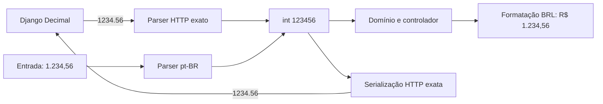

# Dinheiro exato em cartões e contas fixas — Design

**Data:** 2026-08-20  
**Roadmap:** R1.3  
**Estado:** aprovado para planejamento

## Objetivo

Eliminar o uso de `double` para valores monetários nos módulos Flutter de
cartões e contas fixas. O backend permanece autoritativo com `Decimal` de duas
casas; o cliente representa dinheiro como centavos inteiros e troca strings
decimais exatas pela API.

Esta mudança não redesenha telas, não altera regras financeiras do backend e
não adiciona dependência monetária externa.

## Decisão arquitetural

Usar `int` em minor units nos modelos, repositórios, controladores e
formulários Flutter. Os nomes monetários carregam o sufixo `Minor`, como
`amountMinor` e `limitMinor`.

Essa opção reutiliza a fundação existente em
`mobile/lib/core/money/minor_units.dart`, mantém o projeto simples e evita uma
classe `Money` ou biblioteca decimal sem necessidade atual.

`double` continua permitido somente para:

- percentuais, como `limitUsagePercent`;
- dimensões e animações de interface;
- APIs gráficas do Flutter que exigem `double` e não calculam dinheiro.

## Fronteira monetária

### Resposta da API

O Django envia strings com exatamente duas casas, por exemplo `"1234.56"`.
O Flutter usa `parseMinorUnits` para obter `123456` sem passar por ponto
flutuante.

Campo monetário ausente, com expoente, mais de duas casas ou formato diferente
do contrato é resposta inválida. Ele não pode ser convertido silenciosamente
em zero. O erro segue o fluxo seguro já existente do controlador, preservando
o último snapshot válido quando houver.

### Requisição para a API

Todo centavo inteiro é serializado por uma função exata, sem
`toStringAsFixed`, produzindo duas casas:

| Minor units | String HTTP |
|---:|---:|
| `0` | `"0.00"` |
| `1` | `"0.01"` |
| `105` | `"1.05"` |
| `123456` | `"1234.56"` |

Cartões e contas fixas só aceitam valores positivos nos fluxos de criação e
pagamento, preservando as validações atuais do backend.

### Entrada pt-BR

Os formulários aceitam:

- `1234` → `123400` centavos;
- `1234,5` → `123450` centavos;
- `1234,56` → `123456` centavos;
- `1.234,56` → `123456` centavos;
- prefixo opcional `R$` e espaços externos.

Separadores de milhar precisam formar grupos de três dígitos. Mais de duas
casas decimais, expoentes, sinal negativo, texto misto e separadores ambíguos
são rejeitados. Nenhum valor é arredondado silenciosamente.

Valores preenchidos pelo aplicativo usam `1234,56`, sem separador de milhar,
para que edição e reenvio sejam determinísticos.

### Exibição

Valores visuais são formatados em BRL a partir de divisão inteira (`~/`) e
resto (`%`). A parte inteira pode receber agrupamento local; os centavos são
sempre dois dígitos. Nenhum caminho de exibição divide por `100.0`.

## Superfície migrada

### Cartões

- `CreditCardModel`: `limitMinor`, `availableLimitMinor`,
  `unpaidExpensesTotalMinor`, `currentInvoiceTotalMinor`;
- `CardExpenseModel`: `amountMinor`;
- `CardInvoiceModel`: `totalAmountMinor`, `paidAmountMinor` e cálculos
  derivados em inteiros;
- `CardsSummaryModel`: totais de limite, uso, disponibilidade e faturas em
  minor units;
- repositório e controlador: criar/editar cartão, criar compra e pagar fatura
  recebem centavos inteiros;
- formulários, cartões visuais, métricas, faturas e listas formatam minor units.

`limitUsagePercent` permanece `double`, pois é proporção visual e não valor
monetário.

### Contas fixas

- `RecurringBillModel.amountMinor`;
- `BillInstanceModel.amountMinor`;
- `BillsMetricsModel`: pendente, pago, comprometido, saldo de contas e saldo
  livre em minor units;
- repositório e controlador: criar/editar regra e pagar ocorrência recebem
  centavos inteiros;
- formulários, métricas, ocorrências e regras formatam minor units.

### Fora do escopo

- migrações Django ou mudança em `DecimalField`;
- sync offline de cartões e contas fixas;
- alteração de regras de parcelamento, fatura, vencimento ou pagamento;
- migração de percentuais para inteiros;
- redesign da Web ou do Flutter;
- PostgreSQL, Open Finance, empréstimos e investimentos.

## Componentes

### `core/money/minor_units.dart`

Continua sendo a única fronteira monetária comum e passa a oferecer:

- parsing estrito de strings decimais da API;
- parsing de entrada pt-BR;
- serialização exata para a API;
- valor editável pt-BR;
- formatação monetária BRL.

Essas funções são puras e não dependem de widgets, rede ou banco.

### Modelos de domínio

Modelos convertem JSON no construtor e armazenam apenas `int` para dinheiro.
Eles não formatam interface e não aceitam `num` monetário vindo da API.

### Repositórios

Repositórios recebem minor units e serializam strings exatas no limite HTTP.
Isso permite testar o payload sem envolver widgets.

### Controladores e telas

Controladores transportam minor units sem conversão. Formulários fazem parsing
somente no submit/validação; telas fazem formatação somente na apresentação.

## Fluxo de dados

## Erros e compatibilidade

- entrada inválida mantém o formulário aberto e apresenta a mensagem segura já
  usada pela tela;
- valor zero ou negativo é rejeitado nos fluxos positivos;
- resposta monetária inválida da API não vira zero e não substitui snapshot
  válido;
- o formato HTTP existente permanece string decimal com duas casas;
- os nomes públicos internos mudam para `*Minor`, de modo que o analisador
  encontre consumidores esquecidos durante a compilação;
- nenhuma conversão monetária usa `double.parse`, `double.tryParse`,
  `toStringAsFixed` ou divisão por `100.0`.

## Estratégia de testes

### Unidade monetária

- um centavo, zero, valores grandes e negativos no contrato HTTP;
- serialização inversa exata;
- entradas `1234`, `1234,5`, `1234,56`, `1.234,56` e `R$ 1.234,56`;
- rejeição de `1,234`, `1.234,567`, expoente, texto e agrupamento inválido;
- formatação BRL e valor editável sem ponto flutuante.

### Domínio e rede

- todos os campos de cards/bills leem strings exatas para minor units;
- JSON monetário malformado falha em vez de virar zero;
- create/update/pay enviam strings com duas casas, incluindo `0.01` e valores
  que normalmente expõem erro binário em `double`;
- `limitUsagePercent` continua aceitando número percentual.

### Controladores e widgets

- criar, editar e pagar preservam exatamente os centavos digitados;
- campos carregados exibem valor pt-BR editável;
- listas e métricas exibem BRL correto;
- valores inválidos não chamam o repositório.

### Regressão e aceitação

- busca dirigida comprova ausência de `double` em propriedades e parâmetros
  monetários dos módulos cards/bills;
- testes Flutter completos, análise, formatação e builds suportados continuam
  verdes;
- goldens são executados sem atualização primeiro; qualquer mudança é
  inspecionada e só então aceita;
- backend executa Ruff, checks, migrations, testes e cobertura para validar que
  o contrato Decimal não foi alterado.

## Aceite

R1.3 está concluída quando cartões e contas fixas mantêm centavos exatos da
entrada ao payload e da resposta à exibição, nenhum caminho monetário desses
módulos usa ponto flutuante, a interface preserva o desenho aprovado e a CI
completa fica verde.
