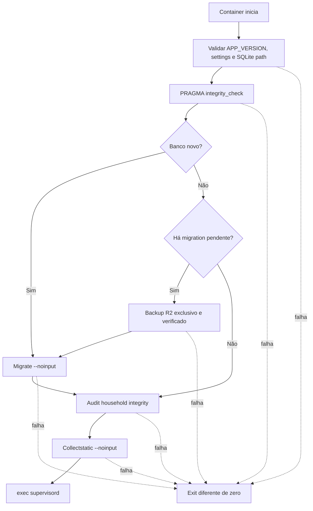

# R1.4 — Deploy fail-fast e versão observável

Data: 2026-08-21
Status: desenho aprovado pelo proprietário; implementação ainda não iniciada.

## 1. Objetivo

Fazer com que uma release do Lar Finance só inicie o Gunicorn e os schedulers
depois de validar o ambiente, proteger o SQLite, aplicar migrations e auditar o
Lar com sucesso. Cada release deve ser uma imagem imutável identificada pelo SHA
que passou na CI, e o mesmo SHA deve aparecer no health público.

Esta entrega fecha a R1 sem expandir o produto pessoal.

## 2. Estado atual comprovado

- O EasyPanel acompanha a `main` e atualmente constrói o repositório.
- `core/wsgi.py` chama `migrate` ao iniciar Gunicorn, captura qualquer exceção e
  permite que o processo web continue.
- O Dockerfile inicia Supervisor como PID 1.
- Supervisor mantém um Gunicorn com um worker, o scheduler R2 e o purge de
  prévias OFX.
- `/api/v1/health/` retorna `status` e `api_version`, mas não informa a imagem.
- A CI executa seis jobs verdes e constrói a imagem de produção apenas como
  verificação local do job Django; não publica a imagem candidata.
- O backup diário R2 está operacional, mas sua chave diária não é suficiente
  para provar um backup novo de cada tentativa de migration.

## 3. Decisões aprovadas

1. Usar imagem do GitHub Container Registry em vez de reconstruir `main` no
   EasyPanel.
2. Publicar imagem somente para tags de release `v*` aprovadas.
3. Identificar cada imagem pelas tags da versão e `sha-<commit>`.
4. Executar um único startup gate versionado antes do Supervisor.
5. Bloquear a migration quando o backup R2 pré-deploy falhar.
6. Não gerar backup pré-deploy em reinício sem migration pendente.
7. Não restaurar o banco automaticamente.
8. Manter uma réplica, um worker, SQLite e os dois schedulers atuais.

## 4. Escopo

### Incluído

- retirar migration de `core/wsgi.py`;
- serviço Python testável para preparar o deploy;
- management command fino para chamar esse serviço;
- script de startup que só executa Supervisor após sucesso;
- detecção de banco novo, banco existente e migrations pendentes;
- integridade SQLite independente do schema Django;
- backup R2 exclusivo por tentativa com migration;
- migration, auditoria e collectstatic em ordem controlada;
- versão/SHA no health;
- imagem GHCR imutável e publicação condicionada à CI completa;
- testes locais, de container e ensaio isolado de rollback;
- atualização de OpenAPI, runbook, PRD, arquitetura e roadmap.

### Fora do escopo

- PostgreSQL, múltiplas réplicas ou mais workers;
- Kubernetes, fila ou serviço de deploy separado;
- restauração automática;
- rate limit persistente, alertas externos ou observabilidade nova;
- redesign Web/Flutter;
- qualquer migration financeira não necessária ao startup gate;
- publicação em lojas.

## 5. Arquitetura

### 5.1 Componentes

| Componente | Responsabilidade |
|---|---|
| `core/deploy.py` | Validar ambiente e orquestrar as etapas fail-fast sem conter lógica de UI ou Supervisor. |
| `prepare_deploy` | Management command fino, com saída técnica segura e exit code diferente de zero em falha. |
| `deploy/start.sh` | Executar `prepare_deploy` e, somente após sucesso, substituir o processo por Supervisor com `exec`. |
| `core/wsgi.py` | Expor apenas a aplicação WSGI; não migrar nem capturar falhas de deploy. |
| `api/views.py` | Expor versão pública estável no health. |
| Dockerfile | Receber `APP_VERSION`, preservá-la na imagem e iniciar o script versionado. |
| GitHub Actions | Publicar GHCR somente em tag `v*`, depois dos seis jobs de qualidade. |

O serviço de deploy deve aceitar dependências injetáveis nas bordas que precisam
de teste, mas não criará framework interno ou abstrações genéricas.

### 5.2 Identidade da release

- `APP_VERSION` contém exatamente o SHA Git completo, em 40 caracteres
  hexadecimais minúsculos, no build de release.
- A tag imutável é `sha-<SHA completo>`.
- A tag humana é a tag Git `v*` e nunca deve ser reatribuída.
- Para este projeto, produção significa `DEBUG=False`. Nesse modo, versão
  ausente, malformada, `unknown` ou `development` aborta o startup gate.
- Com `DEBUG=True`, `development` é permitido para execução local.
- Em produção, o health retorna exatamente:

```json
{
  "status": "ok",
  "api_version": "v1",
  "version": "<SHA de 40 caracteres>"
}
```

O SHA não é segredo nem dado pessoal.

## 6. Fluxo de startup



### 6.1 Preflight

O preflight valida:

- settings Django carregam sem erro;
- backend é SQLite;
- em produção, `SQLITE_PATH` é absoluto e seu caminho resolvido fica dentro de
  `/app/data`;
- diretório existe ou pode ser criado com segurança;
- `APP_VERSION` é válido em produção;
- banco existente passa em `PRAGMA integrity_check`;
- estado de migrations pode ser calculado.

A verificação de integridade anterior à migration usa SQLite diretamente. Ela não
carrega models Django contra um schema antigo.

### 6.2 Banco novo

Banco ausente ou SQLite válido sem schema aplicativo não exige backup. O gate
executa migrations, auditoria, collectstatic e Supervisor.

### 6.3 Banco existente sem migration pendente

Não cria backup de deploy. Executa auditoria e collectstatic antes do Supervisor.
Isso mantém reinícios simples e ainda impede que um estado inconsistente seja
publicado.

### 6.4 Banco existente com migration pendente

Antes de migrar, o gate cria um backup por meio do serviço R2 existente, usando um
prefixo exclusivo:

```text
<prefixo-normal>/deploy/<sha>/<timestamp-UTC-com-micros>/YYYY/MM/DD.sqlite3
```

O timestamp possui precisão de microssegundos e formato UTC estável, impedindo
reuso acidental entre tentativas. O upload preserva a proteção condicional contra
sobrescrita do gateway existente. O backup deve ser uma cópia SQLite consistente,
ter hash calculado, upload verificado e objeto remoto confirmado.
A configuração normal do scheduler não é alterada globalmente.

Após o backup, o gate executa `migrate --noinput`, auditoria e collectstatic.

## 7. Falhas e logs

| Etapa | Resultado em falha |
|---|---|
| Configuração/preflight | exit não zero; nenhum backup, migration ou Supervisor |
| Integridade SQLite | exit não zero; banco não é alterado |
| Backup R2 | exit não zero; migration não inicia |
| Migration | exit não zero; auditoria/collectstatic/Supervisor não iniciam |
| Auditoria | exit não zero; Supervisor não inicia |
| Collectstatic | exit não zero; Supervisor não inicia |

Os logs podem conter somente versão, etapa, código estável, duração e resultado.
Não podem conter credenciais R2, headers, cookies, paths com informação sensível,
conteúdo do banco, e-mail, descrições ou valores financeiros.

O WSGI não captura nem traduz falhas de deploy, pois não participa mais do deploy.

## 8. Rollback

Não há rollback automático. Em falha após início da migration:

1. manter manutenção ativa e parar a imagem candidata;
2. preservar o SQLite que falhou com nome separado;
3. localizar o backup pelo SHA e timestamp da tentativa;
4. baixar e validar tamanho, hash e integridade em caminho descartável;
5. restaurar o SQLite somente com os processos parados;
6. selecionar no EasyPanel a tag `sha-<SHA anterior>`;
7. iniciar uma réplica e executar health, auditoria e smoke checks;
8. registrar apenas evidência técnica sanitizada.

Se a falha ocorrer antes da migration, não há restauração do banco. Basta corrigir
a configuração ou voltar à imagem anterior.

Downgrade de migrations e edição manual de `django_migrations` permanecem
proibidos sem ensaio específico de ida e volta.

## 9. Pipeline GHCR

- Os seis jobs atuais continuam obrigatórios.
- Um job de publicação depende explicitamente de todos eles.
- O job roda somente para `refs/tags/v*`.
- O build usa `--build-arg APP_VERSION=${{ github.sha }}`.
- A imagem recebe as tags `vX.Y.Z` e `sha-<SHA completo>`.
- O job autentica no GHCR com `GITHUB_TOKEN` e permissão mínima `packages: write`.
- Pull privado no EasyPanel usa credencial armazenada somente no secret store.
- Branches e commits comuns não publicam imagem de release.

A imagem publicada é a candidata que deve ser selecionada no EasyPanel; o
EasyPanel não reconstrói o repositório.

## 10. Estratégia de testes

### 10.1 Testes de serviço/command

- banco novo migra sem backup;
- banco existente sem pendência não chama R2;
- banco existente com pendência chama backup antes de migrate;
- backup usa prefixo exclusivo por SHA e timestamp;
- falha R2 não chama migrate;
- falha de migration não chama auditoria ou collectstatic;
- falha de auditoria/collectstatic impede conclusão;
- ordem completa é backup, migrate, audit, collectstatic;
- integridade SQLite falha antes de qualquer mutação;
- exceções conhecidas viram códigos estáveis sem dados sensíveis;
- command preserva `KeyboardInterrupt` e `SystemExit`.

### 10.2 Contratos de runtime

- `core/wsgi.py` não contém `migrate` nem `call_command`;
- Dockerfile inicia `deploy/start.sh`;
- script usa fail-fast e `exec supervisord`;
- Supervisor continua com um worker e dois schedulers;
- Compose não substitui o command;
- o startup gate impede que o health seja servido com versão inválida em
  produção e mantém `development` local;
- OpenAPI descreve o novo campo `version`.

### 10.3 Testes de imagem e CI

- construir imagem com SHA sintético;
- inspecionar `APP_VERSION` e labels;
- iniciar imagem contra SQLite temporário novo;
- aguardar health e comparar o SHA exato;
- confirmar os três processos Supervisor;
- em ensaio isolado com banco copiado e migration pendente, simular falha R2 e
  provar que o schema não mudou e o web não abriu;
- provar que o job GHCR depende dos seis jobs e não roda em branch comum.

### 10.4 Matriz final

- Ruff, Django `check`, `check --deploy` e `makemigrations --check`;
- suíte Django completa com `-Wd` e cobertura mínima de 90%;
- suíte Flutter, análise, formato e goldens para proteger a release existente;
- builds Windows release e APK release;
- build/smoke Docker;
- secret scan;
- revisão independente sem Critical ou Important.

## 11. Aceite no EasyPanel

1. Configurar acesso privado ao GHCR sem expor token.
2. Selecionar a imagem candidata por tag `sha-<SHA>`.
3. Manter uma réplica, mount `/app/data` e `SQLITE_PATH=/app/data/db.sqlite3`.
4. Não sobrescrever o command da imagem.
5. Confirmar health público com o SHA exato.
6. Confirmar um Gunicorn worker, backup scheduler e purge scheduler.
7. Confirmar banco, auditoria e backup após restart controlado.
8. Ensaiar falha e rollback somente em SQLite restaurado/copiado, nunca no banco
   real.
9. Confirmar que a imagem SHA anterior permanece selecionável.

## 12. Critérios de conclusão

A R1.4 termina apenas quando:

- migration não existe mais no WSGI;
- todos os caminhos de falha impedem o Supervisor de iniciar;
- backup exclusivo e verificado precede toda migration em banco existente;
- health público identifica a imagem candidata;
- CI completa está verde e a imagem tagueada foi publicada no GHCR;
- EasyPanel executa a imagem GHCR por SHA com uma réplica/worker;
- ensaio isolado comprova falha segura e rollback;
- documentação corresponde à evidência real;
- commit e push estão concluídos;
- nenhuma tarefa R2 foi iniciada.

## 13. Riscos residuais aceitos

- O serviço fica indisponível se o gate detectar corrupção ou inconsistência; é
  preferível a publicar dados potencialmente incorretos.
- Backups pré-deploy exclusivos acumulam objetos. Para a frequência pessoal de
  releases, a retenção desses objetos será revista apenas se houver custo ou
  volume material.
- Trocar a tag no EasyPanel é manual e intencional para releases pessoais.
- O ensaio prova rollback; não força uma falha destrutiva no banco real.
