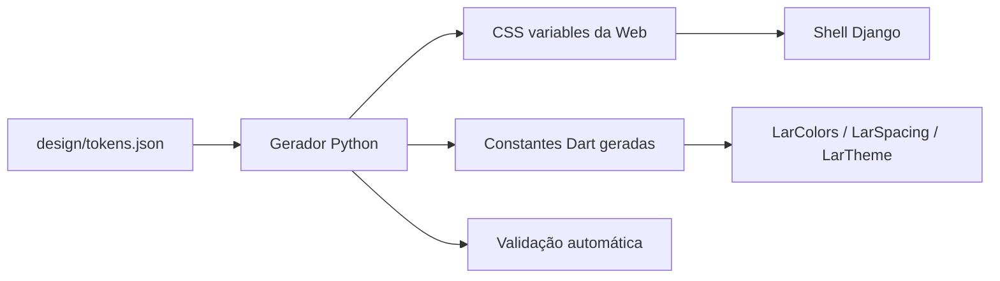

# R2.1 — Tokens e contrato visual Casa de Valores 2.0

**Status:** implementado e verificado em 22/08/2026

**Escopo:** fundação compartilhada de design tokens para Web e Flutter

**Fora do escopo:** tema automático, assets locais, shell adaptativo e redesenho de telas

## 1. Contexto

O Lar Finance possui uma identidade aprovada chamada **Casa de Valores 2.0**,
compartilhada entre Web, Windows, Android e iOS. Hoje, porém, os valores do
design system estão divididos:

- o Flutter concentra os tokens oficiais em `mobile/lib/design_system/`;
- a Web repete valores em `templates/base.html`, no Tailwind configurado por
  CDN e em classes literais espalhadas pelos templates;
- `docs/design-system.md` trata o Flutter como fonte canônica provisória,
  enquanto não existe um contrato compartilhado;
- a auditoria de 20/08/2026 encontrou 821 cores hexadecimais, 315 classes de
  radius e 121 classes de sombra na Web.

A R2.1 cria uma fonte única e neutra para os valores visuais sem redesenhar as
telas. A migração completa de cada tela permanece incremental na R3.

## 2. Objetivos

- criar uma fonte única de verdade independente de plataforma;
- gerar tokens CSS e Dart de forma determinística;
- preservar a API pública atual do design system Flutter;
- centralizar cores, tipografia, spacing, radius, bordas, elevação e motion;
- remover cores estruturais hardcoded do shell Web compartilhado;
- impedir divergência futura por testes e CI;
- manter a aparência escura atual da Web durante a R2.1.

## 3. Não objetivos

- ativar tema automático ou remover o modo escuro fixo;
- impedir flash de tema incorreto;
- localizar Tailwind, Alpine ou Chart.js;
- remover nesta task o carregamento remoto de Inter;
- alterar sidebar, navegação compacta ou breakpoint de composição;
- substituir todas as cores literais das telas Web;
- redesenhar login, dashboard ou qualquer fluxo financeiro;
- alterar backend, banco, API, sincronização ou dados financeiros.

Esses itens pertencem respectivamente à R2.2, R2.3 e R3, conforme
`docs/ROADMAP.md`.

## 4. Decisão arquitetural

### 4.1 Alternativas consideradas

1. **Contrato neutro com geração automática — escolhida.** Um JSON oficial gera
   os artefatos CSS e Dart. Entrega paridade real com pouca infraestrutura.
2. **Contrato neutro com cópia manual.** Evita o gerador, mas exige manter três
   representações editáveis e torna a divergência mais provável.
3. **Flutter como autoridade permanente.** Exige menos mudanças iniciais, mas
   acopla a Web à representação Dart e mantém a assimetria entre plataformas.

### 4.2 Fluxo aprovado

O JSON é o único arquivo editável que contém valores de tokens. CSS e Dart são
saídas geradas e versionadas para que builds Web/Flutter não dependam de geração
em produção. O gerador usa Python já presente no projeto e não adiciona Node ou
um serviço de build.

## 5. Estrutura prevista

| Caminho | Responsabilidade |
|---|---|
| `design/tokens.json` | contrato canônico e versionado |
| `scripts/generate_design_tokens.py` | geração e verificação determinística |
| `static/css/design-tokens.css` | variáveis CSS `--lar-*` para a Web |
| `mobile/lib/design_system/lar_tokens.g.dart` | constantes primitivas geradas para Flutter |
| `mobile/lib/design_system/lar_colors.dart` | fachada pública semântica de cores |
| `mobile/lib/design_system/lar_spacing.dart` | fachada pública da escala de spacing |
| `mobile/lib/design_system/lar_typography.dart` | composição tipográfica Flutter |
| `mobile/lib/design_system/lar_theme.dart` | mapeamento semântico para `ThemeData` |

`staticfiles/` não será editado: é saída de `collectstatic`.

## 6. Modelo dos tokens

O contrato terá duas camadas conceituais:

- **primitivos:** valores crus de cor, medida, duração e curva;
- **semânticos:** papel do valor na interface, resolvido por modo claro/escuro.

Componentes consomem papéis semânticos. Eles não escolhem diretamente uma cor
da paleta. Isso permite alterar um tema sem reescrever os componentes.

### 6.1 Cores

Papéis mínimos:

- `surface.canvas`, `surface.base` e `surface.elevated`;
- `text.primary`, `text.secondary` e `text.muted`;
- `border.default` e `border.strong`;
- `accent.champagne`, `accent.mineral` e respectivos estados de seleção;
- `state.success`, `state.warning`, `state.danger` e `state.info`;
- `focus.ring`;
- `shadow.color`.

Valores Flutter já aprovados permanecem como base:

| Papel | Valor |
|---|---|
| canvas escuro | `#091311` |
| superfície escura | `#101B18` |
| canvas claro | `#F3EFE6` |
| superfície clara | `#FFFCF5` |
| champagne | `#C7A35A` |
| seleção champagne escura | `#4B4027` |
| verde mineral | `#2F756A` |
| verde mineral sobre escuro | `#72B8AC` |
| atenção | `#B9782D` |
| perigo | `#B8534F` |
| texto principal escuro | `#E8E3D8` |
| texto principal claro | `#17201D` |

Os papéis adicionais ficam fechados nesta especificação:

| Papel | Claro | Escuro | Evidência/uso |
|---|---|---|---|
| `surface.elevated` | `#FFFCF5` | `#171F1B` | superfície Flutter clara e card Web atual |
| `text.secondary` | `#59635D` | `#A7AEA8` | texto auxiliar com contraste AA |
| `text.muted` | `#6B716C` | `#8D958D` | texto de menor ênfase com contraste AA |
| `border.default` | `#CBC5B9` | `#31403A` | divisores explícitos de `LarTheme` |
| `border.strong` | `#8B8A80` | `#8D958D` | outlines explícitos de `LarTheme` |
| `focus.ring` | `#2F756A` | `#72B8AC` | verde mineral acessível por tema |
| `state.success` | `#2F756A` | `#72B8AC` | confirmação positiva |
| `state.info` | `#2F756A` | `#72B8AC` | informação; sempre acompanhada de texto/ícone |
| `state.warning` | `#8E571F` | `#DBB86F` | derivação acessível do âmbar atual |
| `state.danger` | `#B8534F` | `#D66D69` | perigo atual e variante clara Web |

As combinações de texto acima têm contraste mínimo de 4,5:1 sobre a superfície
base correspondente. `text.muted` não significa texto desabilitado ou
ilegível. Sucesso e informação podem compartilhar o verde porque estado nunca
será comunicado apenas por cor. Roxo, lavanda e violeta são proibidos inclusive
em estados e gráficos.

### 6.2 Espaçamento

Escala única: `4, 8, 12, 16, 24, 32, 48 px`.

Nomes semânticos atuais: `xxs`, `xs`, `sm`, `md`, `lg`, `xl` e `xxl`. Valores
fora dessa escala exigem uma necessidade estrutural documentada.

### 6.3 Radius e bordas

- radius: `8, 12, 16 e 24 px`;
- pill: valor reservado exclusivamente a seleção compacta, filtro ou status;
- borda padrão: `1 px`;
- foco visível: `2 px`;
- divisores e bordas substituem glow ou sombra decorativa.

### 6.4 Elevação

Três papéis: `flat`, `raised` e `modal`.

- `flat` não aplica sombra;
- `raised` indica conteúdo realmente elevado;
- `modal` separa diálogo ou sheet do plano anterior;
- nenhum papel produz glow mineral, champagne ou danger.

Cada papel é representado por `offsetY`, `blur` e `opacity`, permitindo saída
equivalente em CSS e Flutter:

| Papel | Offset Y | Blur | Opacidade clara | Opacidade escura |
|---|---:|---:|---:|---:|
| `flat` | 0 | 0 | 0 | 0 |
| `raised` | 4 px | 16 px | 10% | 24% |
| `modal` | 12 px | 32 px | 16% | 36% |

No tema claro, a cor-base da sombra é `#091311`; no escuro, `#000000`.

### 6.5 Motion

- durações oficiais: `160, 200 e 240 ms`;
- curva padrão: `cubic-bezier(0.2, 0, 0, 1)` no CSS e a mesma curva cúbica no
  Flutter;
- redução de movimento troca transições por fade curto ou estado imediato;
- animação perpétua e movimento decorativo não fazem parte do sistema.

### 6.6 Tipografia e números

A stack principal é nativa:

- Windows: Segoe UI;
- Apple: SF/system font;
- Android: Roboto;
- Web: `system-ui` e fallbacks nativos equivalentes.

O display financeiro atual continua em 32 px, peso 600, altura 1,15 e números
tabulares. Valores monetários, métricas, tabelas e datas numéricas usam
`font-variant-numeric: tabular-nums` na Web e `FontFeature.tabularFigures()` no
Flutter.

Escala compartilhada:

| Papel | Tamanho | Altura de linha | Peso padrão |
|---|---:|---:|---:|
| `caption` | 12 px | 16 px | 400 |
| `label` | 14 px | 20 px | 500 |
| `body` | 16 px | 24 px | 400 |
| `title` | 20 px | 28 px | 600 |
| `headline` | 24 px | 32 px | 600 |
| `financial` | 32 px | 1,15 | 600 |

Pesos disponíveis: 400, 500, 600 e 700. Valores maiores permanecem decisões de
composição de tela e não entram no contrato básico da R2.1.

### 6.7 Breakpoint estrutural

O contrato registra `900 px` como breakpoint oficial entre composição compacta
e desktop. A R2.1 apenas centraliza o valor; a mudança real do shell pertence à
R2.3.

## 7. Estratégia de geração

O gerador terá dois modos:

- modo padrão: lê o JSON e atualiza CSS/Dart;
- `--check`: gera em memória, compara com os arquivos versionados, não escreve e
  retorna erro quando houver divergência.

Requisitos:

- saída estável para a mesma entrada;
- ordem de propriedades determinística;
- cabeçalho “arquivo gerado; não editar manualmente”;
- erro objetivo para JSON inválido, token ausente, nome duplicado ou tipo
  incompatível;
- nenhum fallback silencioso para token desconhecido;
- nenhum pacote novo necessário para executar o gerador.

## 8. Integração Web

`design-tokens.css` será carregado antes dos estilos específicos da aplicação.
Na R2.1:

- o tema semântico escuro continua sendo o padrão efetivo;
- os tokens claros já são gerados, mas não são selecionados automaticamente;
- `templates/base.html` passa a usar variáveis para body, scrollbar, seleção,
  skip link, foco, fundo e card estrutural;
- a stack `font-sans` passa a apontar para a variável tipográfica nativa;
- efeitos de iluminação ambiente e glows estruturais deixam de definir o shell;
- classes internas das telas continuam funcionando até sua migração na R3.

A ativação por `prefers-color-scheme`, prevenção de flash e remoção dos CDNs
ficam explicitamente para a R2.2.

## 9. Integração Flutter

O artefato Dart fornece valores primitivos gerados. `LarColors`, `LarSpacing`,
`LarTypography` e `LarTheme` continuam sendo a interface consumida pelo app.
Isso evita imports do arquivo `.g.dart` fora da camada de design system e reduz
o impacto da mudança.

Os testes existentes de ausência de roxo, canvases explícitos e contraste do
verde mineral serão mantidos e ampliados para comprovar que as fachadas usam os
valores gerados.

## 10. Validação automatizada

A R2.1 deve cobrir:

- schema e tipos do contrato;
- presença de todos os papéis obrigatórios;
- paridade exata entre JSON, CSS e Dart;
- artefatos gerados atualizados por `--check`;
- proibição da família roxa;
- contraste AA das combinações essenciais;
- adesão às escalas de spacing, radius e motion;
- números financeiros tabulares;
- continuidade dos testes atuais de `LarTheme`;
- ausência de cores estruturais hexadecimais em `templates/base.html`.

O gate será integrado à CI existente. A validação não depende de rede.

## 11. Critérios de aceite

- `design/tokens.json` é a única origem editável dos valores;
- geração CSS/Dart é determinística;
- `--check` não modifica o workspace;
- CSS e Dart correspondem exatamente ao contrato;
- `base.html` não contém cores estruturais hexadecimais;
- Flutter mantém sua API pública atual;
- Web continua escura e funcional nesta task;
- stack tipográfica é nativa e números financeiros são tabulares;
- contraste, ausência de roxo e paridade passam;
- Django, Flutter analyze e testes do design system permanecem verdes.

## 12. Falhas e recuperação

- contrato inválido interrompe geração e CI com mensagem objetiva;
- arquivo gerado editado manualmente é detectado por `--check`;
- token desconhecido ou ausente falha sem fallback silencioso;
- nenhuma migration ou transformação de dados é necessária;
- rollback consiste em reverter o commit da R2.1;
- R2.2 não começa sem autorização separada do proprietário.

## 13. Riscos e mitigação

| Risco | Mitigação |
|---|---|
| alteração pequena de métricas ao usar fonte nativa | smoke visual nos breakpoints existentes; redesign fica fora da task |
| componente antigo depender de literal Web | migrar apenas shell compartilhado; telas seguem incrementais na R3 |
| diferença entre saída gerada e fachada Flutter | teste de paridade e imports restritos à camada de design system |
| tema claro incompleto ser ativado cedo | manter escuro efetivo na R2.1; ativação somente na R2.2 |
| gerador aumentar complexidade | script Python pequeno, determinístico, sem dependências externas |

## 14. Entrega e limite da task

A R2.1 termina quando contrato, gerador, artefatos, integração mínima do shell,
testes, CI e documentação estiverem verdes, commitados e publicados em
`main`. O encerramento será comunicado objetivamente ao proprietário, junto do
próximo passo recomendado. Nenhuma atividade da R2.2 será iniciada sem nova
autorização.
