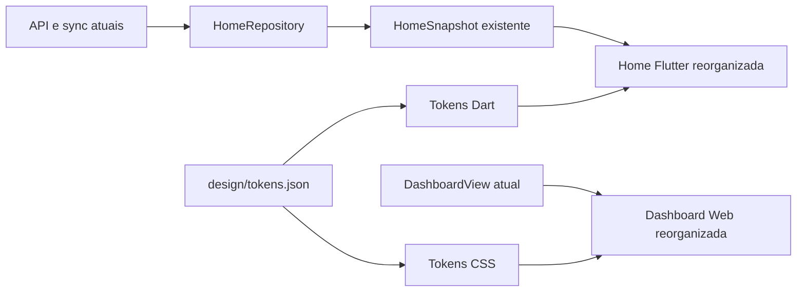

# R3.2 — Paridade visual Dashboard/Home Web e Flutter

**Data:** 22/08/2026

**Status:** concluído

**Escopo:** Dashboard Web e Home Flutter

**Fora do escopo:** backend, contratos de API, sincronização, demais telas e novos indicadores

## 1. Objetivo

Tornar a primeira tela autenticada do Lar Finance imediatamente reconhecível como
o mesmo produto na Web, Windows, Android e iOS. A Web preserva sua densidade
analítica; o Flutter incorpora a hierarquia, os cards e os indicadores aprovados
da Web sem copiar literalmente a composição de desktop para telas compactas.

O resultado deve ser visualmente perceptível. A task não se limita a substituir
cores por tokens: ela reorganiza a primeira dobra e os componentes financeiros da
Dashboard/Home.

## 2. Decisão de direção

### Abordagens consideradas

1. **Copiar integralmente a Dashboard Web para o Flutter.** Rejeitada porque exige
   novos dados no cliente, cria excesso de densidade em celulares e amplia o
   escopo para API e sincronização.
2. **Convergência de hierarquia com composição nativa por plataforma.** Aprovada.
   Web e Flutter compartilham ordem, linguagem, superfícies e estados; gráficos e
   análises adicionais continuam exclusivos da Web abaixo da primeira hierarquia.
3. **Alterar apenas o Flutter e preservar a Web atual.** Rejeitada porque manteria
   a ornamentação excessiva e não resolveria a inconsistência entre plataformas.

### Princípios visuais

- Casa de Valores 2.0, sem roxo;
- superfícies grafite esverdeadas, texto marfim e verde mineral como ação;
- champanhe reservado a patrimônio, planejamento e destaques selecionados;
- perigo reservado a despesa, atraso e erro;
- algarismos tabulares para todos os valores;
- bordas finas, sombra baixa e nenhum brilho estrutural;
- menos cards aninhados e uma pergunta financeira clara por bloco;
- breakpoint estrutural compartilhado em `900 px`.

## 3. Hierarquia compartilhada

As duas plataformas seguem esta ordem:

1. contexto do Lar, atualização e privacidade;
2. seletor `Lar / Eu / Esposa`;
3. posição principal: saldo consolidado ou saldo livre disponível;
4. compromissos próximos e gasto do mês;
5. movimentações recentes;
6. conteúdo analítico adicional, somente quando já existir na plataforma.

A Web mantém abaixo dessa hierarquia o gasto diário permitido, métricas mensais,
fluxo de seis meses, distribuição por categoria e maiores gastos. Esses blocos
não serão inventados no Flutter nesta task porque o `HomeSnapshot` atual não
fornece todos os dados necessários.

## 4. Dashboard Web

### Primeira dobra

- Cabeçalho compacto com título `Visão do Lar`, contexto e ação `Importar OFX`.
- Seletor de responsável visível, sem competir com o título.
- Card principal de posição financeira com rótulo, valor dominante e explicação
  curta; atraso aparece como estado, não como ornamento.
- Dois cards de apoio para compromissos e gasto mensal.
- Ação de lançamento permanece no shell e não é duplicada no conteúdo.

### Conteúdo analítico

- `Gasto diário permitido` vira bloco de planejamento secundário.
- Entradas, saídas, patrimônio e poupança usam uma grade mais compacta.
- Gráficos mantêm pergunta, legenda e dados atuais.
- Movimentações recentes sobem na hierarquia; maiores gastos permanece ao lado no
  desktop e abaixo no compacto.

### Limpeza visual

- Remover estilos hexadecimais estruturais do template da Dashboard.
- Consumir exclusivamente tokens `--lar-*` por classes Tailwind já mapeadas ou
  classes CSS locais baseadas em variáveis.
- Remover gradiente e `shadow-glow-*` dos banners.
- Reduzir raios e padding excessivos sem alterar URLs ou comportamento.

## 5. Home Flutter

### Compacto — Android e iPhone

- Status de sincronização e privacidade continuam no topo.
- Seletor de responsável ocupa uma linha própria.
- Saldo consolidado passa a uma superfície financeira dominante, inspirada no
  card principal da Web.
- Compromissos e gasto mensal aparecem como dois cards; em largura insuficiente,
  ficam empilhados.
- Movimentações recentes usam linhas mais densas, divisores e valor alinhado.
- Pull-to-refresh, navegação inferior e comportamento iOS/Android permanecem.

### Amplo — Windows e Flutter desktop

- Conteúdo central limitado a `1120 px`.
- Card de saldo e cards de apoio formam a primeira faixa.
- Movimentações recentes aparecem em uma faixa de largura total abaixo da primeira
  faixa, preservando a mesma hierarquia aprovada na Web e mais espaço para descrição,
  conta e valor.
- O shell adaptativo existente continua responsável pela navegação.

### Componentes

- `BalanceHeader` evolui para o card de posição financeira.
- `CommitmentsSummary` passa a renderizar cards de apoio reutilizáveis.
- `RecentTransactions` recebe a mesma gramática de cabeçalho e linha da Web.
- `AttentionList`, `OwnerSelector` e `SyncStatusView` preservam suas APIs e estados.
- Novos componentes só serão extraídos se forem usados por mais de um bloco.

## 6. Dados e comportamento

Não haverá alteração de modelo, endpoint ou sincronização.

Mapeamento compartilhado:

| Conceito | Web | Flutter |
|---|---|---|
| posição principal | saldo livre e saldo consolidado existentes | `balanceMinor` |
| compromissos | contas fixas pendentes existentes | `upcomingCommitmentMinor` |
| gasto mensal | despesas mensais existentes | `monthExpenseMinor` |
| movimentações | `recent_transactions` | `recentTransactions` |

As diferenças de significado permanecem explícitas nos rótulos. Não será exibido
`Saldo Livre Real` no Flutter usando saldo consolidado como substituto.

## 7. Estados e acessibilidade

- Loading preserva indicador e texto descritivo.
- Offline distingue ausência de cache de dados salvos.
- Falha oferece `Tentar novamente`.
- Valores ocultos mantêm semântica `Valor oculto`.
- Foco por teclado segue ordem contexto, seletor, conteúdo e retry.
- Escala de texto a partir de `1.5` empilha métricas e valores.
- Contraste mínimo e áreas de toque seguem os testes existentes.
- Animações respeitam `disableAnimations` e não são necessárias para o aceite.

## 8. Responsividade

| Faixa | Web | Flutter |
|---|---|---|
| `< 900 px` | conteúdo em coluna; shell compacto existente | coluna e navegação inferior |
| `>= 900 px` | sidebar e grades analíticas | shell amplo e composição em faixas |
| escala `>= 200%` | sem corte horizontal na primeira hierarquia | cards e valores empilhados |

## 9. Testes e aceite

### Web

- teste de template para ordem da hierarquia e uso de tokens;
- teste para ausência de hex estrutural, gradiente e glow na Dashboard;
- screenshots autenticadas em 375, 900 e 1280 px;
- smoke de seletor, importação e links financeiros existentes.

### Flutter

- widget tests para compacto, amplo, escala de texto, loading, offline e erro;
- goldens da Home em claro/escuro e compacto/amplo;
- `flutter analyze` e suíte sem golden;
- builds Windows, Android e iOS permanecem gates da CI.

### Aceite visual

- primeira dobra Web e Flutter possui a mesma ordem financeira;
- a mudança é perceptível sem esconder informação atual;
- Windows, Android e iOS parecem o mesmo produto da Web;
- nenhuma nova chamada de rede ou campo de domínio é introduzido;
- nenhum roxo, gradiente estrutural ou glow permanece na Dashboard/Home;
- demais telas não são alteradas nesta task.

## 10. Riscos e contenção

| Risco | Contenção |
|---|---|
| transformar celular em dashboard desktop | mesma hierarquia, composição específica por faixa |
| alterar significado de indicadores | preservar rótulos e dados existentes por plataforma |
| quebrar goldens sem ganho real | aprovar novas referências apenas após screenshots comparativas |
| ampliar task para shell ou API | manter interfaces e navegação atuais |
| regressão de acessibilidade | testes de foco, escala, semântica e contraste |

## 11. Entrega

A implementação será uma única task R3.2. Ao concluir: verificação completa,
commit, push e comunicação objetiva do resultado. Nenhuma outra tela ou sprint
será iniciada sem nova autorização.
