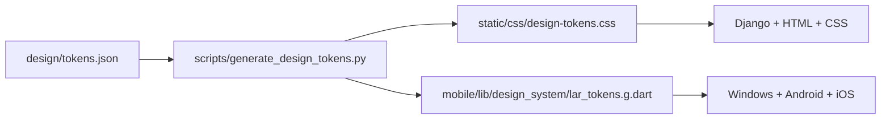
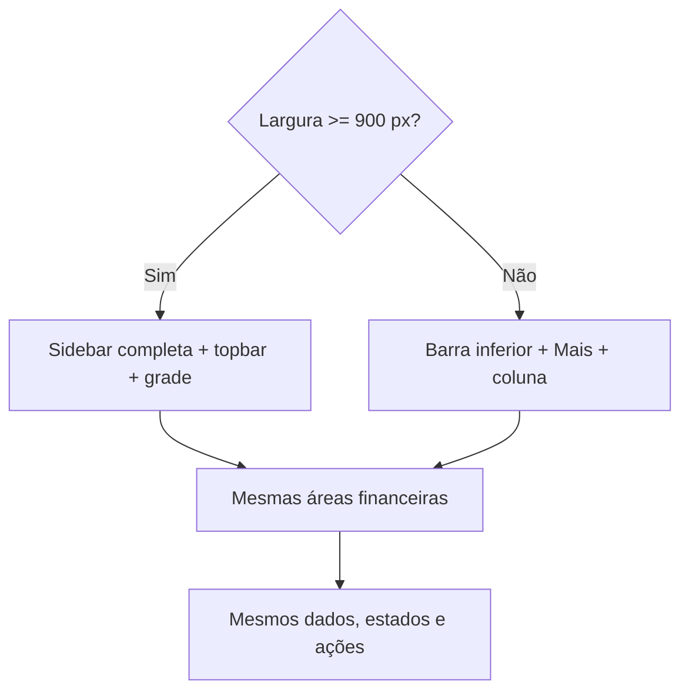

# R3.3 — Estrutura Web com identidade Flutter Casa de Valores

**Data:** 22/08/2026

**Status:** aguardando aprovação da especificação

**Escopo:** convergência visual e estrutural da aplicação autenticada na Web,
Windows, Android e iOS

**Diretriz aprovada:** usar a estrutura funcional da Web e a identidade visual
Casa de Valores já definida no Flutter

## 1. Objetivo

Fazer o Lar Finance parecer e se comportar como um único produto em todas as
plataformas, sem transformar a interface móvel em uma cópia rígida do desktop.

A estrutura da aplicação Web será a referência para hierarquia, navegação,
cards, gráficos, listas, tabelas, formulários e modais. A paleta, os tokens e a
linguagem visual Casa de Valores do Flutter serão a referência estética. O mesmo
arquivo de tokens continuará gerando CSS para a Web e Dart para o Flutter.

O resultado esperado é:

- Web e Windows com a mesma arquitetura visual de desktop;
- Android e iPhone com a mesma hierarquia e componentes, reorganizados para toque;
- mesmos nomes, estados, indicadores financeiros e ordem de ações;
- nenhuma divergência de cor causada por valores hexadecimais isolados;
- nenhuma alteração no significado dos dados financeiros.

## 2. Evidências do estado atual

Esta especificação parte do código existente, não apenas das capturas de tela.

| Evidência | Estado atual | Consequência |
|---|---|---|
| `templates/partials/_sidebar.html` | sidebar Web contém Dashboard, Contas, Categorias, Transações, Contas Fixas, Cartões, Perfil e Sair | esta arquitetura de informação será a referência do desktop |
| `templates/partials/_topbar_app.html` | topbar Web contém Lar, ação Lançar e usuário | o Flutter amplo precisa do mesmo contexto e das mesmas ações |
| `mobile/lib/app/lar_sidebar.dart` | Flutter amplo exibe apenas Início, Movimentações, Contas e Mais | é a principal divergência estrutural atual |
| `mobile/lib/app/adaptive_shell.dart` | shell já troca em `900 px` entre navegação ampla e inferior | a adaptação responsiva pode evoluir sem trocar a base de navegação |
| `mobile/lib/features/reports/` | métricas, gráfico mensal, donut e distribuição por categoria já existem | serão reaproveitados; não é necessário inventar gráficos |
| `mobile/lib/features/auth/presentation/more_screen.dart` | funções secundárias aparecem como uma lista genérica de botões | a tela precisa adotar os mesmos cards e agrupamentos da Web |
| `design/tokens.json` | paleta, tipografia, espaçamento, raios, elevação, movimento e breakpoint já são compartilháveis | permanece como fonte única de verdade visual |
| templates Web de cartões e contas fixas | ainda possuem cores hexadecimais locais | precisam migrar para tokens ao serem tocados |
| `mobile/lib/main.dart` e `templates/base.html` | Flutter usa tema do sistema; Web força tema escuro | o tema inicial ainda diverge entre clientes |

A R3.2 tratou apenas Dashboard Web e Home Flutter. Esta R3.3 amplia a convergência
para o shell e para as demais áreas do produto, de maneira incremental.

## 3. Decisão de design

### 3.1 Regra principal

**Estrutura da Web; cores e linguagem visual Casa de Valores do Flutter.**

Isso significa:

- a Web define onde navegação, ações, conteúdo, filtros e indicadores aparecem;
- o Flutter fornece a paleta marfim, grafite esverdeado, verde mineral,
  champanhe e vermelho financeiro;
- componentes equivalentes compartilham nome, propósito, ordem e estado;
- cada plataforma preserva o padrão de interação apropriado para mouse, teclado
  ou toque;
- paridade significa a mesma experiência financeira, não igualdade pixel a pixel.

### 3.2 Alternativas descartadas

1. **Manter dois designs independentes.** Rejeitado porque repete a divergência
   visível entre Web e Windows.
2. **Copiar literalmente o HTML para todas as larguras.** Rejeitado porque sidebar,
   tabelas largas e modais de desktop não são adequados ao celular.
3. **Criar um terceiro design system.** Rejeitado porque `design/tokens.json` já
   atende à necessidade e o projeto é de uso pessoal.

## 4. Fonte única de verdade visual

`design/tokens.json` permanece como arquivo canônico. O fluxo obrigatório é:

Não se copia CSS para Dart. O gerador traduz a mesma decisão visual para as duas
tecnologias. Componentes alterados não podem introduzir hexadecimais estruturais
fora do arquivo canônico.

### 4.1 Paleta Casa de Valores

| Papel | Claro | Escuro | Uso |
|---|---|---|---|
| canvas | `#F3EFE6` | `#091311` | fundo geral |
| superfície | `#FFFCF5` | `#101B18` | cards e painéis |
| superfície elevada | `#FFFCF5` | `#171F1B` | modal, menu e destaque |
| texto principal | `#17201D` | `#E8E3D8` | títulos, conteúdo e valores |
| verde mineral | `#2F756A` | `#72B8AC` | ação, seleção, sucesso e informação |
| champanhe | `#C7A35A` | `#C7A35A` | patrimônio, planejamento e seleção especial |
| perigo financeiro | `#B8534F` | `#D66D69` | despesa, atraso e erro |
| borda | `#CBC5B9` | `#31403A` | divisão e contorno |

Roxo, gradientes decorativos e brilhos estruturais não fazem parte do sistema.
Valores financeiros usam algarismos tabulares. Champanhe não substitui o verde
em botões primários.

### 4.2 Tema inicial

Para eliminar a diferença imediata entre Web e aplicativos, o tema inicial será
**Casa de Valores claro** em todas as plataformas. O tema escuro continuará
disponível como preferência explícita e persistida localmente. A preferência não
precisa ser sincronizada entre dispositivos nesta etapa.

## 5. Arquitetura de navegação

### 5.1 Desktop — Web, Windows e futuro macOS

Em largura igual ou superior a `900 px`, o shell compartilhado possui:

1. sidebar permanente à esquerda;
2. topbar com nome do Lar, ação `Lançar` e perfil;
3. conteúdo central responsivo, com largura máxima definida por tela;
4. modais centralizados para tarefas curtas e fluxos dedicados para tarefas longas.

Ordem canônica da sidebar:

1. Dashboard;
2. Contas;
3. Categorias;
4. Transações;
5. Contas Fixas;
6. Cartões;
7. Relatórios;
8. Meu Perfil;
9. Sair.

O Flutter Windows deixa de apresentar a navegação reduzida de quatro opções. O
item ativo, ícone, rótulo e destino devem corresponder à Web.

### 5.2 Compacto — Android, iPhone e Web estreita

Abaixo de `900 px`, não se força uma sidebar. A estrutura adapta-se assim:

- barra inferior: Início, Movimentações, Contas, Cartões e Mais;
- `Mais`: Categorias, Contas Fixas, Relatórios, Importar OFX, Perfil e Sair;
- ação de lançamento disponível sem competir com a navegação;
- cards e gráficos empilhados em uma coluna;
- tabelas tornam-se listas financeiras ou permitem rolagem controlada quando a
  comparação entre colunas for indispensável;
- formulário usa tela ou bottom sheet conforme complexidade e espaço.

O conteúdo e os rótulos permanecem os mesmos. Apenas a composição muda.

## 6. Mapa de telas e convergência

| Área | Estrutura canônica | Adaptação compacta |
|---|---|---|
| Login | marca, campos, erro e ação principal | painel único, teclado e preenchimento nativos |
| Dashboard/Início | cabeçalho, seletor do Lar, saldo, compromissos, gasto, recentes e análises | mesma ordem; cards e gráficos empilhados |
| Contas | resumo, filtros, grade/lista e ações | cards/lista por conta |
| Categorias | resumo, uso do orçamento e cadastro | lista agrupada e edição em sheet/tela |
| Transações | métricas, filtros, tabela e lançamento | lista financeira, filtros em sheet e ação flutuante controlada |
| Contas Fixas | resumo, vencimentos, lista e cadastro | agenda/lista empilhada |
| Cartões | métricas, cards, faturas, compras e importação | carrossel/lista de cartões e fatura em seções |
| Relatórios | métricas, fluxo mensal, distribuição e lista | mesmos gráficos empilhados e roláveis |
| Perfil | dados pessoais, preferência visual e dispositivo | seções verticais |
| Importar OFX | seleção, conta/cartão, prévia, validação e resultado | seletor nativo de arquivo e etapas verticais |

Nenhuma tela nova é criada apenas para alcançar paridade visual. As rotas e os
fluxos existentes são reorganizados e recebem componentes consistentes.

## 7. Dashboard, cards e gráficos

### 7.1 Hierarquia financeira

Dashboard Web e Home Flutter compartilham esta sequência:

1. título e contexto de sincronização;
2. seletor `Lar / Eu / Esposa`;
3. saldo consolidado ou saldo livre com rótulo semanticamente correto;
4. compromissos próximos e gasto do mês;
5. transações recentes;
6. gasto diário permitido;
7. entradas, saídas, patrimônio e poupança;
8. fluxo de seis meses;
9. distribuição por categoria;
10. maiores gastos.

Se um cliente ainda não recebe um indicador pela API, ele não exibe valor
inventado. A disponibilidade exata de gasto diário, patrimônio, poupança e
maiores gastos no contrato Flutter deve ser confirmada antes da respectiva task:
**[INVESTIGAR]**.

### 7.2 Contrato visual de card

Todos os cards financeiros possuem:

- uma pergunta ou rótulo claro;
- um valor dominante quando aplicável;
- contexto curto, sem texto promocional;
- estado de ação discreto;
- borda fina e superfície do tema;
- raio `lg`, exceto controles compactos;
- sombra apenas quando a elevação comunicar interação;
- valores negativos/atrasados em perigo, não todo gasto normal;
- estado vazio, carregando, erro e offline quando aplicável.

### 7.3 Contrato visual de gráfico

Os gráficos existentes serão reutilizados. Cada gráfico deve conter:

- título que explique o que está sendo comparado;
- período selecionado;
- legenda quando houver mais de uma série;
- unidade e valores acessíveis fora da cor;
- tooltip no desktop e interação por toque no móvel;
- estado vazio sem eixo ou série falsos;
- cores obtidas dos tokens Casa de Valores.

## 8. Tabelas, listas, formulários e modais

### 8.1 Tabelas e listas

- Web e Windows usam tabela quando a comparação horizontal agrega valor.
- Android e iPhone convertem a mesma informação em linhas financeiras com título,
  metadados e valor alinhado.
- Ordenação, filtros e paginação mantêm o mesmo significado.
- Nenhuma coluna ou informação financeira é omitida sem alternativa de acesso.

### 8.2 Formulários

- mesma ordem de campos e mesmas mensagens de validação;
- rótulos persistentes; placeholder não substitui rótulo;
- botão primário em verde mineral;
- ação destrutiva em vermelho somente quando realmente destrutiva;
- erro aparece junto ao campo e no resumo apenas quando necessário;
- valores monetários usam máscara e precisão já definidas pelo domínio.

### 8.3 Modais, diálogos e sheets

O conteúdo é o mesmo entre plataformas:

- desktop: modal/dialog centralizado para ação curta;
- móvel: bottom sheet para escolha curta e tela completa para fluxo longo;
- título, campos, ações, validação e resultado permanecem equivalentes;
- cancelar/voltar nunca salva silenciosamente;
- importação OFX sempre apresenta validação ou resumo antes da confirmação quando
  esse comportamento já existir no fluxo atual.

## 9. Estados, sincronização e integridade dos dados

O objetivo visual não altera a arquitetura de sincronização nem o modelo de dados.
Entretanto, a aceitação visual exige comparar o mesmo estado financeiro.

Antes das capturas de referência:

1. Web e aplicativo devem usar o mesmo usuário e o mesmo Lar;
2. o seletor `Lar / Eu / Esposa` deve estar na mesma opção;
3. data e hora da última sincronização precisam estar visíveis;
4. qualquer falha de sync deve ser corrigida ou explicitada;
5. dados antigos não podem ser tratados como diferença de layout.

A captura observada do Windows indicava sincronização antiga enquanto a Web
exibia outro estado. A causa precisa ser diagnosticada como gate inicial da
implementação: **[INVESTIGAR]**.

Estados obrigatórios compartilhados:

- carregando;
- vazio legítimo;
- offline com cache;
- offline sem cache;
- sincronizando;
- atualizado;
- erro recuperável com `Tentar novamente`;
- permissão ou sessão expirada;
- valor oculto por privacidade.

## 10. Acessibilidade e interação

- contraste mínimo WCAG AA para texto e controles;
- foco visível, ordem lógica e operação por teclado no desktop;
- áreas de toque de pelo menos `44 × 44` pontos lógicos;
- VoiceOver e TalkBack recebem rótulo, valor e estado de cada card;
- gráficos possuem resumo textual;
- escala de texto até `200%` não corta valores nem ações;
- cor nunca é o único indicador de entrada, saída, atraso ou seleção;
- movimento respeita redução de animações;
- carregamento não bloqueia a navegação já disponível.

## 11. Desempenho e dependências

- primeira tela útil deve carregar em até 2 segundos quando houver cache local;
- gráficos são construídos após o conteúdo financeiro principal;
- listas extensas usam paginação ou construção preguiçosa já compatível com a
  plataforma;
- o projeto não adicionará biblioteca visual apenas para reproduzir um componente
  que já existe;
- componentes de relatório Flutter existentes serão evoluídos, não substituídos;
- esta etapa não inclui rewrite de Django, Flutter ou API.

## 12. Estratégia incremental de entrega

Cada task termina com testes proporcionais, revisão, commit e push. Cada sprint
termina com validação visual comparativa e só avança após autorização.

### Sprint R3.3.1 — Gate de dados e referências

- [ ] diagnosticar a sincronização antiga no Windows;
- [ ] garantir o mesmo usuário, Lar, responsável e período nos clientes;
- [ ] capturar baseline Web, Windows e uma largura móvel;
- [ ] registrar campos da Dashboard ainda ausentes na API Flutter.

**Risco:** ajustar UI sobre dados diferentes e validar uma falsa divergência.

### Sprint R3.3.2 — Shell e tema compartilhados

- [ ] ampliar a sidebar Flutter desktop para a arquitetura completa da Web;
- [ ] criar topbar Flutter ampla equivalente à Web;
- [ ] ajustar barra inferior e tela `Mais` no compacto;
- [ ] padronizar tema inicial claro e preferência persistida;
- [ ] migrar sidebar/topbar Web para tokens, removendo hexadecimais locais.

**Risco:** quebrar navegação ou deep links; todas as rotas existentes são gates.

### Sprint R3.3.3 — Dashboard, cards e gráficos

- [ ] consolidar contratos de card financeiro Web/Flutter;
- [ ] alinhar a hierarquia completa da Dashboard/Home;
- [ ] reaproveitar gráficos e métricas do módulo de relatórios Flutter;
- [ ] migrar cores de gráficos e cards para tokens;
- [ ] validar estados vazio, loading, offline, erro e privacidade.

**Risco:** usar indicadores com significados diferentes; cada campo exige
rótulo e origem confirmados.

### Sprint R3.3.4 — Movimentações, Contas e Categorias

- [ ] alinhar cabeçalhos, filtros, métricas e ações;
- [ ] aplicar tabela no amplo e lista financeira no compacto;
- [ ] alinhar formulários e estados de validação;
- [ ] remover cores locais dos componentes tocados.

**Risco:** perder densidade ou campos no móvel; toda informação deve continuar
acessível.

### Sprint R3.3.5 — Contas Fixas, Cartões e Relatórios

- [ ] alinhar resumo, vencimentos, faturas, compras e limites;
- [ ] alinhar gráficos, período e distribuição por categoria;
- [ ] padronizar estados de limite, fechamento, atraso e pagamento;
- [ ] validar importação associada à conta ou ao cartão correto.

**Risco:** confundir saldo bancário, limite e fatura; componentes devem preservar
o vocabulário do domínio.

### Sprint R3.3.6 — Formulários, modais, perfil e OFX

- [ ] aplicar o contrato visual aos formulários restantes;
- [ ] alinhar modal Web, dialog Windows e sheet/tela móvel;
- [ ] redesenhar `Mais` e Perfil como seções, não uma pilha genérica de botões;
- [ ] revisar seleção, prévia, validação e resultado da importação OFX.

**Risco:** alterar comportamento de importação; fluxo e validações existentes são
preservados.

### Sprint R3.3.7 — Validação multiplataforma

- [ ] executar matriz de screenshots Web, Windows, Android e iOS;
- [ ] validar claro/escuro, compacto/amplo e escala de texto;
- [ ] executar testes Web, Flutter, geração de tokens e builds disponíveis;
- [ ] corrigir divergências visuais e de navegação encontradas;
- [ ] atualizar documentação e checklist de release.

**Risco:** diferenças nativas legítimas serem tratadas como defeito; a decisão é
guiada pela equivalência funcional e pela hierarquia aprovada.

## 13. Critérios de aceite

### Paridade do produto

- Web e Windows exibem sidebar completa, topbar e mesma ordem de conteúdo;
- Android e iPhone exibem a mesma arquitetura por barra inferior e `Mais`;
- títulos, rótulos, ações e indicadores equivalentes usam o mesmo vocabulário;
- cards, gráficos, listas, formulários e modais pertencem à mesma família visual;
- não existe roxo, gradiente decorativo ou glow estrutural.

### Tokens

- `design/tokens.json` é a única origem das cores estruturais;
- gerador CSS/Dart executa sem diferença inesperada;
- componentes tocados não contêm novos hexadecimais estruturais;
- temas claro e escuro usam os respectivos tokens Casa de Valores.

### Responsividade

- `899 px` usa navegação compacta; `900 px` usa shell amplo;
- telas compactas não têm overflow horizontal estrutural;
- desktop não exibe uma coluna móvel excessivamente larga;
- texto a `200%` continua legível e acionável.

### Dados e estados

- comparação visual usa mesma conta, Lar, responsável, período e sincronização;
- nenhum valor é inventado para preencher paridade;
- ausência de campo na API aparece como investigação, não como dado zero;
- loading, vazio, offline, erro e privacidade possuem representação consistente.

### Verificação

- testes Django e Flutter relacionados passam;
- `flutter analyze` passa;
- testes de navegação cobrem todos os destinos do shell;
- screenshots de referência são aprovadas antes do fechamento;
- builds disponíveis de Web, Windows, Android e iOS mantêm os fluxos existentes.

## 14. Fora do escopo

- Open Finance automático ou contratação de agregador;
- segundo login ou administração multiusuário;
- landing page pública;
- telemetria de marketing;
- reescrita do backend ou do aplicativo Flutter;
- nova biblioteca de componentes externa sem necessidade comprovada;
- recursos corporativos de aprovação, auditoria ou múltiplas organizações.

## 15. Ordem de início recomendada

A implementação começa pela Sprint R3.3.1, porque uma tela com dados antigos não
pode ser comparada de forma confiável com a Web. Depois, o shell e o tema são
unificados antes das telas internas. Essa ordem reduz retrabalho e mantém cada
entrega pequena, testável e reversível.

Nenhuma task de implementação começa até esta especificação ser aprovada. Após a
aprovação, será produzido o plano técnico detalhado da Sprint R3.3.1; a sprint
seguinte não começa sem nova autorização.
